# Kioku - AI Journal

**Focus**: Product Overview + Key Concepts
**Technical Details**: See [TECHNICAL_DEEP_DIVE.md](./TECHNICAL_DEEP_DIVE.md)

---

# Slide 1: Title

```
╔════════════════════════════════════════╗
║                                        ║
║         KIOKU AI JOURNAL              ║
║   Knowledge Graph + AI Assistant       ║
║                                        ║
║        Phuc Nguyen                     ║
║      Technical Presentation            ║
║                                        ║
╚════════════════════════════════════════╝
```

---

# Slide 2: The Problem

```mermaid
graph TD
    A[👤 User writes journal daily] --> B{After 2 months...}
    B --> C[❓ Question: When was last quality time with Jake?]
    C --> D[😓 Must read 20 entries manually]
    D --> E[⏰ 15-20 minutes wasted]
    E --> F[❌ Still not sure about patterns]

    style A fill:#e1f5e1
    style C fill:#fff4e1
    style D fill:#ffe1e1
    style E fill:#ffe1e1
    style F fill:#ff6b6b,color:#fff
```



**Core Problems:**
1. **Memory Overload** - Can't remember past entries
2. **No Context Awareness** - Can't ask AI about personal patterns
3. **Lost Connections** - Don't see relationships between events/emotions
4. **Privacy Concerns** - Cloud-based journals expose personal data

---

# Slide 3: The Solution

```mermaid
graph LR
    A[📝 20 Journal Entries<br/>5,000+ words] --> B[🧠 AI Processing]
    B --> C[🕸️ Knowledge Graph<br/>119 entities<br/>105 relationships]
    C --> D[💬 Context-Aware Chat<br/>Ask anything]

    style A fill:#e3f2fd
    style B fill:#fff9c4
    style C fill:#f3e5f5
    style D fill:#e8f5e9
```



**Real Results:**
- **Input**: Journal entries
- **AI Extracted**: Entities (people, emotions, events, places, topics)
- **Discovered**: Relationships between entities
- **Outcome**: Ask "When with Jake?" → Instant answer with context

**Tech Stack:**
- iOS 18+ (Swift, SwiftUI, SwiftData)
- OpenRouter API (Claude/GPT/Gemini)
- Local-first + Encryption

---

# Slide 4: Feature 1 - Entity Extraction

```mermaid
graph TD
    A[📝 Input Entry<br/>Oct 25: Jake's 4-year checkup] --> B[🤖 AI Processing]
    B --> C1[👤 Sarah<br/>PEOPLE<br/>Confidence: 0.95]
    B --> C2[👤 Jake<br/>PEOPLE<br/>Confidence: 0.92]
    B --> C3[📍 ice cream place<br/>PLACES<br/>Confidence: 0.88]
    B --> C4[📅 4-year checkup<br/>EVENTS<br/>Confidence: 0.90]
    B --> C5[💗 happy<br/>EMOTIONS<br/>Confidence: 0.85]
    B --> C6[💗 nervous<br/>EMOTIONS<br/>Confidence: 0.80]

    style A fill:#e3f2fd
    style B fill:#fff9c4
    style C1 fill:#c8e6c9
    style C2 fill:#c8e6c9
    style C3 fill:#b3e5fc
    style C4 fill:#f8bbd0
    style C5 fill:#ffc1cc
    style C6 fill:#ffc1cc
```



**Key Feature:** Automatically extracts 5 types of entities from journal text.

**Challenge: Entity Deduplication**

```mermaid
graph LR
    E1[Entry 1: Sarah] --> Cache{In-Memory<br/>Cache}
    E2[Entry 2: Sarah] --> Cache
    E3[Entry N: Sarah] --> Cache
    Cache --> Result[✅ Single Entity<br/>Sarah<br/>Multiple references<br/>100% coverage]

    style E1 fill:#e3f2fd
    style E2 fill:#e3f2fd
    style E3 fill:#e3f2fd
    style Cache fill:#fff9c4
    style Result fill:#c8e6c9
```



---

# Slide 5: Feature 2 - Relationship Discovery

```mermaid
graph TD
    Sarah[👤 Sarah] -->|temporal<br/>0.95| Home[📍 home]
    Jake[👤 Jake] -->|temporal<br/>0.90| Home
    Sarah -->|topical<br/>0.85| Jake
    Home -->|location_of<br/>0.92| TacoNight[📅 taco night]
    Jake -->|about<br/>0.88| Checkup[📅 4-year checkup]
    Emma[👤 Emma] -->|about<br/>0.80| Checkup

    Happy[💗 happy] -->|emotional<br/>0.85| TacoNight
    Happy -->|emotional<br/>0.82| Home
    Nervous[💗 nervous] -->|emotional<br/>0.75| Checkup

    Sarah -->|emotional<br/>0.90| Happy
    Jake -->|emotional<br/>0.85| Happy
    Emma -->|emotional<br/>0.88| Proud[💗 proud]

    style Sarah fill:#c8e6c9
    style Jake fill:#c8e6c9
    style Emma fill:#c8e6c9
    style Home fill:#b3e5fc
    style TacoNight fill:#f8bbd0
    style Checkup fill:#f8bbd0
    style Happy fill:#ffc1cc
    style Nervous fill:#ffc1cc
    style Proud fill:#ffc1cc
```



**Key Concept:** AI finds meaningful connections between entities with 4 relationship types.

**📖 Technical Details:** [TECHNICAL_DEEP_DIVE.md - Feature 1](./TECHNICAL_DEEP_DIVE.md#feature-1-relationship-discovery)

---

# Slide 6: Feature 3 - Context-Aware Chat

**AI Chat với Complete Context:**

```mermaid
graph LR
    User[👤 User opens chat<br/>for Entry Oct 25] --> Context[📦 Context Loading]

    Context --> T[Temporal:<br/>Current + Recent<br/>+ Historical]
    Context --> E[Entities:<br/>10 entities<br/>from entry]
    Context --> R[Related Notes:<br/>Top 5 via KG<br/>156→19→5]
    Context --> I[Insights:<br/>AI patterns<br/>if available]

    T --> Package[Complete Package]
    E --> Package
    R --> Package
    I --> Package

    Package --> AI[🤖 AI Response]
    AI --> Answer["Answer:<br/>'Oct 25, Jake checkup<br/>+ ice cream'"]

    style Context fill:#fff9c4
    style Package fill:#c8e6c9
    style Answer fill:#90EE90
```



**Context Components:**
- **Temporal**: Current + recent + historical entries
- **Entities**: Extracted entities from entry
- **Related Notes** ⭐: Top entries via KG traversal
- **Insights**: AI-discovered patterns

**Real Example:**
- **User asks**: "When was last quality time with Jake?"
- **AI receives**: Complete context package via Knowledge Graph
- **AI answers**: "October 25th, Jake's checkup + ice cream after"

**📖 Technical Details:** [TECHNICAL_DEEP_DIVE.md - Feature 2](./TECHNICAL_DEEP_DIVE.md#feature-2-context-aware-chat-finding-related-entries)

---

# Slide 7: Technical Architecture

```mermaid
graph TB
    subgraph UI["UI Layer - SwiftUI"]
        Calendar[📅 CalendarTabView]
        Insights[📊 InsightsView]
        Graph[🕸️ KnowledgeGraphView]
        Settings[⚙️ SettingsView]
    end

    subgraph Services["Service Layer"]
        OpenRouter[🤖 OpenRouterService]
        ChatContext[💬 ChatContextService]
        KGService[🧠 KnowledgeGraphService]
        InsightSvc[💡 InsightService]
        Export[💾 ExportService]
    end

    subgraph Data["Data Layer - SwiftData"]
        Entry[(📝 Entry)]
        Entity[(👤 Entity)]
        Relation[(🔗 Relationship)]
        Insight[(💡 AIInsight)]
    end

    subgraph External["External API"]
        API[🌐 OpenRouter API<br/>Claude 3.5 / GPT-4o / Gemini]
    end

    UI --> Services
    Services --> Data
    Services --> External

    style UI fill:#e3f2fd
    style Services fill:#fff9c4
    style Data fill:#f3e5f5
    style External fill:#ffccbc
```



**Tech Stack:**
- **Frontend**: SwiftUI (iOS 18+)
- **Data**: SwiftData (@Observable pattern)
- **API**: OpenRouter (multi-model access)
- **Architecture**: MVVM + Service Layer

---

# Slide 8: Future Roadmap


**Next Steps:**
- **Q4 2025**: Enhanced export, Data cleanup tools
- **Q1 2026**: Advanced AI (sentiment analysis, predictive insights)
- **Q2 2026**: Visualization (interactive graph, heatmap)
- **Q3 2026**: Cross-platform (macOS, iCloud sync)

---

# Slide 9: Q&A


**Key Questions:**

**Q: Why Knowledge Graph vs Vector Database?**
- Structure + explainability with reasons
- Queryable, lightweight, no ML inference

**Q: AI hallucination handling?**
- Confidence scoring for entities
- RAG cites real entries (not generating facts)

**Q: Performance at scale?**
- Pagination + smart filtering
- Graph queries with indexes

**Q: Data security?**
- 100% local storage, encryption
- iOS Keychain, App Store compliant

---

# Slide 10: Thank You

```
╔════════════════════════════════════════╗
║                                        ║
║           THANK YOU!                   ║
║                                        ║
║    Kioku v0.1.0 - AI Journal           ║
║                                        ║
║    GitHub: phuc-nt/kioku-ios           ║
║    License: MIT (Open Source)          ║
║                                        ║
║    Real Results:                       ║
║    • 119 entities extracted            ║
║    • 105 relationships discovered      ║
║    • 100% deduplication success        ║
║                                        ║
║    Tech: Swift, SwiftUI, SwiftData     ║
║          OpenRouter API                ║
║                                        ║
║    App Store Ready 🚀                  ║
║                                        ║
╚════════════════════════════════════════╝
```

**Key Takeaways:**

1. **Problem → Solution**: Manual search → Instant AI answers
2. **Technical Innovation**: Knowledge Graph + Context-Aware RAG
3. **Quality**: Explainable AI with evidence
4. **Production-Ready**: v0.1.0, MIT license, App Store compliant

**What Makes This Special:**
- ✅ **Emotional intelligence**: Understands emotions and patterns
- ✅ **Explainability**: See exact reasons for connections
- ✅ **Privacy-first**: 100% local, encrypted
- ✅ **Verifiable**: All backed by real demo data

---
