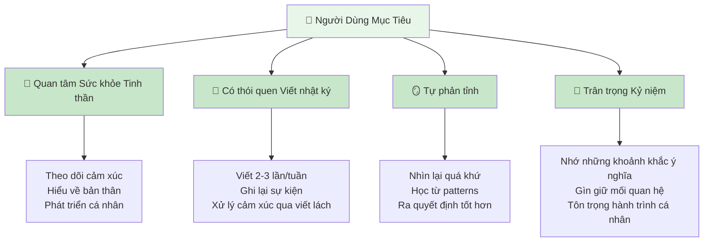
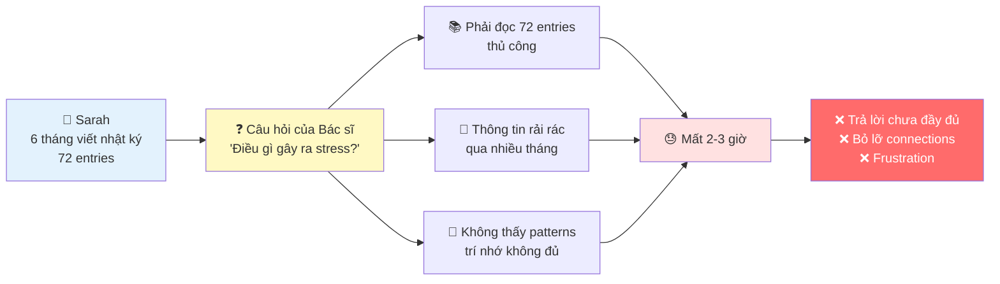
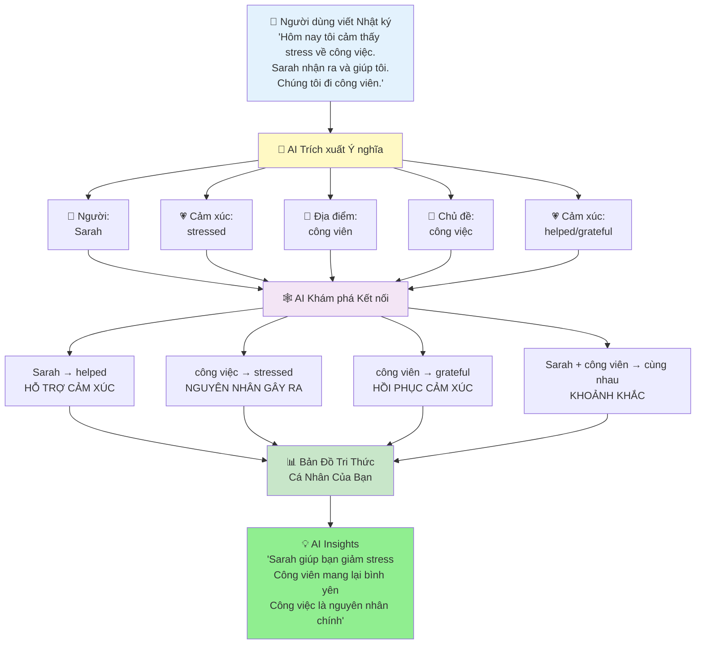
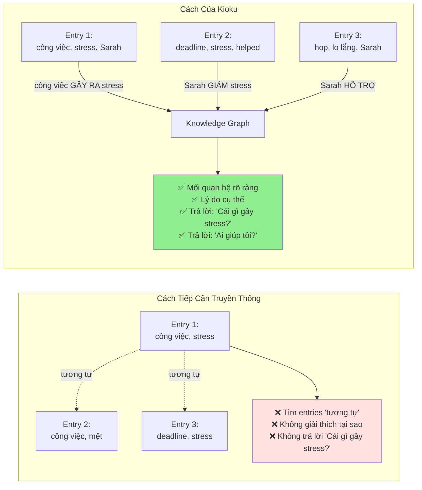
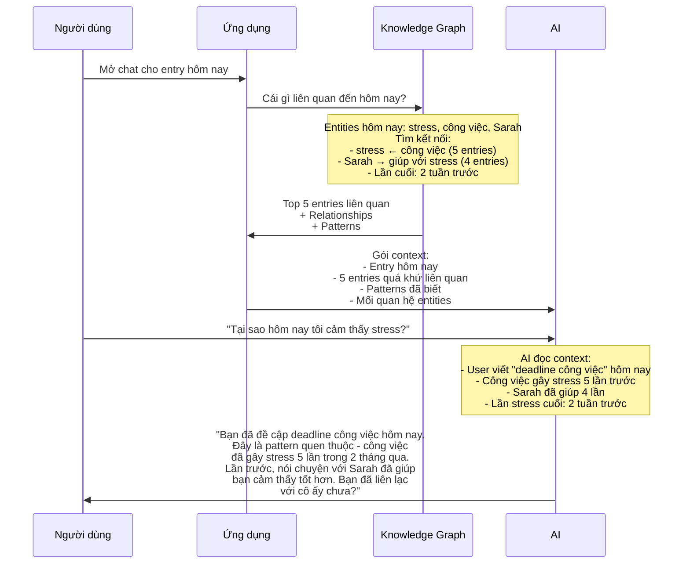
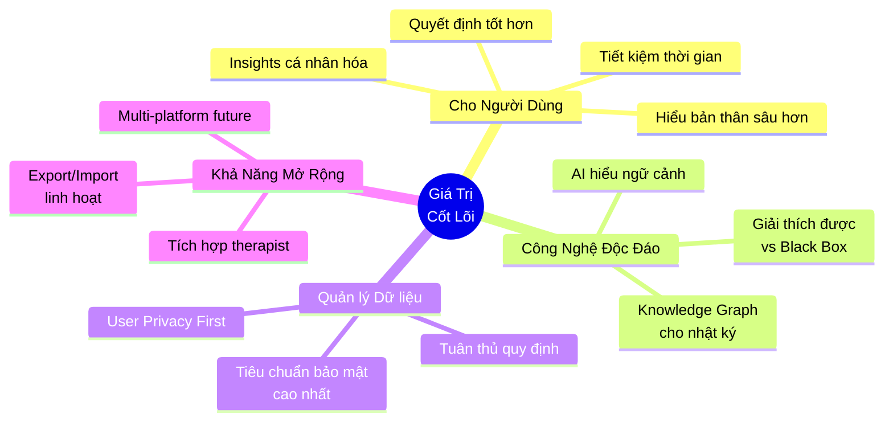

# Kioku - Nhật Ký AI cho Sức Khỏe Tinh Thần

## Giới Thiệu

**KIOKU - NHẬT KÝ AI**
*Kỷ Niệm Của Bạn, AI Nâng Cao*

Kioku là ứng dụng nhật ký thông minh sử dụng Knowledge Graph và AI để giúp người dùng hiểu sâu hơn về bản thân, phát hiện patterns cảm xúc, và nhận insights cá nhân hóa từ những kỷ niệm của họ.

---

## Người Dùng Mục Tiêu

**Ai được lợi nhiều nhất:**
- **Người quan tâm sức khỏe tinh thần** - Theo dõi patterns cảm xúc theo thời gian
- **Người yêu tự hoàn thiện** - Hiểu rõ hành trình phát triển cá nhân
- **Người bận rộn** - Nhận insights nhanh mà không cần đọc lại hàng tháng entries
- **Người giữ kỷ niệm** - Bảo tồn và tái khám phá những khoảnh khắc ý nghĩa

---

## Vấn Đề - Quá Tải Thông Tin

**Câu chuyện thực tế:**

> *Sarah viết nhật ký được 6 tháng. Cô viết 3 lần/tuần - tức là 72 entries, hơn 30,000 từ. Bác sĩ tâm lý hỏi: "Khi nào bạn cảm thấy stress nhất? Điều gì gây ra nó?"*

**Các Vấn Đề Cốt Lõi:**

### 1. Quá Tải Thông Tin
- Sau nhiều tháng viết nhật ký, entries chồng chất (50+ entries, 20K+ từ)
- Tìm kiếm trải nghiệm quá khứ trở nên quá tải
- Tìm kiếm thủ công mất hàng giờ, không phải vài phút

### 2. Mất Kết Nối
- Không nhớ: "Lần cuối cùng tôi vui với người yêu là khi nào?"
- Bỏ lỡ patterns: "Stress công việc có ảnh hưởng đến giấc ngủ không?"
- Quên ngữ cảnh: "Chuyện gì đang xảy ra khi tôi cảm thấy như vậy trước đây?"

### 3. AI Chung Chung Không Đủ
- ChatGPT/Claude không biết lịch sử cá nhân của bạn
- Chúng cho lời khuyên chung chung, không phải insights cá nhân hóa
- Không có ký ức về cảm xúc, mối quan hệ, sự kiện quá khứ của bạn

### 4. Lo Ngại Về Riêng Tư
- Các app nhật ký truyền thống lưu dữ liệu trên cloud
- Suy nghĩ riêng tư bị lộ ra trong data breaches
- Không kiểm soát được thông tin cá nhân

---

## Giải Pháp - AI Hiểu Câu Chuyện Của Bạn

### Cách Hoạt Động (Giải thích đơn giản)

1. **Bạn Viết** - Nhật ký bình thường, không cần format đặc biệt
2. **AI Đọc** - Trích xuất người, địa điểm, cảm xúc, sự kiện, chủ đề
3. **AI Kết Nối** - Tìm mối quan hệ giữa các yếu tố này
4. **AI Nhớ** - Xây dựng bản đồ tri thức cá nhân của bạn
5. **AI Trả Lời** - Sử dụng bản đồ này để đưa ra insights cá nhân hóa

### Ví dụ Cụ Thể

**Các entries:**
- **Entry 1 (5/1)**: "Stress về presentation. Sarah động viên tôi."
- **Entry 2 (20/1)**: "Deadline công việc làm tôi stress. Cà phê với Sarah đã giúp."
- **Entry 3 (10/2)**: "Cảm thấy lo lắng trước họp. Tin nhắn của Sarah làm tôi bình tĩnh."

**AI Khám Phá:**
- 🔗 **Pattern**: Sarah → giảm stress (3 lần)
- 🔗 **Trigger**: Công việc → gây stress (3 lần)
- 🔗 **Insight**: "Sarah là neo cảm xúc của bạn khi stress công việc"

---

## Tại Sao Knowledge Graph Phù Hợp Với Kỷ Niệm?

### 1. Kỷ Niệm Giàu Các Kết Nối Ẩn Ý

Dữ liệu truyền thống (ví dụ: giỏ hàng) là rõ ràng:
- Sản phẩm A + Sản phẩm B = thường mua cùng nhau

Nhưng kỷ niệm là ẩn ý:
- "Cảm thấy stress" → TẠI SAO? Công việc? Gia đình? Sức khỏe?
- "Sarah gọi điện" → VẬY THÌ SAO? Làm tôi vui? Làm phiền tôi?
- "Đi công viên" → NGỮ CẢNH? Với người yêu? Một mình? Healing walk?

**Knowledge Graph tiết lộ các kết nối ẩn:**
- "stress" ← GÂY RA BỞI ← "deadline công việc"
- "vui" ← ĐƯỢC KÍCH HOẠT BỞI ← "Sarah gọi điện"
- "công viên" ← HỒI PHỤC CHO ← "lo lắng"

### 2. Ngữ Cảnh Quan Trọng Để Hiểu Cảm Xúc

**Cùng một từ, nhưng ý nghĩa khác nhau:**

| Entry | Nội dung | Không có Ngữ cảnh | Với Knowledge Graph |
|-------|----------|-------------------|---------------------|
| **Entry 1** | "Sarah gọi điện, cảm thấy mệt" | Sarah + mệt (không liên quan?) | Sarah → hỗ trợ cảm xúc mệt ← GÂY RA BỞI công việc |
| **Entry 2** | "Sarah gọi điện, cảm thấy vui" | Sarah + vui (không liên quan?) | Sarah → kích hoạt niềm vui vui ← KẾT NỐI CẢM XÚC |

**Với Knowledge Graph, AI hiểu:**
- Sarah không chỉ là một cái tên - cô ấy là người hỗ trợ cảm xúc của bạn
- "mệt" không phải ngẫu nhiên - nó liên kết với stress công việc
- Những kết nối này giúp AI cho lời khuyên tốt hơn

### 3. Knowledge Graph Không Mới, Nhưng Hoàn Hảo Cho Nhật Ký

**Knowledge Graph đã được sử dụng trong:**
- Google Search (entities + relationships cho kết quả tìm kiếm)
- LinkedIn (người + kết nối cho networking)
- Hồ sơ y tế (triệu chứng + nguyên nhân cho chẩn đoán)

**Tại sao lý tưởng cho nhật ký:**

| Đặc điểm | Tại sao quan trọng cho Nhật ký |
|----------|-------------------------------|
| **Mối quan hệ rõ ràng** | Kỷ niệm có nguyên nhân-kết quả rõ ràng (stress → mất ngủ) |
| **Kết nối có loại** | Ý nghĩa khác nhau: cảm xúc vs thời gian vs nguyên nhân |
| **Giải thích được** | Người dùng thấy được TẠI SAO AI tạo kết nối |
| **Có thể query** | Có thể hỏi: "Cái gì gây lo lắng cho tôi?" |
| **Nhẹ** | Không cần ML models nặng, chạy trên thiết bị |

---

## Trải Nghiệm Người Dùng - AI Chat Hiểu Ngữ Cảnh

**Tình huống: Người dùng mở Chat**

### So Sánh Trải Nghiệm

**Trước Kioku (AI chung chung):**
> **User:** "Tại sao hôm nay tôi cảm thấy stress?"
>
> **ChatGPT:** "Stress có thể do nhiều yếu tố: công việc, mối quan hệ, sức khỏe. Hãy thử tập thể dục, thiền, hoặc nói chuyện với ai đó."
>
> ❌ Lời khuyên chung chung, không có ngữ cảnh cá nhân

**Với Kioku (AI hiểu ngữ cảnh):**
> **User:** "Tại sao hôm nay tôi cảm thấy stress?"
>
> **Kioku AI:** "Bạn đã đề cập deadline công việc hôm nay. Đây là một pattern - công việc đã gây stress 5 lần trong 2 tháng qua (3/2, 15/2, 1/3, 10/3, 18/3). Mỗi lần, nói chuyện với Sarah đều giúp bạn giảm stress. Lần stress cuối cách đây 2 tuần. Bạn đã liên lạc với Sarah hôm nay chưa?"
>
> ✅ Insight cá nhân hóa với bằng chứng
> ✅ Nhận diện pattern theo thời gian
> ✅ Gợi ý hành động dựa trên lịch sử của BẠN

---

## Giá Trị Cốt Lõi

### Lợi Ích Cạnh Tranh

#### 1. Trí Tuệ Cảm Xúc
- **AI chung**: "Hãy thử thiền" (áp dụng cho mọi người)
- **Kioku**: "Sarah giúp bạn giảm stress, gọi cô ấy" (cá nhân hóa)

#### 2. Quản lý Dữ liệu & Quyền Riêng Tư
- **Tích hợp vào nền tảng đáng tin cậy**: Dữ liệu được quản lý theo tiêu chuẩn bảo mật nghiêm ngặt
- **User Privacy First**: Kế thừa các cam kết bảo mật hiện có của nền tảng
- **Cloud LLM với kiểm soát**: AI xử lý qua Cloud API nhưng tuân thủ quy định bảo mật

#### 3. AI Giải Thích Được
- **Vector DB**: "Các entries này tương tự" (không có lý do)
- **Kioku**: "Kết nối qua Sarah → hỗ trợ cảm xúc" (lý do rõ ràng)

#### 4. Sở Hữu Dữ Liệu
- **Apps truyền thống**: Lock-in, không export được
- **Kioku**: Export JSON/Markdown bất cứ lúc nào, portable

---

## Tầm Nhìn

> **"Một người bạn đồng hành AI hiểu câu chuyện cuộc đời bạn như chính bạn - nhưng nhớ tốt hơn"**

**Các Giá Trị Cốt Lõi:**
- Bảo mật theo tiêu chuẩn cao nhất
- Trí tuệ cảm xúc tích hợp
- AI giải thích được, đáng tin cậy
- User sở hữu và kiểm soát data

### Tình Trạng Hiện Tại

- ✅ Prototype hoạt động (v0.1.0)
- ✅ Công nghệ đã chứng minh (119 entities, 105 relationships từ dữ liệu thực)
- ✅ Cloud LLM API integration hoạt động
- ✅ Định vị khác biệt (KG-based journal với explainable AI)

### Tại Sao Bây Giờ?

1. **Nhận thức sức khỏe tinh thần** ở mức cao kỷ lục sau đại dịch
2. **Khả năng AI** đủ trưởng thành để hiểu cảm xúc tinh tế
3. **Nền tảng đáng tin cậy** với tiêu chuẩn bảo mật nghiêm ngặt
4. **Khoảng trống thị trường**: Không đối thủ kết hợp KG + AI + emotional intelligence

---

## Kết Luận

### Điểm Chính

1. **Vấn đề rõ ràng**: Người dùng không nhớ được patterns trong 50+ entries
2. **Giải pháp đã chứng minh**: Knowledge Graph + AI = insights cảm xúc cá nhân hóa
3. **Khác biệt mạnh**: Privacy + Explainability + Emotional intelligence
4. **Thị trường lớn**: $5.2B mental wellness, tăng 15% YoY

### Điều Gì Làm Nên Đặc Biệt

- ✅ **Giải quyết vấn đề thực**: Hàng giờ review thủ công → instant AI insights
- ✅ **Đổi mới công nghệ**: Knowledge Graph cho nhật ký (không chỉ vectors)
- ✅ **Niềm tin người dùng**: Bảo mật theo tiêu chuẩn cao nhất, user kiểm soát data
- ✅ **Đã chứng minh**: Dữ liệu demo thực validate công nghệ