# Kioku - AI-Powered Mental Health Journal

## Introduction

**KIOKU - AI-POWERED JOURNAL**
*Your Memories, AI-Enhanced*

Kioku is an intelligent journaling application that uses Knowledge Graph and AI to help users gain deeper self-understanding, discover emotional patterns, and receive personalized insights from their memories.

---

## Target Users

```mermaid
graph TD
    User[🧘 Target Users]

    User --> Care[💚 Mental Health Conscious]
    User --> Habit[📔 Journaling Habit]
    User --> Reflect[🪞 Self-Reflective]
    User --> Treasure[💎 Memory Keepers]

    Care --> Detail1[Track emotions<br/>Understand themselves<br/>Personal development]
    Habit --> Detail2[Write 2-3 times/week<br/>Record events<br/>Process emotions through writing]
    Reflect --> Detail3[Review the past<br/>Learn from patterns<br/>Make better decisions]
    Treasure --> Detail4[Remember meaningful moments<br/>Preserve relationships<br/>Honor personal journey]

    style User fill:#e8f5e9
    style Care fill:#c8e6c9
    style Habit fill:#c8e6c9
    style Reflect fill:#c8e6c9
    style Treasure fill:#c8e6c9
```

**Who Benefits Most:**
- **Mental health conscious individuals** - Track emotional patterns over time
- **Self-improvement enthusiasts** - Understand personal growth journey
- **Busy professionals** - Get quick insights without reading months of entries
- **Memory keepers** - Preserve and rediscover meaningful moments

---

## Problem - Information Overload

**Real Story:**

> *Sarah has been journaling for 6 months. She writes 3 times/week - that's 72 entries, over 30,000 words. Her therapist asks: "When do you feel most stressed? What causes it?"*

```mermaid
graph LR
    Sarah[👤 Sarah<br/>6 months of journaling<br/>72 entries] --> Question[❓ Therapist's Question<br/>'What causes stress?']

    Question --> Problem1[📚 Must read 72 entries<br/>manually]
    Question --> Problem2[🧩 Information scattered<br/>across months]
    Question --> Problem3[🤔 Can't see patterns<br/>memory isn't enough]

    Problem1 --> Pain[😓 Takes 2-3 hours]
    Problem2 --> Pain
    Problem3 --> Pain

    Pain --> Result[❌ Incomplete answer<br/>❌ Missed connections<br/>❌ Frustration]

    style Sarah fill:#e3f2fd
    style Question fill:#fff9c4
    style Pain fill:#ffe1e1
    style Result fill:#ff6b6b,color:#fff
```

**Core Problems:**

### 1. Information Overload
- After months of journaling, entries pile up (50+ entries, 20K+ words)
- Searching past experiences becomes overwhelming
- Manual search takes hours, not minutes

### 2. Lost Connections
- Can't remember: "When was the last time I was happy with my partner?"
- Missing patterns: "Does work stress affect my sleep?"
- Forgotten context: "What was happening when I felt this way before?"

### 3. Generic AI Isn't Enough
- ChatGPT/Claude don't know your personal history
- They give generic advice, not personalized insights
- No memory of your emotions, relationships, past events

### 4. Privacy Concerns
- Traditional journal apps store data in the cloud
- Private thoughts exposed in data breaches
- No control over personal information

---

## Solution - AI That Understands Your Story

```mermaid
graph TB
    Write[📝 User writes Journal<br/>'Today I feel stressed about work.<br/>Sarah noticed and helped me.<br/>We went to the park.']

    Write --> Extract[🧠 AI Extracts Meaning]

    Extract --> Entity1[👤 Person:<br/>Sarah]
    Extract --> Entity2[💗 Emotion:<br/>stressed]
    Extract --> Entity3[📍 Place:<br/>park]
    Extract --> Entity4[💼 Topic:<br/>work]
    Extract --> Entity5[💗 Emotion:<br/>helped/grateful]

    Entity1 --> Connect[🕸️ AI Discovers Connections]
    Entity2 --> Connect
    Entity3 --> Connect
    Entity4 --> Connect
    Entity5 --> Connect

    Connect --> R1[Sarah → helped<br/>EMOTIONAL SUPPORT]
    Connect --> R2[work → stressed<br/>CAUSAL TRIGGER]
    Connect --> R3[park → grateful<br/>EMOTIONAL RECOVERY]
    Connect --> R4[Sarah + park → together<br/>MOMENT]

    R1 --> Graph[📊 Your Personal<br/>Knowledge Graph]
    R2 --> Graph
    R3 --> Graph
    R4 --> Graph

    Graph --> Insight[💡 AI Insights<br/>'Sarah helps you reduce stress<br/>Park brings peace<br/>Work is the main trigger']

    style Write fill:#e3f2fd
    style Extract fill:#fff9c4
    style Connect fill:#f3e5f5
    style Graph fill:#c8e6c9
    style Insight fill:#90EE90
```

### How It Works (Simple Explanation)

1. **You Write** - Normal journal entries, no special format needed
2. **AI Reads** - Extracts people, places, emotions, events, topics
3. **AI Connects** - Finds relationships between these elements
4. **AI Remembers** - Builds your personal knowledge map
5. **AI Responds** - Uses this map to provide personalized insights

### Concrete Example

**Journal Entries:**
- **Entry 1 (Jan 5)**: "Stressed about presentation. Sarah encouraged me."
- **Entry 2 (Jan 20)**: "Work deadline stressing me out. Coffee with Sarah helped."
- **Entry 3 (Feb 10)**: "Anxious before meeting. Sarah's text calmed me down."

**AI Discovers:**
- 🔗 **Pattern**: Sarah → reduces stress (3 times)
- 🔗 **Trigger**: Work → causes stress (3 times)
- 🔗 **Insight**: "Sarah is your emotional anchor during work stress"

---

## Why Knowledge Graph is Perfect for Memories?

### 1. Memories Are Rich with Implicit Connections

Traditional data (e.g., shopping carts) is explicit:
- Product A + Product B = often bought together

But memories are implicit:
- "Feeling stressed" → WHY? Work? Family? Health?
- "Sarah called" → SO WHAT? Made me happy? Annoyed me?
- "Went to park" → CONTEXT? With partner? Alone? Healing walk?

**Knowledge Graph reveals hidden connections:**
- "stress" ← CAUSED BY ← "work deadline"
- "happy" ← TRIGGERED BY ← "Sarah's call"
- "park" ← RECOVERY FOR ← "anxiety"

### 2. Context is Critical for Understanding Emotions

**Same word, different meanings:**

| Entry | Content | Without Context | With Knowledge Graph |
|-------|---------|----------------|---------------------|
| **Entry 1** | "Sarah called, feeling tired" | Sarah + tired (unrelated?) | Sarah → emotional support tired ↠CAUSED BY work |
| **Entry 2** | "Sarah called, feeling happy" | Sarah + happy (unrelated?) | Sarah → triggers joy happy ↠EMOTIONAL CONNECTION |

**With Knowledge Graph, AI understands:**
- Sarah isn't just a name - she's your emotional support person
- "tired" isn't random - it connects to work stress
- These connections help AI give better advice

### 3. Knowledge Graph Not New, But Perfect for Journals

**Knowledge Graph already used in:**
- Google Search (entities + relationships for search results)
- LinkedIn (people + connections for networking)
- Medical records (symptoms + causes for diagnosis)

**Why ideal for journals:**

| Feature | Why Important for Journals |
|---------|---------------------------|
| **Clear relationships** | Memories have obvious cause-effect (stress → insomnia) |
| **Typed connections** | Different meanings: emotional vs temporal vs causal |
| **Explainable** | Users see WHY AI makes connections |
| **Queryable** | Can ask: "What makes me anxious?" |
| **Lightweight** | No heavy ML models, runs on device |

---

## User Experience - Context-Aware AI Chat

**Scenario: User Opens Chat**

### Experience Comparison

**Before Kioku (Generic AI):**
> **User:** "Why am I stressed today?"
>
> **ChatGPT:** "Stress can be caused by many factors: work, relationships, health. Try exercise, meditation, or talking to someone."
>
> ❌ Generic advice, no personal context

**With Kioku (Context-Aware AI):**
> **User:** "Why am I stressed today?"
>
> **Kioku AI:** "You mentioned a work deadline today. This is a pattern - work has caused stress 5 times in the past 2 months (Feb 3, Feb 15, Mar 1, Mar 10, Mar 18). Each time, talking to Sarah helped you reduce stress. Your last stress episode was 2 weeks ago. Have you contacted Sarah today?"
>
> ✅ Personalized insights with evidence
> ✅ Recognizes patterns over time
> ✅ Suggests actions based on YOUR history

---

## Core Values

### Competitive Advantages

#### 1. Emotional Intelligence
- **Generic AI**: "Try meditation" (applies to everyone)
- **Kioku**: "Sarah helps you reduce stress, call her" (personalized)

#### 2. Data Management & Privacy
- **Integrated into trusted platform**: Data managed according to strict security standards
- **User Privacy First**: Inherits existing platform security commitments
- **Cloud LLM with control**: AI processes via Cloud API but complies with security regulations

#### 3. Explainable AI
- **Vector DB**: "These entries are similar" (no reason)
- **Kioku**: "Connected via Sarah → emotional support" (clear reason)

#### 4. Data Ownership
- **Traditional Apps**: Lock-in, can't export
- **Kioku**: Export JSON/Markdown anytime, portable

---

## Vision

> **"An AI companion that understands your life story like you do - but remembers better"**

**Core Values:**
- Security according to highest standards
- Integrated emotional intelligence
- Explainable, trustworthy AI
- User owns and controls data

### Current Status

- ✅ Working prototype (v0.1.0)
- ✅ Proven technology (119 entities, 105 relationships from real data)
- ✅ Cloud LLM API integration operational
- ✅ Unique positioning (KG-based journal with explainable AI)

### Why Now?

1. **Mental health awareness** at record highs post-pandemic
2. **AI capabilities** mature enough to understand subtle emotions
3. **Trusted platform** with strict security standards
4. **Market gap**: No competitor combines KG + AI + emotional intelligence

---

## Conclusion

### Key Points

1. **Clear problem**: Users can't remember patterns in 50+ entries
2. **Proven solution**: Knowledge Graph + AI = personalized emotional insights
3. **Strong differentiation**: Privacy + Explainability + Emotional intelligence
4. **Large market**: $5.2B mental wellness, growing 15% YoY

### What Makes This Special

- ✅ **Solves real problem**: Hours of manual review → instant AI insights
- ✅ **Technology innovation**: Knowledge Graph for journals (not just vectors)
- ✅ **User trust**: Security according to highest standards, user controls data
- ✅ **Proven**: Real demo data validates technology