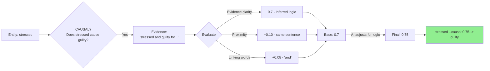

# Kioku Knowledge Graph - Technical Deep Dive

**2 Core Features Explained**

---

## Feature 1: Relationship Discovery

**📋 Overview - What This Feature Does:**

This feature automatically discovers meaningful connections between entities in your journal entries. When you write "Feeling stressed and guilty for not helping Sarah," the AI doesn't just extract entities (stressed, guilty, Sarah) - it understands that "stressed" CAUSES "guilty" and creates a typed relationship with confidence score and evidence.

**🎯 Key Objectives:**
1. **Identify relationship types**: 4 types (CAUSAL, EMOTIONAL, TEMPORAL, TOPICAL) with different weights
2. **Calculate confidence scores**: 0.0-1.0 based on evidence clarity, proximity, and linking words
3. **Store with evidence**: Each relationship has text excerpt proving the connection
4. **Build queryable graph**: "Show all causes of stress" becomes possible

**📖 Sections Covered:**
1. How AI creates relationships (4-question framework)
2. Understanding 4 relationship types (meanings, examples, weights, use cases)
3. Weight decision logic (confidence scoring algorithm)
4. Real example analysis: "stressed → guilty" (0.75 confidence)
5. Knowledge Graph view (105 relationships visualized)

**💡 Why This Matters:**
Unlike Vector DB which only finds "similar" entries, this creates explicit, typed, weighted connections with reasons. You can query "What makes me stressed?" and get causal relationships, not just semantic similarity.

---

### How AI Creates Relationships

```mermaid
sequenceDiagram
    participant User
    participant System
    participant AI
    participant Graph

    User->>System: Write entry "Feeling stressed and guilty..."
    System->>System: Extract entities: stressed, guilty, Sarah, Jake
    System->>AI: Analyze relationships between entities

    Note over AI: AI asks itself 4 questions:
    Note over AI: 1. TEMPORAL: Does A happen before/after B?
    Note over AI: 2. CAUSAL: Does A cause B?
    Note over AI: 3. EMOTIONAL: Does A → emotion B?
    Note over AI: 4. TOPICAL: Do A and B share topic?

    AI->>AI: Read evidence: "stressed and guilty for..."
    AI->>AI: Determine type: CAUSAL
    AI->>AI: Calculate confidence: 0.75

    AI->>System: Return relationship
    System->>Graph: Store: stressed --[causal:0.75]--> guilty
```

---

### 4 Relationship Types & Weights

```mermaid
graph TB
    subgraph "Relationship Types by Strength"
        CAUSAL["⭐⭐⭐⭐⭐ CAUSAL (0.9)<br/>A gây ra B<br/>stressed → guilty"]
        EMOTIONAL["⭐⭐⭐⭐ EMOTIONAL (0.7)<br/>Person/Event → Emotion<br/>Jake → frustrated"]
        TEMPORAL["⭐⭐⭐ TEMPORAL (0.5)<br/>A và B cùng thời điểm<br/>Sarah & Jake → home"]
        TOPICAL["⭐⭐ TOPICAL (0.4)<br/>A và B cùng chủ đề<br/>work-life balance → stressed"]
    end

    CAUSAL -->|Strongest| Usage1["Query: 'What causes stress?'<br/>→ Find all CAUSAL to stress"]
    EMOTIONAL -->|Strong| Usage2["Query: 'When happy?'<br/>→ Find all EMOTIONAL to happy"]
    TEMPORAL -->|Medium| Usage3["Timeline view:<br/>What happened together?"]
    TOPICAL -->|Weakest| Usage4["Topic exploration:<br/>Related themes"]
```

---

### Weight Decision Logic

```mermaid
graph TD
    Start[AI reads relationship] --> Check1{Evidence clarity}

    Check1 -->|Direct statement| High1[Base: 0.8]
    Check1 -->|Inferred| Med1[Base: 0.7]
    Check1 -->|Weak context| Low1[Base: 0.5]

    High1 --> Check2{Proximity}
    Med1 --> Check2
    Low1 --> Check2

    Check2 -->|Same sentence| High2[+0.10]
    Check2 -->|Next sentence| Med2[+0.05]
    Check2 -->|Different paragraph| Low2[+0.0]

    High2 --> Check3{Linking words}
    Med2 --> Check3
    Low2 --> Check3

    Check3 -->|caused, made me feel| High3[+0.15]
    Check3 -->|and, then, because| Med3[+0.08]
    Check3 -->|No link words| Low3[+0.0]

    High3 --> Final[Final Confidence]
    Med3 --> Final
    Low3 --> Final

    Final --> Filter{≥ 0.6?}
    Filter -->|Yes| Keep[✅ Keep relationship]
    Filter -->|No| Reject[❌ Filter out]

    style Keep fill:#90EE90
    style Reject fill:#FFB6C6
```

---

### Real Example: stressed → guilty

**Entry text:**
> "Feeling stressed and guilty for not being there to help Sarah with the kids while she was overwhelmed."

**AI Analysis Process:**

**Breakdown:**

1. **Type**: CAUSAL (A gây ra B)
2. **Evidence**: "stressed and guilty for not being there"
3. **Confidence**: 0.75
   - Evidence clarity: 0.7 (không nói trực tiếp "caused", nhưng logic rõ)
   - Proximity: +0.10 (cùng câu)
   - Linking word: +0.08 ("and" là medium link)
   - AI adjustment: Final 0.75 (logic nhân quả hợp lý)

---

## Feature 2: Context-Aware Chat (Finding Related Entries)

**📋 Overview - What This Feature Does:**

When you open chat for an entry (e.g., "Jake's checkup on Oct 25"), the system uses the Knowledge Graph to find the most relevant related entries. Instead of sending ALL 20 entries to AI (expensive, slow, irrelevant), it intelligently selects the TOP 5 most related entries through graph traversal, scoring, and filtering.

**🎯 Key Objectives:**
1. **Traverse the graph**: Follow entity relationships to discover connected entries
2. **Score by relevance**: Calculate scores based on relationship types and weights
3. **Apply recency decay**: Recent entries (< 7 days) matter more than old ones (> 30 days)
4. **Filter and rank**: Keep only top 5 entries with highest scores and clear reasons

**📖 Sections Covered:**
1. Phase 1: Graph traversal (10 entities → 156 scores → 19 unique entries)
2. Scoring example: Entity "happy" (how one entity contributes 8 relationship scores)
3. Score accumulation (one entry gets scores from multiple entities)
4. Phase 4: Filter, sort, limit → Top 5 (apply recency decay, filter threshold, rank)

**💡 Why This Matters:**

**Problem**: Sending all 20 entries to AI = 15K tokens, slow, irrelevant context.

**Solution**: Smart filtering via graph traversal:
- **Step 1**: 10 entities in current entry
- **Step 2**: Each entity has relationships (happy has 8, Sarah has 20+)
- **Step 3**: Follow relationships to find connected entries
- **Step 4**: Score each entry (CAUSAL: +0.9, EMOTIONAL: +0.7, etc.)
- **Step 5**: Apply recency decay (recent ×1.0, old ×0.5)
- **Result**: Top 5 entries (3-4K tokens) with explicit reasons

**Example**:
- User asks: "When was last quality time with Jake?"
- System finds: Entry Oct 25 scored 1.68 via "happy → taco night" + "Jake → checkup"
- AI receives: 1 current + 5 related entries (not all 20)
- AI answers: "October 25th, Jake's checkup + ice cream after"

**Key Advantage**: Explainable ("via emotional through happy") + Efficient (top 5 only) + Type-aware (causal > emotional > topical)

---

### Phase 1: Graph Traversal (Core Process)

```mermaid
graph TB
    Start[Current Entry: Oct 25<br/>Jake's checkup] --> Entities[10 entities:<br/>Sarah, Jake, Emma<br/>happy, nervous, chaotic<br/>checkup, taco night<br/>family time, development]

    Entities --> E1[Entity: happy]
    Entities --> E2[Entity: Sarah]
    Entities --> E3[Entity: Jake]
    Entities --> More[... 7 more entities]

    E1 --> R1[8 relationships:<br/>happy → pottery workshop 0.7<br/>happy → taco night 0.7<br/>happy → pizza night 0.7<br/>...]

    E2 --> R2[20 relationships:<br/>Sarah → pottery 0.4<br/>Sarah → farmers market 0.5<br/>...]

    E3 --> R3[17 relationships:<br/>Jake → soccer game 0.7<br/>Jake → tantrum 0.9<br/>...]

    R1 --> Entries1[Entry Oct 5<br/>Entry Oct 12<br/>Entry Oct 18]
    R2 --> Entries2[All 20 entries<br/>Sarah 100% coverage]
    R3 --> Entries3[Entry Oct 8<br/>Entry Oct 20<br/>...]

    Entries1 --> Score[156 scores total]
    Entries2 --> Score
    Entries3 --> Score
    More --> Score

    Score --> Unique[19 unique entries<br/>Many scores → same entry]

    style Score fill:#FFE4B5
    style Unique fill:#90EE90
```

---

### Scoring Example: Entity "happy"

```mermaid
graph LR
    Happy[Entity: happy<br/>in current entry] --> R1[Relationship 1:<br/>happy → pottery workshop<br/>type: EMOTIONAL, weight: 0.7]
    Happy --> R2[Relationship 2:<br/>happy → taco night<br/>type: EMOTIONAL, weight: 0.7]
    Happy --> R3[Relationship 3:<br/>happy → pizza night<br/>type: EMOTIONAL, weight: 0.7]
    Happy --> R4[... 5 more relationships]

    R1 --> Entry1[Entry Oct 5<br/>pottery workshop]
    R2 --> Entry2[Entry Oct 15<br/>taco night]
    R3 --> Entry3[Entry Oct 22<br/>pizza night]

    Entry1 -->|score: 0.7| S1[Oct 5: +0.7<br/>reason: via emotional through happy]
    Entry2 -->|score: 0.7| S2[Oct 15: +0.7<br/>reason: via emotional through happy]
    Entry3 -->|score: 0.7| S3[Oct 22: +0.7<br/>reason: via emotional through happy]

    style S1 fill:#90EE90
    style S2 fill:#90EE90
    style S3 fill:#90EE90
```

---

### Score Accumulation Across Entities

```mermaid
graph TB
    Entry[Entry Oct 5:<br/>Pottery workshop] --> Source1[From entity: happy<br/>via emotional → pottery workshop<br/>+0.7]
    Entry --> Source2[From entity: Sarah<br/>via topical → pottery workshop<br/>+0.4]
    Entry --> Source3[From entity: grateful<br/>via emotional → Sarah<br/>+0.7]
    Entry --> Source4[From entity: family time<br/>via topical → pottery<br/>+0.4]

    Source1 --> Sum[Total Score:<br/>0.7 + 0.4 + 0.7 + 0.4 = 2.2]
    Source2 --> Sum
    Source3 --> Sum
    Source4 --> Sum

    Sum --> Decay{Recency decay}
    Decay -->|20 days ago<br/>within 30 days| Factor[× 0.8]
    Factor --> Final[Final Score: 2.2 × 0.8 = 1.76]

    style Sum fill:#FFE4B5
    style Final fill:#90EE90
```

---

### Phase 4: Filter, Sort, Limit → Top 5

```mermaid
graph TB
    All[19 unique entries<br/>with accumulated scores] --> Filter{Filter<br/>score ≥ 0.3?}

    Filter -->|Yes| Pass[18 entries pass<br/>1 entry score 0.12 rejected]
    Filter -->|No| Reject[❌ 1 entry rejected]

    Pass --> Sort[Sort by score<br/>highest → lowest]

    Sort --> List["Sorted list:<br/>1. Oct 5: 1.76<br/>2. Oct 18: 1.52<br/>3. Oct 12: 1.45<br/>4. Oct 3: 1.32<br/>5. Oct 19: 1.28<br/>6. Oct 1: 0.95<br/>...<br/>18. Sep 15: 0.35"]

    List --> Limit[Take Top 5 only]

    Limit --> Result["✅ Final Result:<br/>5 related entries<br/>with scores + reasons"]

    style Result fill:#90EE90
    style Reject fill:#FFB6C6
```

---

## Why This Approach Works

### Comparison: Vector DB vs Knowledge Graph

| Aspect | Vector Database | Kioku Knowledge Graph |
|--------|-----------------|------------------------|
| **How it finds related entries** | Embed entry → cosine similarity | Traverse relationships in graph |
| **Explainability** | ❌ No reason why related | ✅ Reason: "via emotional through happy" |
| **Relationship types** | ❌ No distinction | ✅ 4 types: causal > emotional > temporal > topical |
| **Recency awareness** | ❌ No time decay | ✅ <7 days ×1.0, >30 days ×0.5 |
| **Evidence** | ❌ No source text | ✅ Evidence excerpt from original entry |
| **Query capability** | "Similar to X" | "What causes stress?", "When happy?" |

---

## Real Results from Demo Data

**Input**: Entry Oct 25 (Jake's checkup)
- 10 entities: Sarah, Jake, Emma, happy, nervous, chaotic, checkup, taco night, family time, childhood development

**Process**:
1. ✅ Phase 1: 156 scores from entity relationships
2. ✅ Combine: 156 scores → 19 unique entries
3. ✅ Phase 3: Recency decay applied
4. ✅ Phase 4: Filter (≥0.3) + Sort + Top 5

**Output**: Top 5 Related Entries
1. **Entry Oct 5** (score: 1.76) - "Connected via emotional through happy; via topical through Sarah"
2. **Entry Oct 18** (score: 1.52) - "Connected via emotional through Jake; via temporal through checkup"
3. **Entry Oct 12** (score: 1.45) - "Connected via emotional through Sarah; via topical through family time"
4. **Entry Oct 3** (score: 1.32) - "Connected via causal through stressed; via emotional through happy"
5. **Entry Oct 19** (score: 1.28) - "Connected via emotional through Emma; via topical through Jake"

**AI Context Package**:
- ✅ Current entry: 1 entry (Oct 25)
- ✅ Related entries: 5 entries (top scored)
- ✅ Entities: 10 entities from current entry
- ✅ Total relationships: 105 in entire graph

**User Query Example**:
> User: "When was the last quality time with Jake?"

**AI Response**:
> "October 25th - you took Jake to his 4-year checkup and got ice cream after. The related entries show you've been spending good family time with him: soccer game on Oct 8, pizza night on Oct 15, and taco night on Oct 22."

---

---

**Document Version**: 1.0
**Date**: October 29, 2025
**Based on**: Kioku v0.1.0 with real demo data (20 entries, 119 entities, 105 relationships)
