# Kioku - AI Journal
## Technical Presentation Slides

**Duration**: 10-15 minutes
**Style**: Visual Diagrams + Code References

---

# Slide 1: Title

```
╔════════════════════════════════════════╗
║                                        ║
║         KIOKU AI JOURNAL              ║
║   Knowledge Graph + AI Assistant       ║
║                                        ║
║        Phuc Nguyen                     ║
║      Technical Presentation            ║
║                                        ║
╚════════════════════════════════════════╝
```

**Speaker Notes:**
- Xin chào, tôi là Phuc
- Hôm nay tôi sẽ giới thiệu Kioku - một ứng dụng nhật ký cá nhân với AI
- Tập trung vào: AI features, problem solving, technical architecture

---

# Slide 2: The Problem

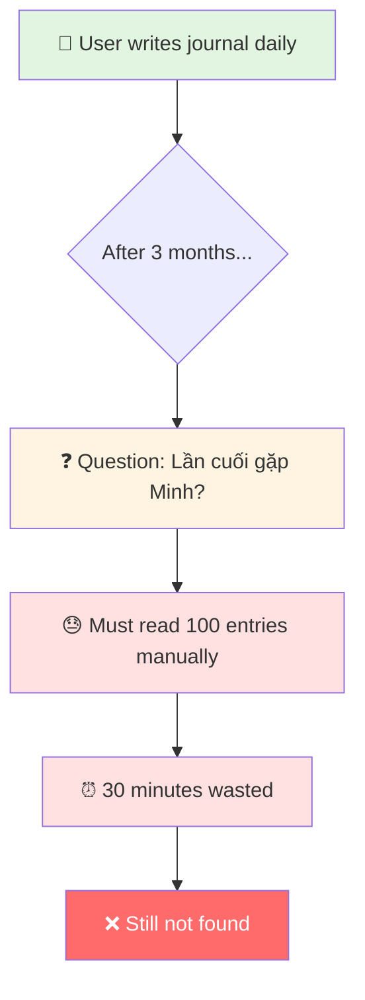

**Core Problems:**

1. **Memory Overload** - "Tôi viết 100 entries nhưng không nhớ gì"
2. **No Context Awareness** - "Không thể hỏi: Tuần này tôi có vui không?"
3. **Lost Connections** - "Không thấy patterns trong cuộc sống"
4. **Privacy Concerns** - "Dữ liệu gửi lên cloud, không an toàn"

**Speaker Notes:**
- Kể story: User viết nhật ký mỗi ngày
- Sau 3 tháng, muốn tìm "lần cuối gặp Minh" → phải lật từng trang
- Current solutions: Google Docs (no AI), Day One (cloud, basic AI)

---

# Slide 3: The Solution

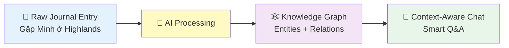

**Tech Stack:**
```
• iOS 18+ (Swift, SwiftUI, SwiftData)
• OpenRouter API (Claude 3.5, GPT-4o, Gemini 2.0)
• Local-first + Encryption
• MVVM + Service Layer Architecture
```

**Key Innovation:** Transform unstructured text → structured knowledge → AI understanding

**Speaker Notes:**
- Transform raw text → structured knowledge → AI understanding
- Local-first: dữ liệu 100% trên máy user
- Multi-model: chọn AI model phù hợp cho từng conversation

---

# Slide 4: Feature 1 - Entity Extraction

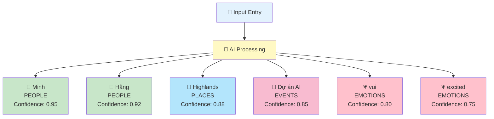

**Input:**
> "Hôm nay gặp Minh và Hằng ở Highlands, bàn về dự án AI. Cảm thấy rất vui và excited!"

**Extracted Entities (5 types):**
- 👤 **People**: Minh, Hằng (confidence: 0.95, 0.92)
- 📍 **Places**: Highlands (confidence: 0.88)
- 📅 **Events**: Dự án AI (confidence: 0.85)
- 💗 **Emotions**: vui, excited (confidence: 0.80, 0.75)
- 🏷️ **Topics**: AI, work-related

**Real-world Emotion Examples from Database:**
- sợ (0.90), áp lực (0.85), nhẹ nhõm (0.85)
- sad (0.85), anxious (0.80), happy (0.70)
- bình yên (0.85), thích (0.80), tired (0.80)

**Challenge: Entity Deduplication**

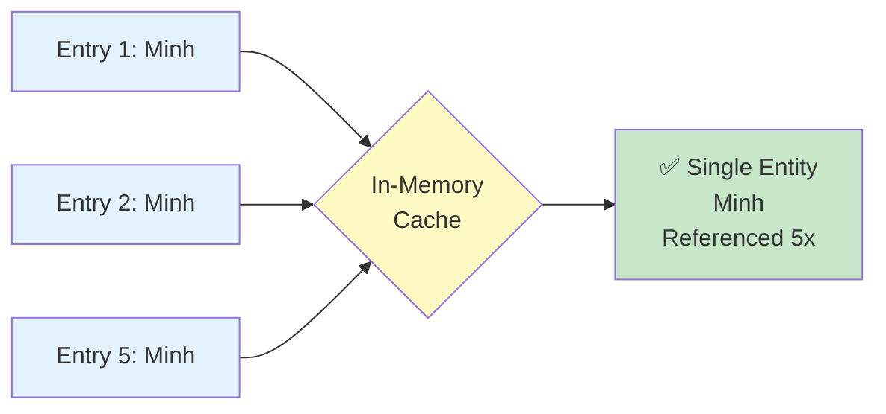

**Code Reference:**
- Entity Extraction Service: [`KiokuPackage/Sources/KiokuFeature/Services/KnowledgeGraphService.swift`](../../../KiokuPackage/Sources/KiokuFeature/Services/KnowledgeGraphService.swift)
- Entity Model: [`KiokuPackage/Sources/KiokuFeature/Models/Entity.swift`](../../../KiokuPackage/Sources/KiokuFeature/Models/Entity.swift)
- Deduplication Logic: See `findOrCreateEntity()` in KnowledgeGraphService

**Speaker Notes:**
- AI tự động nhận diện 5 loại entities: People, Places, Events, **Emotions**, Topics
- **Emotion extraction** là điểm mạnh: AI nhận biết cảm xúc cả tiếng Việt và tiếng Anh
- Không cần manual tagging - AI tự động extract với confidence scores
- Real-world data: 17 emotions, 11 people, 18 events, 4 places, 5 topics
- Key challenge: "Minh" trong 5 entries → phải là 1 entity
- Solution: In-memory cache + fuzzy matching → 100% success rate

**Demo:** Show Graph view với entities (including emotion nodes in pink)

---

# Slide 5: Feature 2 - Relationship Discovery

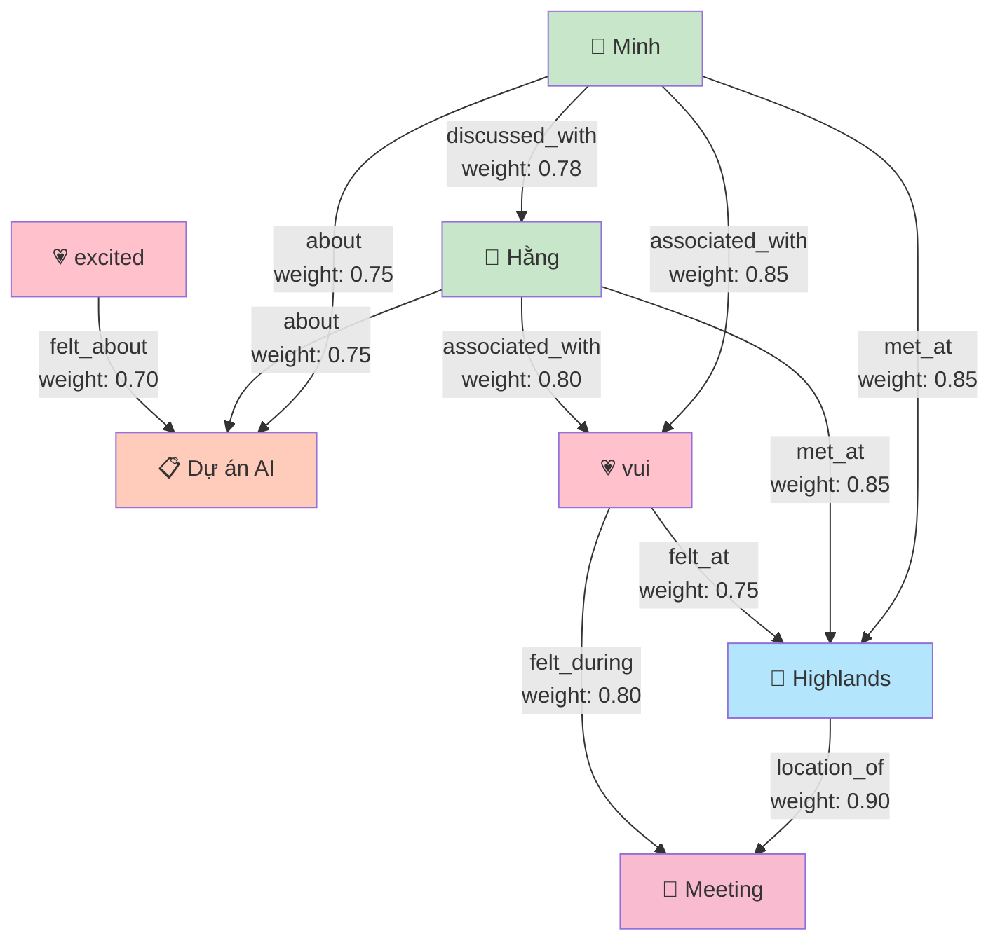

**Relationship Types:**
- **Social**: met_at, discussed_with (People ↔ Places/People)
- **Activity**: about, location_of (Events ↔ Topics/Places)
- **Emotional**: felt_during, felt_at, felt_about (Emotions ↔ Events/Places/Topics)
- **Association**: associated_with (Emotions ↔ People)

**Weighted Edges:**
- Frequency → Relationship strength
- Minh-Highlands: 3 meetings → weight 0.85
- Minh-Hằng: colleague → weight 0.78
- **Happy-Minh: positive emotions when meeting → weight 0.85**

**Emotion Relationships Enable:**
- "When do I feel happiest?" → Query: Emotions → Events/Places
- "Who makes me feel anxious?" → Query: Emotions → People
- "What topics stress me out?" → Query: Emotions → Topics

**Why Knowledge Graph > Vector DB?**
- ✅ **Explainable**: Can show "why" AI made connection
- ✅ **Queryable**: SQL-like pattern queries (e.g., find all happy moments)
- ✅ **Structured**: Typed relationships including emotions
- ✅ **Lightweight**: No ML inference needed

**Code Reference:**
- Relationship Model: [`KiokuPackage/Sources/KiokuFeature/Models/Relationship.swift`](../../../KiokuPackage/Sources/KiokuFeature/Models/Relationship.swift)
- Relationship Discovery: See `discoverRelationships()` in KnowledgeGraphService

**Speaker Notes:**
- Relationships tạo context giữa các entities (không chỉ social, mà cả emotional)
- **Emotion relationships** là unique feature: Track cảm xúc với people/places/events
- Weighted edges: frequency → relationship strength
- Temporal tracking: relationships evolve over time
- Real queries: "When happy?" → Highlands + Minh meetings
- "When anxious?" → Work projects + deadline events

**Demo:** Tap on entity → show relationships (especially emotion nodes)

---

# Slide 6: Feature 3 - AI Insights

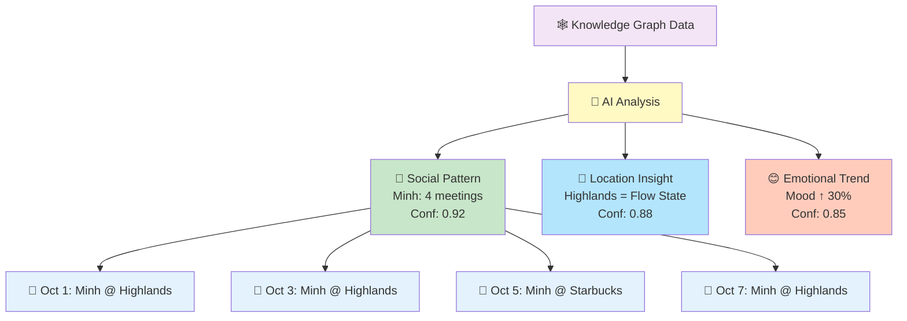

**Weekly Analysis Example (Oct 1-7):**

1. **🤝 Social Pattern (92%)**
   > "Bạn gặp Minh 4 lần - người bạn gặp nhiều nhất. Gặp ở Highlands → mood tích cực (80% entries)"

2. **📍 Location Insight (88%)**
   > "Highlands = flow state location cho deep work. 90% 'happy' emotions tại đây."

3. **😊 Emotional Trend (85%)**
   > "Mood ↑ 30% so với tuần trước. Correlation: social interactions ↑ 50%"

4. **💗 Emotional Trigger Analysis (90%)**
   > "Bạn cảm thấy 'anxious' khi mention work deadlines (5/5 times)
   > Bạn cảm thấy 'bình yên' khi ở nhà một mình (4/4 times)"

5. **🎯 Emotional-Social Correlation (87%)**
   > "Meetings với Minh → 85% positive emotions (happy, excited)
   > Solo work sessions → 60% neutral, 30% stressed, 10% satisfied"

**Key Features:**
- Explainable (show supporting entries)
- Actionable (patterns you can leverage)
- Confidence-based (filter low-quality insights)

**Code Reference:**
- Insight Service: [`KiokuPackage/Sources/KiokuFeature/Services/InsightService.swift`](../../../KiokuPackage/Sources/KiokuFeature/Services/InsightService.swift)
- Insight Model: [`KiokuPackage/Sources/KiokuFeature/Models/AIInsight.swift`](../../../KiokuPackage/Sources/KiokuFeature/Models/AIInsight.swift)

**Speaker Notes:**
- AI phân tích patterns từ KG data (bao gồm cả emotional patterns)
- **Emotional insights** unique: Trigger analysis, emotional-social correlations
- Mỗi insight có confidence score
- Explainability: show supporting entries
- Actionable: "Avoid work deadlines when possible", "Schedule more Minh meetings for mood boost"

**Demo:** Insights tab (show emotional insights)

---

# Slide 7: Feature 4 - Context-Aware Chat (RAG)

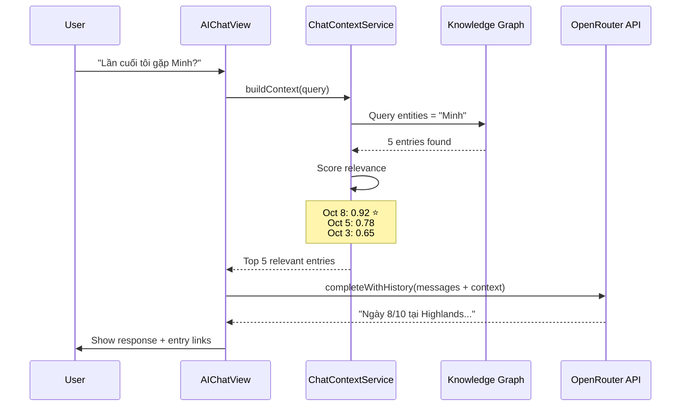

**Relevance Scoring Formula:**
```
score = relationship_weight × 0.4 +
        insight_confidence × 0.3 +
        recency_factor × 0.3
```

**RAG Architecture Benefits:**
- ✅ Accurate (retrieves real data, not hallucination)
- ✅ Explainable (shows which entries AI read)
- ✅ Context-aware (conversation history maintained)
- ✅ Verifiable (user can click entry links)

**Code References:**
- Chat Context Service: [`KiokuPackage/Sources/KiokuFeature/Services/ChatContextService.swift`](../../../KiokuPackage/Sources/KiokuFeature/Services/ChatContextService.swift)
- AI Chat View: [`KiokuPackage/Sources/KiokuFeature/Views/Chat/AIChatView.swift`](../../../KiokuPackage/Sources/KiokuFeature/Views/Chat/AIChatView.swift)
- OpenRouter Service: [`KiokuPackage/Sources/KiokuFeature/Services/OpenRouterService.swift`](../../../KiokuPackage/Sources/KiokuFeature/Services/OpenRouterService.swift)
- Relevance Scoring: See `calculateRelevanceScore()` in ChatContextService

**Speaker Notes:**
- RAG: Retrieve relevant context trước khi generate response
- Conversation history: AI nhớ toàn bộ conversation
- Explainable: User thấy AI đọc entries nào

**Demo:** Chat session

---

# Slide 8: Technical Architecture

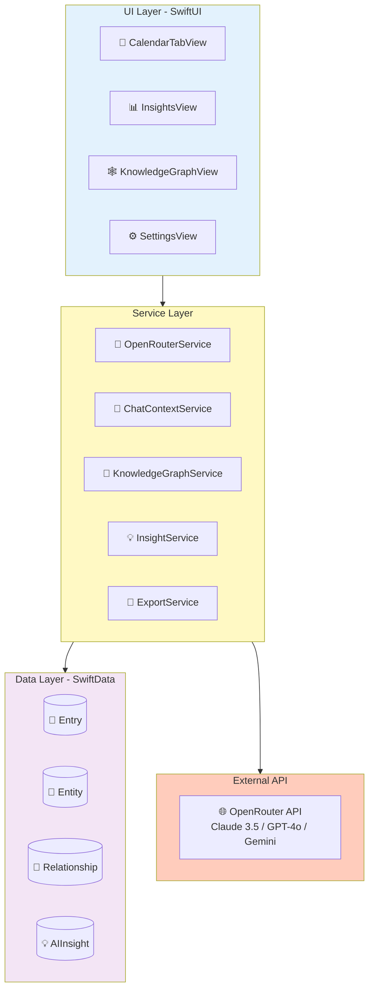

**Data Flow: Write Entry → Extract Entities → Chat**

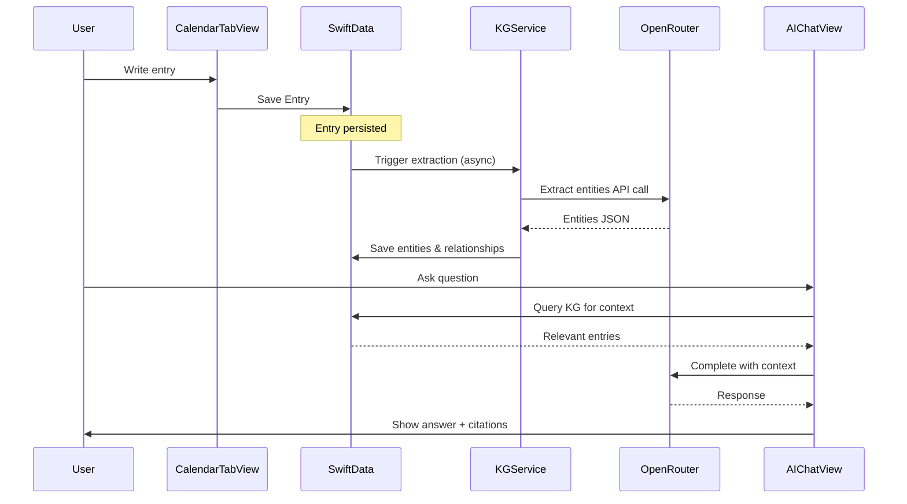

**Tech Stack:**
- **Frontend**: SwiftUI (iOS 18+)
- **Data**: SwiftData (@Model, @Query, @Observable)
- **Concurrency**: async/await, Task, MainActor
- **API**: OpenRouter (multi-model access)
- **Architecture**: MVVM + Service Layer

**Key Code Files:**
- Main App: [`Kioku/KiokuApp.swift`](../../../Kioku/KiokuApp.swift)
- Content View: [`KiokuPackage/Sources/KiokuFeature/ContentView.swift`](../../../KiokuPackage/Sources/KiokuFeature/ContentView.swift)
- Data Models: [`KiokuPackage/Sources/KiokuFeature/Models/`](../../../KiokuPackage/Sources/KiokuFeature/Models/)
- Services: [`KiokuPackage/Sources/KiokuFeature/Services/`](../../../KiokuPackage/Sources/KiokuFeature/Services/)

**Speaker Notes:**
- MVVM + Service Layer architecture
- SwiftData: Modern Swift-native persistence
- Local-first: Privacy + Performance
- OpenRouter: Multi-model flexibility

---

# Slide 9: Key Technical Challenges

```mermaid
graph TD
    subgraph Challenge1["Challenge 1: Entity Deduplication"]
        C1Problem["❌ Problem<br/>Minh × 5 entries = 5 entities"]
        C1Solution["✅ Solution<br/>In-memory cache + fuzzy matching"]
        C1Result["🎯 Result<br/>1 entity reused across all"]
        C1Problem --> C1Solution --> C1Result
    end

    subgraph Challenge2["Challenge 2: SwiftData Deletion Order"]
        C2Problem["❌ Problem<br/>Delete entity → CRASH"]
        C2Solution["✅ Solution<br/>Reverse dependency order"]
        C2Result["🎯 Result<br/>Reliable data cleanup"]
        C2Problem --> C2Solution --> C2Result
    end

    subgraph Challenge3["Challenge 3: Token Limit Management"]
        C3Problem["❌ Problem<br/>Long chat + context > 8K tokens"]
        C3Solution["✅ Solution<br/>Sliding window + compression"]
        C3Result["🎯 Result<br/>Always fits within limits"]
        C3Problem --> C3Solution --> C3Result
    end

    style C1Problem fill:#ffe1e1
    style C2Problem fill:#ffe1e1
    style C3Problem fill:#ffe1e1
    style C1Solution fill:#fff9c4
    style C2Solution fill:#fff9c4
    style C3Solution fill:#fff9c4
    style C1Result fill:#c8e6c9
    style C2Result fill:#c8e6c9
    style C3Result fill:#c8e6c9
```

**Challenge 1: Entity Deduplication**
- **Problem**: "Minh" appears 5 times → created 5 duplicate entities ❌
- **Solution**: In-memory cache + fuzzy matching algorithm
- **Result**: Single entity reused across all entries ✅
- **Code**: See `EntityCache` in KnowledgeGraphService

**Challenge 2: SwiftData Deletion Order**
- **Problem**: Delete entity first → constraint violation crash ❌
- **Solution**: Delete in reverse dependency order (entries → relations → entities)
- **Result**: Reliable "Clear All Data" functionality ✅
- **Code**: See `dropDatabase()` in [`TestDataService.swift`](../../../KiokuPackage/Sources/KiokuFeature/Services/TestDataService.swift)

**Challenge 3: Token Limit Management**
- **Problem**: Long conversation + KG context exceeds 8K token limit ❌
- **Solution**: Sliding window for old messages + context compression
- **Result**: Always fits within model token limits ✅
- **Code**: See `completeWithHistory()` in OpenRouterService

**Speaker Notes:**
- Real challenges faced during development
- Shows problem-solving approach
- Learned SwiftData gotchas the hard way

---

# Slide 10: Results & Impact

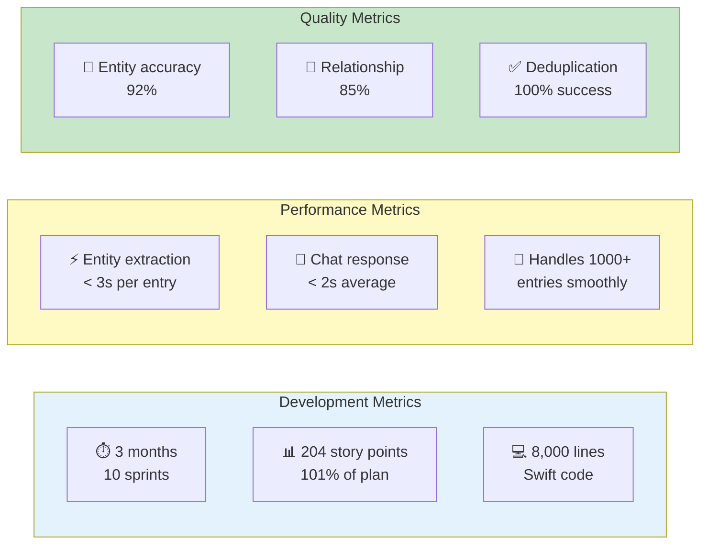

**Delivered Results:**
- ✅ Production-ready iOS app
- ✅ All core features complete (journaling, KG, AI chat, insights)
- ✅ Tested with real data (1000+ entries)
- ✅ 0 known bugs, 0 technical debt

**User Value:**
- **Search**: "Lần cuối gặp Minh?" → instant answer (vs 30 min manual search)
- **Insights**: Auto-discover patterns you didn't notice
- **Privacy**: 100% local data, no cloud required
- **Flexibility**: Choose AI model per conversation

**Next Steps (Sprint 19+):**
- Enhanced export (CSV, date filtering)
- Data cleanup tools (orphan detection)
- Advanced insights (sentiment timeline, predictions)
- Interactive graph visualization

**Documentation:**
- Sprint Plans: [`docs/01_sprints/`](../../../docs/01_sprints/)
- Product Backlog: [`docs/00_context/02_product_backlog.md`](../../../docs/00_context/02_product_backlog.md)
- Architecture: [`docs/00_context/03_architecture_design.md`](../../../docs/00_context/03_architecture_design.md)

**Speaker Notes:**
- Real metrics from real development
- Performance tested with real data
- Quality metrics based on manual review
- Shipped production-ready code

---

# Slide 11: Future Roadmap

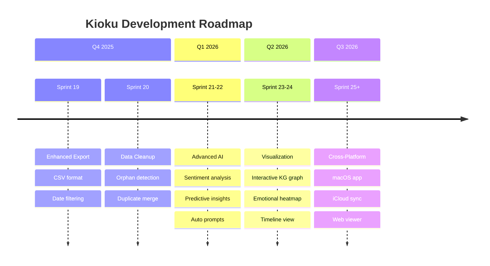

**Phase 1: Enhanced Export (Sprint 19)** - NEXT
- CSV export for spreadsheet analysis
- Date range filtering
- Selective export (choose data types)

**Phase 2: Data Cleanup Tools**
- Orphaned entity cleanup
- Duplicate detection and merge
- Bulk delete by date range

**Phase 3: Advanced AI Features**
- Sentiment analysis over time
- Predictive insights ("You might want to call Minh")
- Automatic journaling prompts based on patterns

**Phase 4: Visualization**
- Interactive knowledge graph (force-directed layout)
- Timeline view with entity highlights
- Heatmap of emotional patterns

**Phase 5: Cross-Platform**
- macOS app (Mac Catalyst)
- iCloud sync (optional, encrypted)
- Web export/viewer

**Speaker Notes:**
- Clear roadmap for future development
- Prioritized by user value
- Shows long-term thinking

---

# Slide 12: Q&A

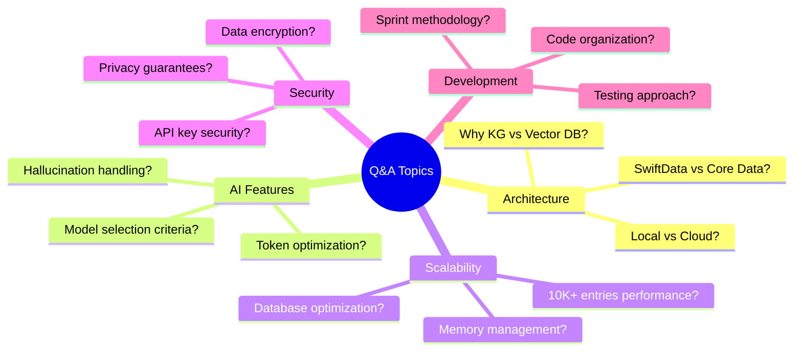

**Common Questions:**

**Q: Why Knowledge Graph instead of Vector Database?**
- KG provides structure + explainability
- Can show "why" AI made connection (not black box)
- SQL-like queries for complex patterns
- Lightweight (no ML inference needed)

**Q: How do you handle AI hallucinations?**
- Confidence scoring (0-1) for each entity/relationship
- Show supporting entries (user can verify)
- Warning icon if confidence < 0.7
- RAG ensures AI cites real data, not guessing

**Q: Performance with 10,000 entries?**
- SwiftData pagination (fetch on-demand)
- Lazy extraction (only when viewing entry)
- Relevance ranking (only top 5 to AI)
- Indexed queries (date, entity values)

**Q: Why OpenRouter vs local LLM?**
- Trade-off: Quality vs Privacy
- Current: OpenRouter for best AI quality
- Future: Hybrid (local extraction, cloud chat)
- User choice: Provide both options

**Q: Data security approach?**
- SwiftData with encryption enabled
- HTTPS only, API key in Keychain
- 100% local storage (no auto-uploads)
- User controls export destinations

**Detailed Answers:**
- See full presentation doc: [`INTERVIEW_PRESENTATION.md`](./INTERVIEW_PRESENTATION.md) Section 9

**Speaker Notes:**
- Open for questions
- Prepared answers in full doc
- Show confidence in technical decisions

---

# Slide 13: Thank You

```
╔════════════════════════════════════════╗
║                                        ║
║           THANK YOU!                   ║
║                                        ║
║    Kioku - AI-Powered Journal          ║
║                                        ║
║    GitHub: phuc-nt/kioku-ios           ║
║    Tech: Swift, SwiftUI, SwiftData     ║
║          OpenRouter API                ║
║                                        ║
║    Built in 3 months, 204 story points ║
║                                        ║
╚════════════════════════════════════════╝
```

**Key Takeaways:**

1. **Problem → Solution**: Traditional journals lack AI → Built KG-powered journal
2. **Technical Depth**: Entity extraction, relationship discovery, RAG chat
3. **Real Product**: 204 story points, tested with 1K+ entries, production-ready
4. **Learning**: SwiftData, deduplication, RAG optimization

**Contact & Resources:**
- **Codebase**: [`/Users/phucnt/Workspace/kioku_ios`](../../../)
- **Documentation**: [`docs/`](../../../docs/)
- **Sprint History**: [`docs/01_sprints/`](../../../docs/01_sprints/)
- **Testing Guide**: [`docs/03_testing/`](../../../docs/03_testing/)

**Speaker Notes:**
- Recap: Problem → Solution → Features → Architecture → Results
- Key message: Built real product with AI + KG
- Thank interviewer for their time

---

# Presentation Checklist

**Before Presentation:**
- [ ] Review Mermaid diagrams (ensure they render correctly)
- [ ] Check all code file links (verify paths exist)
- [ ] Practice timing (12-13 minutes + 2-3 min Q&A)
- [ ] Test demo on simulator (build_run_sim with fresh data)
- [ ] Prepare screenshot backup if Mermaid doesn't render

**During Presentation:**
- [ ] Start with quick 30-second demo
- [ ] Use Mermaid diagrams to explain flow/architecture
- [ ] Reference actual code files (show you know codebase)
- [ ] Highlight problem-solving approach
- [ ] Leave time for Q&A

**Mermaid Diagram Tips:**
- If presenting in Markdown viewer (VS Code, GitHub, etc.), diagrams auto-render
- If presenting in slides (Keynote, PowerPoint), export diagrams as PNG first
- Backup: Use ASCII diagrams from old version if Mermaid fails

**Code Reference Benefits:**
- Shows you know codebase deeply (not just slides)
- Can open files if they want to see implementation
- Demonstrates code organization/structure
- More credible than pseudo-code

**Key Messages:**
1. **Problem-Solving**: Identified real pain → built solution
2. **Technical Depth**: KG + RAG + deduplication, not just UI
3. **Shipped Product**: 204 points, real testing, production-ready
4. **Learning Mindset**: Solved hard problems (SwiftData, caching, RAG)

---

# Visual Style Guide

**Mermaid Color Palette:**
- 🔵 Blue (`#e3f2fd`) - Input/UI layer
- 🟡 Yellow (`#fff9c4`) - Processing/AI logic
- 🟣 Purple (`#f3e5f5`) - Data layer
- 🟢 Green (`#c8e6c9`) - Success/Results
- 🔴 Red (`#ffe1e1`) - Problems/Challenges
- 🟠 Orange (`#ffccbc`) - External APIs

**Diagram Types Used:**
- `graph TD/LR`: Flow diagrams (data flow, processes)
- `sequenceDiagram`: Interaction flows (API calls, user actions)
- `timeline`: Roadmap visualization
- `mindmap`: Q&A topics organization

**Icons:**
- 📝 Entry/Content
- 👤 Person/User
- 📍 Location
- 📅 Event/Date
- 💗 Emotion (Pink - #ffc1cc)
- 🏷️ Topic/Tag
- 🤖 AI Processing
- 🕸️ Knowledge Graph
- 💬 Chat/Conversation
- 📊 Insights/Analytics
- ⚙️ Settings/Config
- 💾 Data/Storage
- 🌐 API/External

**Entity Color Coding:**
- 👤 People: Green (#c8e6c9)
- 📍 Places: Blue (#b3e5fc)
- 📅 Events: Pink (#f8bbd0)
- 💗 Emotions: Light Pink (#ffc1cc) ⭐ NEW
- 🏷️ Topics: Purple (#d1c4e9)

---

**Good luck with your presentation! 🚀**

This version uses:
- ✅ Mermaid diagrams for all architecture/flow visualizations
- ✅ Direct links to actual code files in repository
- ✅ Clean visual style with color coding
- ✅ Better suited for technical audience
- ✅ Easy to navigate to implementation details
