# Kioku - AI Journal
## Technical Presentation Slides

**Duration**: 10-15 minutes
**Style**: Visual Diagrams + Code References

---

# Slide 1: Title

```
╔════════════════════════════════════════╗
║                                        ║
║         KIOKU AI JOURNAL              ║
║   Knowledge Graph + AI Assistant       ║
║                                        ║
║        Phuc Nguyen                     ║
║      Technical Presentation            ║
║                                        ║
╚════════════════════════════════════════╝
```

**Speaker Notes:**
- Xin chào, tôi là Phuc
- Hôm nay tôi sẽ giới thiệu Kioku - một ứng dụng nhật ký cá nhân với AI
- Tập trung vào: AI features, problem solving, technical architecture

---

# Slide 2: The Problem

```mermaid
graph TD
    A[👤 User writes journal daily] --> B{After 3 months...}
    B --> C[❓ Question: Lần cuối gặp Minh?]
    C --> D[😓 Must read 100 entries manually]
    D --> E[⏰ 30 minutes wasted]
    E --> F[❌ Still not found]

    style A fill:#e1f5e1
    style C fill:#fff4e1
    style D fill:#ffe1e1
    style E fill:#ffe1e1
    style F fill:#ff6b6b,color:#fff
```



**Core Problems:**

1. **Memory Overload** - "Tôi viết 100 entries nhưng không nhớ gì"
2. **No Context Awareness** - "Không thể hỏi: Tuần này tôi có vui không?"
3. **Lost Connections** - "Không thấy patterns trong cuộc sống"
4. **Privacy Concerns** - "Dữ liệu gửi lên cloud, không an toàn"

**Speaker Notes:**
- Kể story: User viết nhật ký mỗi ngày
- Sau 3 tháng, muốn tìm "lần cuối gặp Minh" → phải lật từng trang
- Current solutions: Google Docs (no AI), Day One (cloud, basic AI)

---

# Slide 3: The Solution

```mermaid
graph LR
    A[📝 Raw Journal Entry<br/>Gặp Minh ở Highlands] --> B[🧠 AI Processing]
    B --> C[🕸️ Knowledge Graph<br/>Entities + Relations]
    C --> D[💬 Context-Aware Chat<br/>Smart Q&A]

    style A fill:#e3f2fd
    style B fill:#fff9c4
    style C fill:#f3e5f5
    style D fill:#e8f5e9
```



**Tech Stack:**
```
• iOS 18+ (Swift, SwiftUI, SwiftData)
• OpenRouter API (Claude 3.5, GPT-4o, Gemini 2.0)
• Local-first + Encryption
• MVVM + Service Layer Architecture
```

**Key Innovation:** Transform unstructured text → structured knowledge → AI understanding

**Speaker Notes:**
- Transform raw text → structured knowledge → AI understanding
- Local-first: dữ liệu 100% trên máy user
- Multi-model: chọn AI model phù hợp cho từng conversation

---

# Slide 4: Feature 1 - Entity Extraction

```mermaid
graph TD
    A[📝 Input Entry] --> B[🤖 AI Processing]
    B --> C1[👤 Minh<br/>PERSON<br/>Confidence: 0.95]
    B --> C2[👤 Hằng<br/>PERSON<br/>Confidence: 0.92]
    B --> C3[📍 Highlands<br/>LOCATION<br/>Confidence: 0.88]
    B --> C4[📅 Dự án AI<br/>EVENT<br/>Confidence: 0.85]

    style A fill:#e3f2fd
    style B fill:#fff9c4
    style C1 fill:#c8e6c9
    style C2 fill:#c8e6c9
    style C3 fill:#b3e5fc
    style C4 fill:#f8bbd0
```



**Input:**
> "Hôm nay gặp Minh và Hằng ở Highlands, bàn về dự án AI"

**Challenge: Entity Deduplication**

```mermaid
graph LR
    E1[Entry 1: Minh] --> Cache{In-Memory<br/>Cache}
    E2[Entry 2: Minh] --> Cache
    E3[Entry 5: Minh] --> Cache
    Cache --> Result[✅ Single Entity<br/>Minh<br/>Referenced 5x]

    style E1 fill:#e3f2fd
    style E2 fill:#e3f2fd
    style E3 fill:#e3f2fd
    style Cache fill:#fff9c4
    style Result fill:#c8e6c9
```



**Code Reference:**
- Entity Extraction Service: [`KiokuPackage/Sources/KiokuFeature/Services/KnowledgeGraphService.swift`](../../../KiokuPackage/Sources/KiokuFeature/Services/KnowledgeGraphService.swift)
- Entity Model: [`KiokuPackage/Sources/KiokuFeature/Models/Entity.swift`](../../../KiokuPackage/Sources/KiokuFeature/Models/Entity.swift)
- Deduplication Logic: See `findOrCreateEntity()` in KnowledgeGraphService

**Speaker Notes:**
- AI tự động nhận diện người, địa điểm, sự kiện
- Không cần manual tagging
- Key challenge: "Minh" trong 5 entries → phải là 1 entity
- Solution: In-memory cache + fuzzy matching → 100% success rate

**Demo:** Show Graph view với entities

---

# Slide 5: Feature 2 - Relationship Discovery

```mermaid
graph TD
    Minh[👤 Minh] -->|met_at<br/>weight: 0.85| Highlands[📍 Highlands]
    Hang[👤 Hằng] -->|met_at<br/>weight: 0.85| Highlands
    Minh -->|discussed_with<br/>weight: 0.78| Hang
    Highlands -->|location_of<br/>weight: 0.90| Meeting[📅 Meeting]
    Minh -->|about<br/>weight: 0.75| Project[📋 Dự án AI]
    Hang -->|about<br/>weight: 0.75| Project

    style Minh fill:#c8e6c9
    style Hang fill:#c8e6c9
    style Highlands fill:#b3e5fc
    style Meeting fill:#f8bbd0
    style Project fill:#ffccbc
```



**Weighted Edges:**
- Frequency → Relationship strength
- Minh-Highlands: 3 meetings → weight 0.85
- Minh-Hằng: colleague → weight 0.78

**Why Knowledge Graph > Vector DB?**
- ✅ **Explainable**: Can show "why" AI made connection
- ✅ **Queryable**: SQL-like pattern queries
- ✅ **Structured**: Typed relationships
- ✅ **Lightweight**: No ML inference needed

**Code Reference:**
- Relationship Model: [`KiokuPackage/Sources/KiokuFeature/Models/Relationship.swift`](../../../KiokuPackage/Sources/KiokuFeature/Models/Relationship.swift)
- Relationship Discovery: See `discoverRelationships()` in KnowledgeGraphService

**Speaker Notes:**
- Relationships tạo context giữa các entities
- Weighted edges: frequency → relationship strength
- Temporal tracking: relationships evolve over time

**Demo:** Tap on entity → show relationships

---

# Slide 6: Feature 3 - AI Insights

```mermaid
graph TD
    KG[🕸️ Knowledge Graph Data] --> Analysis[🤖 AI Analysis]
    Analysis --> I1[🤝 Social Pattern<br/>Minh: 4 meetings<br/>Conf: 0.92]
    Analysis --> I2[📍 Location Insight<br/>Highlands = Flow State<br/>Conf: 0.88]
    Analysis --> I3[😊 Emotional Trend<br/>Mood ↑ 30%<br/>Conf: 0.85]

    I1 --> Support1[📝 Oct 1: Minh @ Highlands]
    I1 --> Support2[📝 Oct 3: Minh @ Highlands]
    I1 --> Support3[📝 Oct 5: Minh @ Starbucks]
    I1 --> Support4[📝 Oct 7: Minh @ Highlands]

    style KG fill:#f3e5f5
    style Analysis fill:#fff9c4
    style I1 fill:#c8e6c9
    style I2 fill:#b3e5fc
    style I3 fill:#ffccbc
    style Support1 fill:#e3f2fd
    style Support2 fill:#e3f2fd
    style Support3 fill:#e3f2fd
    style Support4 fill:#e3f2fd
```



**Weekly Analysis Example (Oct 1-7):**

1. **🤝 Social Pattern (92%)**
   > "Bạn gặp Minh 4 lần - người bạn gặp nhiều nhất. Gặp ở Highlands → mood tích cực (80% entries)"

2. **📍 Location Insight (88%)**
   > "Highlands = flow state location cho deep work"

3. **😊 Emotional Trend (85%)**
   > "Mood ↑ 30% so với tuần trước. Correlation: social interactions ↑ 50%"

**Key Features:**
- Explainable (show supporting entries)
- Actionable (patterns you can leverage)
- Confidence-based (filter low-quality insights)

**Code Reference:**
- Insight Service: [`KiokuPackage/Sources/KiokuFeature/Services/InsightService.swift`](../../../KiokuPackage/Sources/KiokuFeature/Services/InsightService.swift)
- Insight Model: [`KiokuPackage/Sources/KiokuFeature/Models/AIInsight.swift`](../../../KiokuPackage/Sources/KiokuFeature/Models/AIInsight.swift)

**Speaker Notes:**
- AI phân tích patterns từ KG data
- Mỗi insight có confidence score
- Explainability: show supporting entries

**Demo:** Insights tab

---

# Slide 7: Feature 4 - Context-Aware Chat (RAG)

```mermaid
sequenceDiagram
    participant User
    participant Chat as AIChatView
    participant Context as ChatContextService
    participant KG as Knowledge Graph
    participant AI as OpenRouter API

    User->>Chat: "Lần cuối tôi gặp Minh?"
    Chat->>Context: buildContext(query)
    Context->>KG: Query entities = "Minh"
    KG-->>Context: 5 entries found
    Context->>Context: Score relevance
    Note over Context: Oct 8: 0.92 ⭐<br/>Oct 5: 0.78<br/>Oct 3: 0.65
    Context-->>Chat: Top 5 relevant entries
    Chat->>AI: completeWithHistory(messages + context)
    AI-->>Chat: "Ngày 8/10 tại Highlands..."
    Chat->>User: Show response + entry links
```



**Relevance Scoring Formula:**
```
score = relationship_weight × 0.4 +
        insight_confidence × 0.3 +
        recency_factor × 0.3
```

**RAG Architecture Benefits:**
- ✅ Accurate (retrieves real data, not hallucination)
- ✅ Explainable (shows which entries AI read)
- ✅ Context-aware (conversation history maintained)
- ✅ Verifiable (user can click entry links)

**Code References:**
- Chat Context Service: [`KiokuPackage/Sources/KiokuFeature/Services/ChatContextService.swift`](../../../KiokuPackage/Sources/KiokuFeature/Services/ChatContextService.swift)
- AI Chat View: [`KiokuPackage/Sources/KiokuFeature/Views/Chat/AIChatView.swift`](../../../KiokuPackage/Sources/KiokuFeature/Views/Chat/AIChatView.swift)
- OpenRouter Service: [`KiokuPackage/Sources/KiokuFeature/Services/OpenRouterService.swift`](../../../KiokuPackage/Sources/KiokuFeature/Services/OpenRouterService.swift)
- Relevance Scoring: See `calculateRelevanceScore()` in ChatContextService

**Speaker Notes:**
- RAG: Retrieve relevant context trước khi generate response
- Conversation history: AI nhớ toàn bộ conversation
- Explainable: User thấy AI đọc entries nào

**Demo:** Chat session

---

# Slide 8: Technical Architecture


**Data Flow: Write Entry → Extract Entities → Chat**


**Tech Stack:**
- **Frontend**: SwiftUI (iOS 18+)
- **Data**: SwiftData (@Model, @Query, @Observable)
- **Concurrency**: async/await, Task, MainActor
- **API**: OpenRouter (multi-model access)
- **Architecture**: MVVM + Service Layer

**Key Code Files:**
- Main App: [`Kioku/KiokuApp.swift`](../../../Kioku/KiokuApp.swift)
- Content View: [`KiokuPackage/Sources/KiokuFeature/ContentView.swift`](../../../KiokuPackage/Sources/KiokuFeature/ContentView.swift)
- Data Models: [`KiokuPackage/Sources/KiokuFeature/Models/`](../../../KiokuPackage/Sources/KiokuFeature/Models/)
- Services: [`KiokuPackage/Sources/KiokuFeature/Services/`](../../../KiokuPackage/Sources/KiokuFeature/Services/)

**Speaker Notes:**
- MVVM + Service Layer architecture
- SwiftData: Modern Swift-native persistence
- Local-first: Privacy + Performance
- OpenRouter: Multi-model flexibility

---

# Slide 9: Key Technical Challenges

```mermaid
graph TD
    subgraph Challenge1["Challenge 1: Entity Deduplication"]
        C1Problem["❌ Problem<br/>Minh × 5 entries = 5 entities"]
        C1Solution["✅ Solution<br/>In-memory cache + fuzzy matching"]
        C1Result["🎯 Result<br/>1 entity reused across all"]
        C1Problem --> C1Solution --> C1Result
    end

    subgraph Challenge2["Challenge 2: SwiftData Deletion Order"]
        C2Problem["❌ Problem<br/>Delete entity → CRASH"]
        C2Solution["✅ Solution<br/>Reverse dependency order"]
        C2Result["🎯 Result<br/>Reliable data cleanup"]
        C2Problem --> C2Solution --> C2Result
    end

    subgraph Challenge3["Challenge 3: Token Limit Management"]
        C3Problem["❌ Problem<br/>Long chat + context > 8K tokens"]
        C3Solution["✅ Solution<br/>Sliding window + compression"]
        C3Result["🎯 Result<br/>Always fits within limits"]
        C3Problem --> C3Solution --> C3Result
    end

    style C1Problem fill:#ffe1e1
    style C2Problem fill:#ffe1e1
    style C3Problem fill:#ffe1e1
    style C1Solution fill:#fff9c4
    style C2Solution fill:#fff9c4
    style C3Solution fill:#fff9c4
    style C1Result fill:#c8e6c9
    style C2Result fill:#c8e6c9
    style C3Result fill:#c8e6c9
```



**Challenge 1: Entity Deduplication**
- **Problem**: "Minh" appears 5 times → created 5 duplicate entities ❌
- **Solution**: In-memory cache + fuzzy matching algorithm
- **Result**: Single entity reused across all entries ✅
- **Code**: See `EntityCache` in KnowledgeGraphService

**Challenge 2: SwiftData Deletion Order**
- **Problem**: Delete entity first → constraint violation crash ❌
- **Solution**: Delete in reverse dependency order (entries → relations → entities)
- **Result**: Reliable "Clear All Data" functionality ✅
- **Code**: See `dropDatabase()` in [`TestDataService.swift`](../../../KiokuPackage/Sources/KiokuFeature/Services/TestDataService.swift)

**Challenge 3: Token Limit Management**
- **Problem**: Long conversation + KG context exceeds 8K token limit ❌
- **Solution**: Sliding window for old messages + context compression
- **Result**: Always fits within model token limits ✅
- **Code**: See `completeWithHistory()` in OpenRouterService

**Speaker Notes:**
- Real challenges faced during development
- Shows problem-solving approach
- Learned SwiftData gotchas the hard way

---

# Slide 10: Results & Impact

```mermaid
graph LR
    subgraph Development["Development Metrics"]
        D1[⏱️ 3 months<br/>10 sprints]
        D2[📊 204 story points<br/>101% of plan]
        D3[💻 8,000 lines<br/>Swift code]
    end

    subgraph Performance["Performance Metrics"]
        P1[⚡ Entity extraction<br/>< 3s per entry]
        P2[💬 Chat response<br/>< 2s average]
        P3[💾 Handles 1000+<br/>entries smoothly]
    end

    subgraph Quality["Quality Metrics"]
        Q1[🎯 Entity accuracy<br/>92%]
        Q2[🔗 Relationship<br/>85%]
        Q3[✅ Deduplication<br/>100% success]
    end

    style Development fill:#e3f2fd
    style Performance fill:#fff9c4
    style Quality fill:#c8e6c9
```



**Delivered Results:**
- ✅ Production-ready iOS app
- ✅ All core features complete (journaling, KG, AI chat, insights)
- ✅ Tested with real data (1000+ entries)
- ✅ 0 known bugs, 0 technical debt

**User Value:**
- **Search**: "Lần cuối gặp Minh?" → instant answer (vs 30 min manual search)
- **Insights**: Auto-discover patterns you didn't notice
- **Privacy**: 100% local data, no cloud required
- **Flexibility**: Choose AI model per conversation

**Next Steps (Sprint 19+):**
- Enhanced export (CSV, date filtering)
- Data cleanup tools (orphan detection)
- Advanced insights (sentiment timeline, predictions)
- Interactive graph visualization

**Documentation:**
- Sprint Plans: [`docs/01_sprints/`](../../../docs/01_sprints/)
- Product Backlog: [`docs/00_context/02_product_backlog.md`](../../../docs/00_context/02_product_backlog.md)
- Architecture: [`docs/00_context/03_architecture_design.md`](../../../docs/00_context/03_architecture_design.md)

**Speaker Notes:**
- Real metrics from real development
- Performance tested with real data
- Quality metrics based on manual review
- Shipped production-ready code

---

# Slide 11: Future Roadmap


**Phase 1: Enhanced Export (Sprint 19)** - NEXT
- CSV export for spreadsheet analysis
- Date range filtering
- Selective export (choose data types)

**Phase 2: Data Cleanup Tools**
- Orphaned entity cleanup
- Duplicate detection and merge
- Bulk delete by date range

**Phase 3: Advanced AI Features**
- Sentiment analysis over time
- Predictive insights ("You might want to call Minh")
- Automatic journaling prompts based on patterns

**Phase 4: Visualization**
- Interactive knowledge graph (force-directed layout)
- Timeline view with entity highlights
- Heatmap of emotional patterns

**Phase 5: Cross-Platform**
- macOS app (Mac Catalyst)
- iCloud sync (optional, encrypted)
- Web export/viewer

**Speaker Notes:**
- Clear roadmap for future development
- Prioritized by user value
- Shows long-term thinking

---

# Slide 12: Q&A


**Common Questions:**

**Q: Why Knowledge Graph instead of Vector Database?**
- KG provides structure + explainability
- Can show "why" AI made connection (not black box)
- SQL-like queries for complex patterns
- Lightweight (no ML inference needed)

**Q: How do you handle AI hallucinations?**
- Confidence scoring (0-1) for each entity/relationship
- Show supporting entries (user can verify)
- Warning icon if confidence < 0.7
- RAG ensures AI cites real data, not guessing

**Q: Performance with 10,000 entries?**
- SwiftData pagination (fetch on-demand)
- Lazy extraction (only when viewing entry)
- Relevance ranking (only top 5 to AI)
- Indexed queries (date, entity values)

**Q: Why OpenRouter vs local LLM?**
- Trade-off: Quality vs Privacy
- Current: OpenRouter for best AI quality
- Future: Hybrid (local extraction, cloud chat)
- User choice: Provide both options

**Q: Data security approach?**
- SwiftData with encryption enabled
- HTTPS only, API key in Keychain
- 100% local storage (no auto-uploads)
- User controls export destinations

**Detailed Answers:**
- See full presentation doc: [`INTERVIEW_PRESENTATION.md`](./INTERVIEW_PRESENTATION.md) Section 9

**Speaker Notes:**
- Open for questions
- Prepared answers in full doc
- Show confidence in technical decisions

---

# Slide 13: Thank You

```
╔════════════════════════════════════════╗
║                                        ║
║           THANK YOU!                   ║
║                                        ║
║    Kioku - AI-Powered Journal          ║
║                                        ║
║    GitHub: phuc-nt/kioku-ios           ║
║    Tech: Swift, SwiftUI, SwiftData     ║
║          OpenRouter API                ║
║                                        ║
║    Built in 3 months, 204 story points ║
║                                        ║
╚════════════════════════════════════════╝
```

**Key Takeaways:**

1. **Problem → Solution**: Traditional journals lack AI → Built KG-powered journal
2. **Technical Depth**: Entity extraction, relationship discovery, RAG chat
3. **Real Product**: 204 story points, tested with 1K+ entries, production-ready
4. **Learning**: SwiftData, deduplication, RAG optimization

**Contact & Resources:**
- **Codebase**: [`/Users/phucnt/Workspace/kioku_ios`](../../../)
- **Documentation**: [`docs/`](../../../docs/)
- **Sprint History**: [`docs/01_sprints/`](../../../docs/01_sprints/)
- **Testing Guide**: [`docs/03_testing/`](../../../docs/03_testing/)

**Speaker Notes:**
- Recap: Problem → Solution → Features → Architecture → Results
- Key message: Built real product with AI + KG
- Thank interviewer for their time

---

# Presentation Checklist

**Before Presentation:**
- [ ] Review Mermaid diagrams (ensure they render correctly)
- [ ] Check all code file links (verify paths exist)
- [ ] Practice timing (12-13 minutes + 2-3 min Q&A)
- [ ] Test demo on simulator (build_run_sim with fresh data)
- [ ] Prepare screenshot backup if Mermaid doesn't render

**During Presentation:**
- [ ] Start with quick 30-second demo
- [ ] Use Mermaid diagrams to explain flow/architecture
- [ ] Reference actual code files (show you know codebase)
- [ ] Highlight problem-solving approach
- [ ] Leave time for Q&A

**Mermaid Diagram Tips:**
- If presenting in Markdown viewer (VS Code, GitHub, etc.), diagrams auto-render
- If presenting in slides (Keynote, PowerPoint), export diagrams as PNG first
- Backup: Use ASCII diagrams from old version if Mermaid fails

**Code Reference Benefits:**
- Shows you know codebase deeply (not just slides)
- Can open files if they want to see implementation
- Demonstrates code organization/structure
- More credible than pseudo-code

**Key Messages:**
1. **Problem-Solving**: Identified real pain → built solution
2. **Technical Depth**: KG + RAG + deduplication, not just UI
3. **Shipped Product**: 204 points, real testing, production-ready
4. **Learning Mindset**: Solved hard problems (SwiftData, caching, RAG)

---

# Visual Style Guide

**Mermaid Color Palette:**
- 🔵 Blue (`#e3f2fd`) - Input/UI layer
- 🟡 Yellow (`#fff9c4`) - Processing/AI logic
- 🟣 Purple (`#f3e5f5`) - Data layer
- 🟢 Green (`#c8e6c9`) - Success/Results
- 🔴 Red (`#ffe1e1`) - Problems/Challenges
- 🟠 Orange (`#ffccbc`) - External APIs

**Diagram Types Used:**
- `graph TD/LR`: Flow diagrams (data flow, processes)
- `sequenceDiagram`: Interaction flows (API calls, user actions)
- `timeline`: Roadmap visualization
- `mindmap`: Q&A topics organization

**Icons:**
- 📝 Entry/Content
- 👤 Person/User
- 📍 Location
- 📅 Event/Date
- 🤖 AI Processing
- 🕸️ Knowledge Graph
- 💬 Chat/Conversation
- 📊 Insights/Analytics
- ⚙️ Settings/Config
- 💾 Data/Storage
- 🌐 API/External

---

**Good luck with your presentation! 🚀**

This version uses:
- ✅ Mermaid diagrams for all architecture/flow visualizations
- ✅ Direct links to actual code files in repository
- ✅ Clean visual style with color coding
- ✅ Better suited for technical audience
- ✅ Easy to navigate to implementation details
