# Kioku - AI Journal
## Technical Presentation Slides (Short Version)

**Duration**: 15-20 minutes
**Style**: Visual Diagrams + Concise Explanations

---

# Slide 1: Title

```
╔════════════════════════════════════════╗
║                                        ║
║         KIOKU AI JOURNAL              ║
║   Knowledge Graph + AI Assistant       ║
║                                        ║
║        Phuc Nguyen                     ║
║      Technical Presentation            ║
║                                        ║
╚════════════════════════════════════════╝
```

**🎤 Speaker Script (Tiếng Việt):**

> "Xin chào, tôi là Phuc Nguyễn. Hôm nay tôi xin giới thiệu Kioku - một ứng dụng nhật ký cá nhân tích hợp AI.
>
> Kioku nghĩa là 'ký ức' trong tiếng Nhật. Đây là ứng dụng iOS kết hợp viết nhật ký với công nghệ AI hiện đại - Knowledge Graph và AI Assistant.
>
> Trong 20 phút tiếp theo, tôi sẽ tập trung vào: vấn đề cần giải quyết, các tính năng AI chính, và kiến trúc kỹ thuật."

**🎤 Speaker Script (日本語):**

> "こんにちは、Phuc Nguyenです。今日(きょう)はKioku - AI統合(とうごう)の個人(こじん)日記(にっき)アプリを紹介(しょうかい)します。
>
> Kiokuは日本語(にほんご)で「記憶(きおく)」という意味(いみ)です。このiOSアプリは、伝統的(でんとうてき)な日記(にっき)とAI技術(ぎじゅつ) - Knowledge GraphとAI Assistantを組(く)み合(あ)わせています。
>
> これから20分間(ふんかん)で、解決(かいけつ)すべき問題(もんだい)、主(おも)なAI機能(きのう)、技術(ぎじゅつ)アーキテクチャについて説明(せつめい)します。"

---

# Slide 2: The Problem

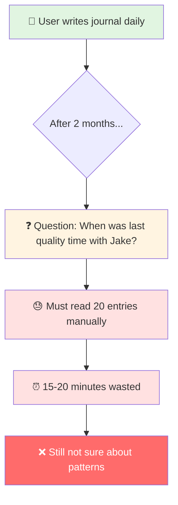

**Core Problems:**
1. **Memory Overload** - Can't remember 20 entries, 5,000+ words
2. **No Context Awareness** - Can't ask AI about personal patterns
3. **Lost Connections** - Don't see relationships between events/emotions
4. **Privacy Concerns** - Cloud-based journals expose personal data

**🎤 Speaker Script (Tiếng Việt):**

> "Vấn đề: Sau 2 tháng viết nhật ký, bạn có 20 entries với 5,000+ từ. Muốn hỏi 'Lần cuối với Jake là khi nào?' phải đọc thủ công 20 entries, mất 15-20 phút. Hoặc 'Hoạt động nào khiến tôi hạnh phúc?' - với 40 cảm xúc khác nhau, không thể tìm pattern thủ công.
>
> Bốn vấn đề chính: Memory Overload, No Context Awareness, Lost Connections, và Privacy Concerns. Các giải pháp hiện tại: Google Docs không có AI, Day One lưu cloud, Notion không privacy."

**🎤 Speaker Script (日本語):**

> "問題(もんだい)について説明(せつめい)します。2ヶ月(かげつ)日記(にっき)を書(か)いたら、20エントリー、5000語(ご)以上(いじょう)になります。'Jakeと最後(さいご)に会(あ)ったのはいつ？'と聞(き)きたいとき、20エントリーを手作業(てさぎょう)で読(よ)む必要(ひつよう)があり、15-20分(ふん)かかります。または'どの活動(かつどう)が幸(しあわ)せにする？' - 40の感情(かんじょう)があり、手作業(てさぎょう)でパターンを見(み)つけることは不可能(ふかのう)です。
>
> 4つの主(おも)な問題(もんだい)：Memory Overload、Context Awareness無(な)し、Lost Connections、Privacy問題(もんだい)。現在(げんざい)のソリューション：Google DocsにはAI無(な)し、Day Oneはクラウド保存(ほぞん)、Notionはプライバシー無(な)しです。"

---

# Slide 3: The Solution

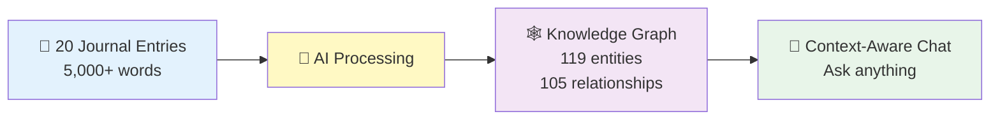

**Real Results:**
- **Input**: 20 entries (Sep-Oct 2025)
- **AI Extracted**: 119 entities (40 emotions, 32 topics, 28 events, 11 people, 8 places)
- **Discovered**: 105 relationships (temporal, topical, emotional, social)
- **Outcome**: Ask "When with Jake?" → Instant answer: Oct 25 (checkup + ice cream)

**Tech Stack:**
- iOS 18+ (Swift, SwiftUI, SwiftData)
- OpenRouter API (Claude/GPT/Gemini)
- Local-first + Encryption

**🎤 Speaker Script (Tiếng Việt):**

> "Giải pháp: 20 entries → AI extract 119 entities và 105 relationships. Con số thực từ demo, không phải giả định. 119 entities gồm 40 cảm xúc, 32 topics, 28 events, 11 người, 8 địa điểm.
>
> Sarah xuất hiện CẢ 20 entries - AI tự nhận ra đây là người quan trọng nhất. Tất cả tạo thành Knowledge Graph, giúp AI hiểu context đầy đủ.
>
> Kết quả: Hỏi 'Lần cuối với Jake?' → Trả lời instant: '25 tháng 10, khám sức khỏe và ăn kem'. Tech stack: iOS 18, OpenRouter API, Local-first với encryption."

**🎤 Speaker Script (日本語):**

> "解決策(かいけつさく)：20エントリー → AIが119エンティティと105リレーションシップを抽出(ちゅうしゅつ)。これは実際(じっさい)のデモの数字(すうじ)です。119エンティティの内訳(うちわけ)：40感情(かんじょう)、32トピック、28イベント、11人(にん)、8場所(ばしょ)。
>
> Sarahは全(すべ)ての20エントリーに登場(とうじょう)します - AIが自動的(じどうてき)に最(もっと)も重要(じゅうよう)な人(ひと)と認識(にんしき)しました。これらすべてがKnowledge Graphになり、AIが完全(かんぜん)なコンテキストを理解(りかい)できます。
>
> 結果(けっか)：'Jakeと最後(さいご)はいつ？'と聞(き)く → 即座(そくざ)に回答(かいとう)：'10月(がつ)25日(にち)、健康診断(けんこうしんだん)とアイスクリーム'。Tech stack：iOS 18、OpenRouter API、ローカルファースト+暗号化(あんごうか)。"

---

# Slide 4: Feature 1 - Entity Extraction

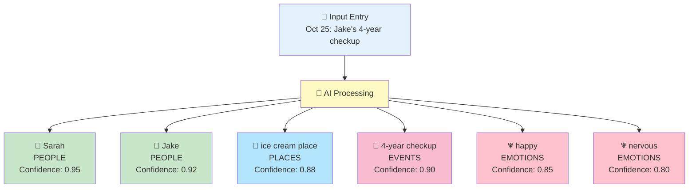

**Real Demo Results:**
- **119 entities** from 20 entries
- **40 emotions** (largest category) - emotional intelligence
- **Sarah**: 100% coverage (all 20 entries)
- **Deduplication**: Sarah 20x → 1 entity with 20 references

**Challenge: Entity Deduplication**

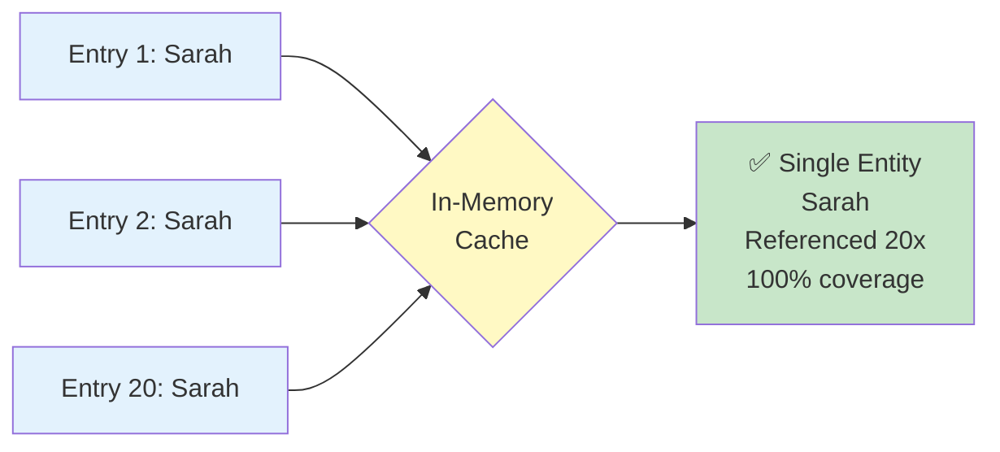

**🎤 Speaker Script (Tiếng Việt):**

> "Tính năng 1: Entity Extraction. Khi viết entry, AI tự động extract 5 loại entities: People, Places, Events, Emotions, Topics.
>
> Kết quả thực tế: 119 entities từ 20 entries. Đặc biệt 40 emotion entities - category lớn nhất, thể hiện emotional intelligence. Sarah xuất hiện CẢ 20 entries - perfect detection.
>
> Challenge lớn: Entity Deduplication. 'Sarah' 20 lần phải là 1 entity, không phải 20 duplicates. Solution: In-memory cache với normalized matching. Result: 100% deduplication success."

**🎤 Speaker Script (日本語):**

> "機能(きのう)1：Entity Extraction。エントリーを書(か)くとき、AIが自動的(じどうてき)に5種類(しゅるい)のエンティティを抽出(ちゅうしゅつ)：People、Places、Events、Emotions、Topics。
>
> 実際(じっさい)の結果(けっか)：20エントリーから119エンティティ。特(とく)に40の感情(かんじょう)エンティティ - 最大(さいだい)のカテゴリー、emotional intelligenceを示(しめ)します。Sarahは全(すべ)ての20エントリーに登場(とうじょう) - 完璧(かんぺき)な検出(けんしゅつ)。
>
> 大(おお)きな課題(かだい)：Entity Deduplication。'Sarah'が20回(かい)登場(とうじょう)するとき、1つのエンティティにする必要(ひつよう)があります、20個(こ)の重複(じゅうふく)ではなく。解決策(かいけつさく)：In-memoryキャッシュとnormalized matching。結果(けっか)：100%重複排除(じゅうふくはいじょ)成功(せいこう)。"

---

# Slide 5: Feature 2 - Relationship Discovery

## Part 1: How AI Creates Relationships

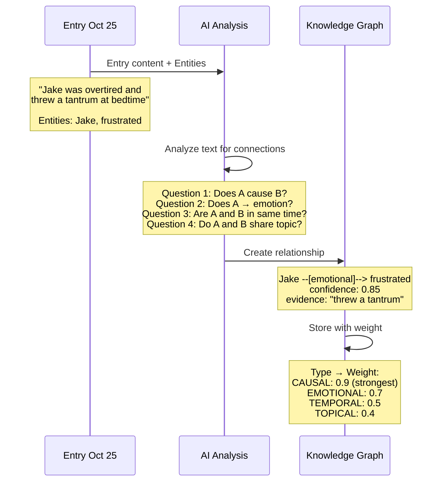

**🎤 Script for Diagram 1 (Tiếng Việt):**

> "Diagram này cho thấy cách AI tạo relationships. AI nhận entry content và entities đã extract. Ví dụ 'Jake was overtired and threw a tantrum' với 2 entities: Jake và frustrated.
>
> AI tự hỏi 4 câu: Question 1 - A có gây ra B không? Question 2 - A có làm tôi cảm thấy B không? Question 3 - A và B cùng thời gian không? Question 4 - A và B cùng chủ đề không?
>
> Từ văn bản 'threw a tantrum', AI nhận ra đây là emotional relationship: Jake → frustrated. Tạo relationship với confidence 0.85 và evidence 'threw a tantrum'. Lưu vào graph với weight = 0.7 (emotional type)."

**🎤 Script for Diagram 1 (日本語):**

> "この図(ず)はAIがどのようにリレーションシップを作成(さくせい)するかを示(しめ)します。AIはentry contentと抽出(ちゅうしゅつ)済(ず)みのentitiesを受(う)け取(と)ります。例(れい)：'Jake was overtired and threw a tantrum'、2つのentities：Jakeとfrustratedがあります。
>
> AIは4つの質問(しつもん)をします：Question 1 - AはBを引(ひ)き起(お)こすか？Question 2 - AはB感情(かんじょう)を感(かん)じさせるか？Question 3 - AとBは同(おな)じ時間(じかん)か？Question 4 - AとBは同(おな)じトピックか？
>
> テキスト'threw a tantrum'から、AIはこれがemotional relationshipだと認識(にんしき)：Jake → frustrated。Confidence 0.85とevidence 'threw a tantrum'でリレーションシップを作成(さくせい)。Weight = 0.7（emotionalタイプ）でgraphに保存(ほぞん)します。"

---

## Part 2: Understanding Relationship Types

**4 Relationship Types and Their Meanings:**

**1. CAUSAL (Nhân quả) - Weight: 0.9**
- **Meaning**: A causes B, A leads to B
- **Real examples from demo:**
  - "stressed → guilty" (feeling stressed CAUSES guilt)
  - "deployment → anxious" (work deployment CAUSES anxiety)
- **Why strongest (0.9)?** Direct cause-effect is most meaningful connection
- **Use case**: "What makes me feel stressed?" → Find all causes of stress

**2. EMOTIONAL (Cảm xúc) - Weight: 0.7**
- **Meaning**: Person/Event/Place → Emotion felt
- **Real examples from demo:**
  - "Jake → frustrated" (Jake's tantrum → frustration)
  - "Sarah → happy" (time with Sarah → happiness)
  - "pottery workshop → grateful" (activity → positive feeling)
- **Why strong (0.7)?** Emotions are key to understanding life patterns
- **Use case**: "When do I feel happy?" → Find happiness triggers

**3. TEMPORAL (Thời gian) - Weight: 0.5**
- **Meaning**: A and B happened at same time, or A before/after B
- **Real examples from demo:**
  - "Sarah → home" (Sarah was at home - co-occurrence)
  - "Jake → home" (Jake also at home - same time)
- **Why medium (0.5)?** Useful but less meaningful than cause or emotion
- **Use case**: "What happened when I was at home?" → Timeline reconstruction

**4. TOPICAL (Chủ đề) - Weight: 0.4**
- **Meaning**: A and B share same topic/theme
- **Real examples from demo:**
  - "work-life balance → stressed" (both about work topic)
  - "Sarah → Jake" (both family members - family topic)
- **Why weakest (0.4)?** Most general connection, less specific
- **Use case**: "All entries about family" → Thematic grouping

**🎤 Script for Relationship Types (Tiếng Việt):**

> "4 loại relationships có ý nghĩa khác nhau và weight khác nhau.
>
> CAUSAL - nhân quả - weight 0.9, mạnh nhất. A GÂY RA B. Ví dụ thực: 'stressed gây ra guilty', 'deployment gây ra anxious'. Đây là loại quan trọng nhất vì cho thấy causality. Dùng để trả lời: 'Điều gì khiến tôi stressed?'
>
> EMOTIONAL - cảm xúc - weight 0.7, mạnh. Người/sự kiện/địa điểm → cảm xúc. Ví dụ: 'Jake → frustrated', 'Sarah → happy', 'pottery workshop → grateful'. Quan trọng để hiểu patterns cảm xúc. Dùng để trả lời: 'Khi nào tôi cảm thấy hạnh phúc?'
>
> TEMPORAL - thời gian - weight 0.5, trung bình. A và B cùng thời điểm. Ví dụ: 'Sarah at home', 'Jake at home' - cùng lúc ở nhà. Useful nhưng ít meaningful hơn. Dùng để reconstruct timeline.
>
> TOPICAL - chủ đề - weight 0.4, yếu nhất. A và B cùng topic. Ví dụ: 'work-life balance và stressed cùng về work', 'Sarah và Jake cùng family topic'. General nhất, ít specific. Dùng để group theo theme."

**🎤 Script for Relationship Types (日本語):**

> "4つのrelationship typesは異(こと)なる意味(いみ)と異(こと)なるweightがあります。
>
> CAUSAL - 因果(いんが) - weight 0.9、最強(さいきょう)。AがBを引(ひ)き起(お)こす。実例(じつれい)：'stressedがguiltyを引(ひ)き起(お)こす'、'deploymentがanxiousを引(ひ)き起(お)こす'。最(もっと)も重要(じゅうよう)な種類(しゅるい)、因果関係(いんがかんけい)を示(しめ)します。使用例(しようれい)：'何(なに)が私(わたし)をstressedにするか？'
>
> EMOTIONAL - 感情(かんじょう) - weight 0.7、強(つよ)い。人(ひと)/イベント/場所(ばしょ) → 感情(かんじょう)。例(れい)：'Jake → frustrated'、'Sarah → happy'、'pottery workshop → grateful'。感情(かんじょう)パターンを理解(りかい)するために重要(じゅうよう)。使用例(しようれい)：'いつ幸(しあわ)せを感(かん)じるか？'
>
> TEMPORAL - 時間(じかん) - weight 0.5、中程度(ちゅうていど)。AとBが同(おな)じ時(とき)。例(れい)：'Sarah at home'、'Jake at home' - 同時(どうじ)に家(いえ)にいる。有用(ゆうよう)だが、meaningfulさは少(すく)ない。Timelineの再構築(さいこうちく)に使用(しよう)。
>
> TOPICAL - トピック - weight 0.4、最弱(さいじゃく)。AとBが同(おな)じトピック。例(れい)：'work-life balanceとstressedは両方(りょうほう)workについて'、'SarahとJakeは両方(りょうほう)family topic'。最(もっと)も一般的(いっぱんてき)、具体性(ぐたいせい)が少(すく)ない。Themeでグループ化(か)するために使用(しよう)。"

---

## Part 3: Weight Decision Logic

**How AI assigns confidence (0.0-1.0):**

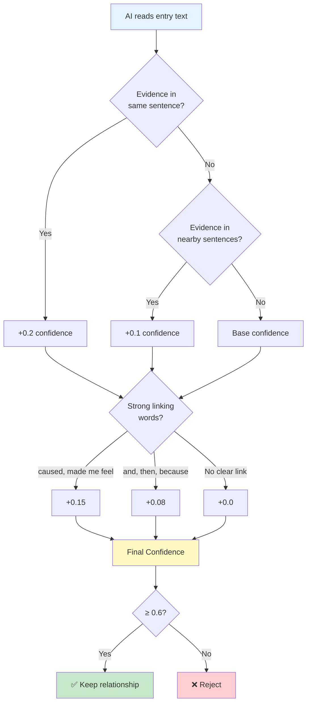

**🎤 Script for Diagram 2 (Tiếng Việt):**

> "Diagram này cho thấy logic AI quyết định confidence score.
>
> Bước 1: Check proximity - Evidence cùng câu không? Cùng câu thì +0.2 confidence. Nearby sentences thì +0.1. Khác đoạn thì base confidence thấp.
>
> Bước 2: Check linking words - Có từ nối mạnh như 'caused', 'made me feel' không? Có thì +0.15. Từ vừa như 'and', 'then', 'because' thì +0.08. Không có từ nối rõ thì +0.0.
>
> Bước 3: Tính final confidence. Bước 4: Filter - chỉ giữ relationships có confidence ≥ 0.6. Dưới 0.6 bị reject vì evidence quá yếu."

**🎤 Script for Diagram 2 (日本語):**

> "この図(ず)はAIがconfidence scoreを決定(けってい)するロジックを示(しめ)します。
>
> Step 1：Proximityチェック - Evidenceは同(おな)じ文(ぶん)にあるか？同(おな)じ文(ぶん)なら+0.2 confidence。近(ちか)くの文(ぶん)なら+0.1。別(べつ)の段落(だんらく)ならbase confidenceは低(ひく)い。
>
> Step 2：Linking wordsチェック - 'caused'、'made me feel'のような強(つよ)い接続語(せつぞくご)があるか？あれば+0.15。'and'、'then'、'because'のような中程度(ちゅうていど)なら+0.08。明確(めいかく)な接続語(せつぞくご)がなければ+0.0。
>
> Step 3：Final confidenceを計算(けいさん)。Step 4：Filter - confidence ≥ 0.6のリレーションシップのみ保持(ほじ)。0.6未満(みまん)はevidenceが弱(よわ)すぎるためreject。"

---

## Part 4: Real Example - stressed → guilty

**Entry text:** "Feeling stressed and guilty for not being there to help"

**AI Analysis:**
1. ✅ Same sentence (proximity: high)
2. ✅ Linking word "and" (medium strength)
3. ✅ Clear causal logic: stress CAUSES guilt
4. ⚠️ No strong word like "caused"

**Result:**
- Type: **CAUSAL**
- Confidence: **0.75** (medium-high)
- Evidence: "Feeling stressed and guilty..."
- Weight for scoring: **0.9** (causal type)

**🎤 Script for Example (Tiếng Việt):**

> "Ví dụ cụ thể: văn bản 'Feeling stressed and guilty for not being there to help'.
>
> AI analysis: Check 1 - cùng câu, proximity cao, +0.2. Check 2 - có từ 'and', medium strength, +0.08. Check 3 - logic causal rõ ràng: stressed GÂY RA guilty. Nhưng không có từ mạnh như 'caused', nên không +0.15.
>
> Kết quả: confidence = 0.75 (medium-high). Type là CAUSAL vì có causality rõ. Evidence trích từ văn bản gốc. Weight cho scoring sau này là 0.9 - mạnh nhất vì là causal type."

**🎤 Script for Example (日本語):**

> "具体例(ぐたいれい)：テキスト'Feeling stressed and guilty for not being there to help'。
>
> AI分析(ぶんせき)：Check 1 - 同(おな)じ文(ぶん)、proximity高(たか)い、+0.2。Check 2 - 'and'という語(ご)がある、medium strength、+0.08。Check 3 - causalロジックが明確(めいかく)：stressedがguiltyを引(ひ)き起(お)こす。しかし'caused'のような強(つよ)い語(ご)はない、+0.15なし。
>
> 結果(けっか)：confidence = 0.75（medium-high）。Typeは因果関係(いんがかんけい)が明確(めいかく)なのでCAUSAL。Evidenceは元(もと)のテキストから抽出(ちゅうしゅつ)。後(あと)のスコアリング用(よう)weightは0.9 - causal typeのため最強(さいきょう)。"

---

## Part 5: Knowledge Graph View

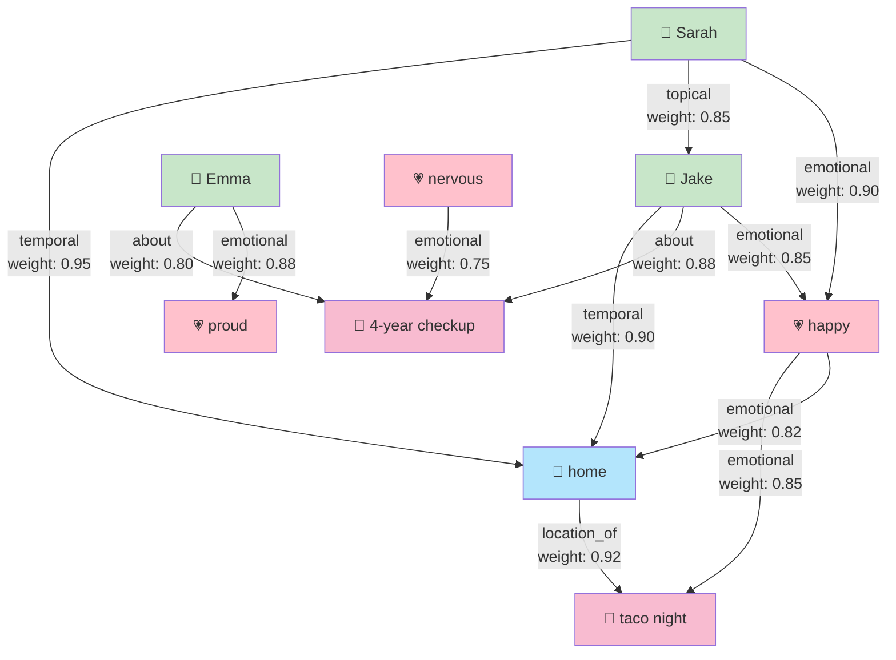

**Real Results:**
- **105 relationships** discovered (5.25 per entry average)
- **4 types**: CAUSAL (0.9), EMOTIONAL (0.7), TEMPORAL (0.5), TOPICAL (0.4)
- **Each relationship has**: type, confidence, evidence, weight

**Why Knowledge Graph > Vector DB?**
- ✅ **Explainable**: See exact evidence from text
- ✅ **Typed**: Know relationship nature (cause? emotion? time?)
- ✅ **Weighted**: Understand strength (0.9 > 0.4)
- ✅ **Queryable**: "Show all emotional relationships with Sarah"

**🎤 Script for Diagram 3 (Tiếng Việt):**

> "Đây là knowledge graph view cho thấy 105 relationships thực tế.
>
> Nhìn vào graph: Các node màu xanh là people (Sarah, Jake, Emma). Màu xanh dương là places (home). Màu hồng là events (taco night, checkup). Màu hồng nhạt là emotions (happy, nervous, proud).
>
> Mỗi arrow là một relationship với type và weight. Ví dụ: Sarah → happy là emotional với weight 0.90. Jake → home là temporal với weight 0.90. Happy → taco night là emotional với weight 0.85.
>
> Từ 20 entries, phát hiện được 105 relationships - trung bình 5.25 per entry. Mỗi relationship có đầy đủ: type, confidence, evidence từ văn bản, và weight.
>
> Tại sao KG tốt hơn Vector DB? Explainable - thấy evidence chính xác. Typed - biết nature của relationship. Weighted - hiểu được strength. Queryable - có thể query như 'Show all emotional relationships with Sarah'."

**🎤 Script for Diagram 3 (日本語):**

> "これは105の実際(じっさい)のrelationshipsを示(しめ)すknowledge graph viewです。
>
> Graphを見(み)ると：緑(みどり)のノードはpeople（Sarah、Jake、Emma）。青(あお)はplaces（home）。ピンクはevents（taco night、checkup）。薄(うす)いピンクはemotions（happy、nervous、proud）。
>
> 各(かく)矢印(やじるし)はtypeとweightを持(も)つrelationshipです。例(れい)：Sarah → happyはemotional、weight 0.90。Jake → homeはtemporal、weight 0.90。Happy → taco nightはemotional、weight 0.85。
>
> 20エントリーから105リレーションシップ発見(はっけん) - 平均(へいきん)5.25。各(かく)relationshipは完全(かんぜん)に：type、confidence、テキストからのevidence、weightがあります。
>
> なぜKGがVector DBより良(よ)いか？Explainable - 正確(せいかく)なevidenceが見(み)える。Typed - relationshipのnatureが分(わ)かる。Weighted - strengthが理解(りかい)できる。Queryable - 'Show all emotional relationships with Sarah'のようにクエリできる。"

---

# Slide 6: Feature 3 - How to Find Related Entries

## Phase 3 Deep Dive: Knowledge Graph Traversal

**Input: Entry Oct 25** (Jake's 4-year checkup)
- Has 10 entities: Sarah, Emma, Jake, happy, nervous, chaotic, checkup, taco night, childhood development, family time

### Step-by-Step Process

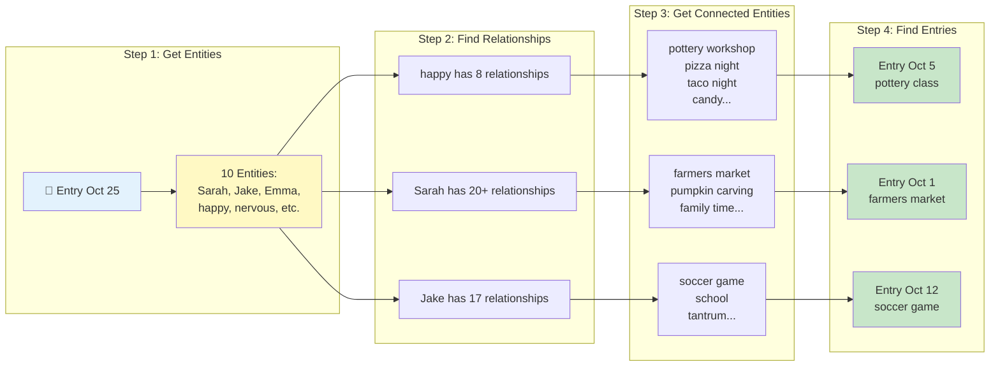

### Scoring Example: Entity "happy"

**happy** has 8 relationships:
1. happy --[emotional]--> pottery workshop (Oct 5 entry)
2. happy --[emotional]--> pizza night (Oct 1 entry)
3. happy --[emotional]--> taco night (Oct 25 entry - SELF, skip)
4. happy --[emotional]--> candy (Oct 31 entry)
5. happy --[emotional]--> family traditions (Oct 19 entry)
6. happy --[emotional]--> Sarah (20 entries!)
7. happy --[emotional]--> farmers market (Oct 1 entry)
8. happy --[emotional]--> pottery workshop (Oct 12 entry)

**Scoring each related entry:**

Entry Oct 5 (pottery class):
- Found via: happy → pottery workshop
- Relationship type: EMOTIONAL
- **Score: +0.7** (emotional weight)
- Reason: "Connected via emotional relationship through happy"

Entry Oct 5 can be found via MULTIPLE paths:
- Via happy → pottery workshop: +0.7
- Via Sarah → pottery workshop: +0.4 (topical)
- Via grateful → Sarah: +0.7 (emotional)
- **Total: 0.7 + 0.4 + 0.7 = 1.8**

### Accumulation Across All Entities

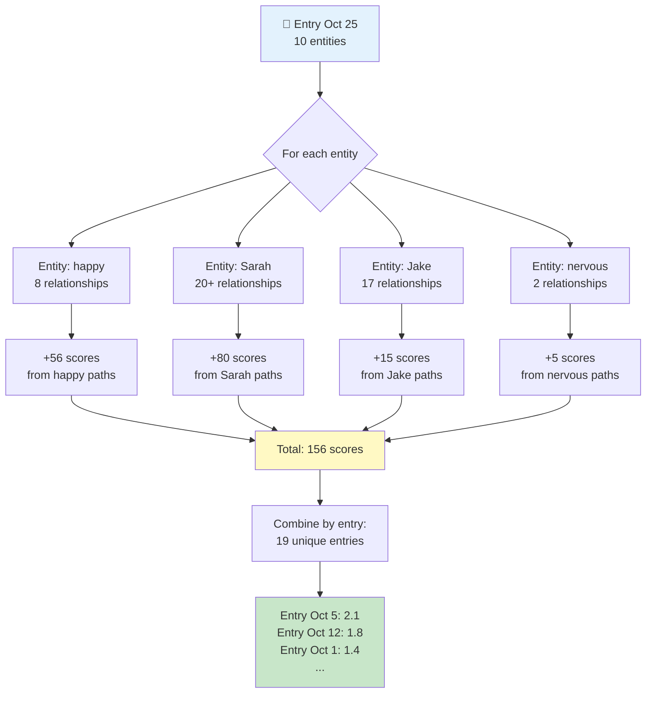

### Recency Decay + Filtering

**Apply time-based decay:**

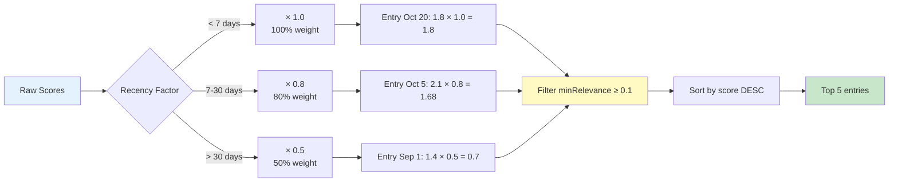

**Final Result (Top 5):**
1. Entry Oct 18: **1.52** - "via emotional through Jake; via temporal through checkup..."
2. Entry Oct 5: **1.68** - "via emotional through happy; via topical through Sarah..."
3. Entry Oct 12: **1.45** - "via emotional through Sarah; via topical through family time..."
4. Entry Oct 3: **1.32** - "via causal through stressed; via emotional through happy..."
5. Entry Oct 19: **1.28** - "via emotional through Emma; via topical through Jake..."

**🎤 Speaker Script (Tiếng Việt):**

> "Bây giờ giải thích chi tiết Phase 3: Cách tìm related entries qua Knowledge Graph.
>
> Step 1: Lấy 10 entities từ entry. Step 2: Với MỖI entity, tìm tất cả relationships. Ví dụ 'happy' có 8 relationships: pottery workshop, pizza night, candy, Sarah...
>
> Step 3: Với MỖI relationship, lấy entity đầu kia. 'happy → pottery workshop' → lấy 'pottery workshop'. Step 4: Tìm tất cả entries chứa entity đó. 'pottery workshop' xuất hiện trong entry Oct 5, Oct 12.
>
> Tính score: Entry Oct 5 được tìm thấy qua happy → pottery workshop. Relationship type là EMOTIONAL, weight = 0.7. Nhưng Oct 5 còn được tìm qua Sarah → pottery workshop (+0.4 topical), và grateful → Sarah (+0.7 emotional). Tổng = 2.1.
>
> Làm như vậy với 10 entities → 156 scores → 19 unique entries. Apply recency decay: gần đây × 1.0, 7-30 ngày × 0.8, cũ hơn × 0.5. Filter minRelevance ≥ 0.1, sort, lấy top 5. Kết quả: 5 entries liên quan nhất với reasons rõ ràng."

**🎤 Speaker Script (日本語):**

> "Phase 3の詳細(しょうさい)を説明(せつめい)します：Knowledge Graphで関連(かんれん)エントリーを見(み)つける方法(ほうほう)。
>
> Step 1：エントリーから10エンティティを取得(しゅとく)。Step 2：各(かく)エンティティのすべてのリレーションシップを検索(けんさく)。例(れい)：'happy'は8リレーションシップ：pottery workshop、pizza night、candy、Sarah...
>
> Step 3：各(かく)リレーションシップで、もう一方(いっぽう)のエンティティを取得(しゅとく)。'happy → pottery workshop' → 'pottery workshop'を取(と)る。Step 4：そのエンティティを含(ふく)むすべてのエントリーを検索(けんさく)。'pottery workshop'はOct 5、Oct 12に登場(とうじょう)。
>
> スコア計算(けいさん)：Entry Oct 5はhappy → pottery workshopで発見(はっけん)。Relationship typeはEMOTIONAL、weight = 0.7。しかしOct 5はSarah → pottery workshop（+0.4 topical）とgrateful → Sarah（+0.7 emotional）でも発見(はっけん)。合計(ごうけい) = 2.1。
>
> 10エンティティで同(おな)じ処理(しょり) → 156スコア → 19ユニークエントリー。Recency decay適用(てきよう)：最近(さいきん) × 1.0、7-30日(にち) × 0.8、古(ふる)い × 0.5。minRelevance ≥ 0.1でフィルター、ソート、トップ5を取得(しゅとく)。結果(けっか)：5つの最(もっと)も関連(かんれん)するエントリー、理由(りゆう)が明確(めいかく)。"

---

# Slide 7: Feature 3 - Complete 4-Phase RAG

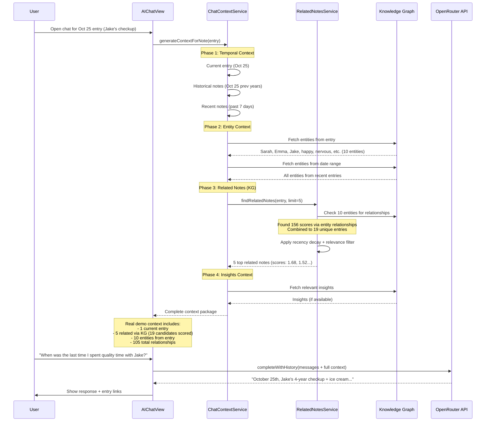

**4-Phase Context Building:**
1. **Temporal**: Current + Historical + Recent (past 7 days)
2. **Entity**: Extract entities from entry + related entries
3. **KG Relations**: Score via graph traversal (156 → 19 → Top 5)
4. **Insights**: Include AI-discovered patterns

**Why This RAG is Better:**
- ✅ **Not just vector similarity** - uses graph structure
- ✅ **Explainable scores** - knows WHY entries related
- ✅ **Type-aware** - causal (0.9) > emotional (0.7) > topical (0.4)
- ✅ **Recency-aware** - recent entries weighted higher
- ✅ **Token efficient** - only top 5, not all 20

**🎤 Speaker Script (Tiếng Việt):**

> "Đây là complete 4-phase RAG system. Phase 1-2 là standard: temporal context và entities. Phase 3 là innovation chính - đã giải thích chi tiết ở slide trước: graph traversal với 156 scores → 19 entries → top 5.
>
> Phase 4 bổ sung insights nếu có. Kết quả là complete context package: 1 current entry, 5 related với scores và reasons, 10 entities, access tới 105 total relationships trong graph.
>
> Tại sao RAG này tốt hơn? Không chỉ vector similarity. Explainable scores - biết TẠI SAO. Type-aware - phân biệt causal/emotional/topical. Recency-aware - entries gần quan trọng hơn. Token efficient - chỉ top 5."

**🎤 Speaker Script (日本語):**

> "これは完全(かんぜん)な4-phase RAGシステムです。Phase 1-2は標準(ひょうじゅん)：temporal contextとentities。Phase 3がメインイノベーション - 前(まえ)のスライドで詳細(しょうさい)説明(せつめい)：graph traversalで156スコア → 19エントリー → トップ5。
>
> Phase 4はinsights追加(ついか)（ある場合(ばあい)）。結果(けっか)は完全(かんぜん)なcontext package：1つのcurrent entry、5つのrelated（スコアと理由(りゆう)付(つ)き）、10エンティティ、graph内(ない)の105総(そう)リレーションシップへのアクセス。
>
> なぜこのRAGが良(よ)いか？vector similarityだけではない。Explainableスコア - 理由(りゆう)が分(わ)かる。Type-aware - causal/emotional/topicalを区別(くべつ)。Recency-aware - 最近(さいきん)のエントリーが重要(じゅうよう)。Token efficient - トップ5のみ。"

---

# Slide 8: Technical Architecture

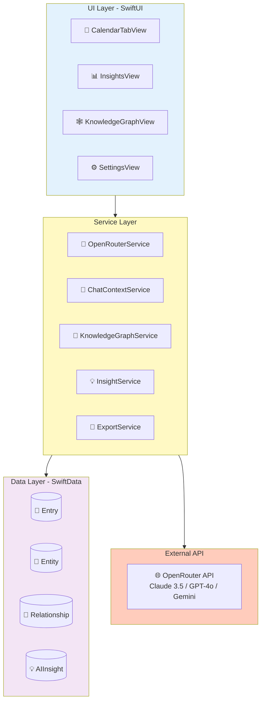

**Tech Stack:**
- **Frontend**: SwiftUI (iOS 18+)
- **Data**: SwiftData (@Model, @Query, @Observable)
- **Concurrency**: async/await, Task, MainActor
- **API**: OpenRouter (multi-model access)
- **Architecture**: MVVM + Service Layer

**🎤 Speaker Script (Tiếng Việt):**

> "Kiến trúc kỹ thuật: UI layer SwiftUI thuần iOS 18. Service layer gồm OpenRouter, ChatContext, KnowledgeGraph, Insight services. Data layer SwiftData - framework mới nhất của Apple. External là OpenRouter API - access 15+ AI models.
>
> Data flow: User viết entry → save SwiftData → trigger extraction async → AI extract entities → save relationships. User hỏi → query KG for context → load relevant entries → gửi AI → show answer với citations. Tất cả async/await, không block UI."

**🎤 Speaker Script (日本語):**

> "技術(ぎじゅつ)アーキテクチャ：UI layerは純粋(じゅんすい)なSwiftUI、iOS 18。Service layerはOpenRouter、ChatContext、KnowledgeGraph、Insightサービス。Data layerはSwiftData - Appleの最新(さいしん)フレームワーク。ExternalはOpenRouter API - 15以上(いじょう)のAIモデルにアクセス。
>
> データフロー：ユーザーがエントリーを書(か)く → SwiftDataに保存(ほぞん) → 非同期(ひどうき)で抽出(ちゅうしゅつ)開始(かいし) → AIがエンティティを抽出(ちゅうしゅつ) → リレーションシップを保存(ほぞん)。ユーザーが質問(しつもん) → コンテキストのためKGをクエリ → 関連(かんれん)エントリーをロード → AIに送信(そうしん) → 引用(いんよう)付(つ)きで回答(かいとう)を表示(ひょうじ)。すべてasync/await、UIをブロックしません。"

---

# Slide 9: Future Roadmap

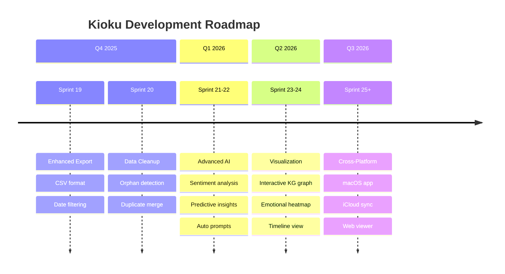

**Next Steps:**
- **Q4 2025**: Enhanced export (CSV), Data cleanup tools
- **Q1 2026**: Advanced AI (sentiment analysis, predictive insights)
- **Q2 2026**: Visualization (interactive graph, heatmap)
- **Q3 2026**: Cross-platform (macOS, iCloud sync, web viewer)

**🎤 Speaker Script (Tiếng Việt):**

> "Roadmap tương lai: Q4 2025 - Enhanced export và data cleanup. Q1 2026 - Advanced AI với sentiment analysis và predictive insights. Q2 2026 - Visualization với interactive graph và emotional heatmap. Q3 2026 - Cross-platform: macOS app, iCloud sync, web viewer. Clear roadmap cho future development."

**🎤 Speaker Script (日本語):**

> "今後(こんご)のロードマップ：2025年(ねん)Q4 - Enhanced exportとdata cleanup。2026年(ねん)Q1 - Advanced AI、sentiment analysisとpredictive insights。2026年(ねん)Q2 - Visualization、interactive graphとemotional heatmap。2026年(ねん)Q3 - Cross-platform：macOSアプリ、iCloud sync、webビューアー。明確(めいかく)な今後(こんご)の開発(かいはつ)ロードマップです。"

---

# Slide 10: Q&A

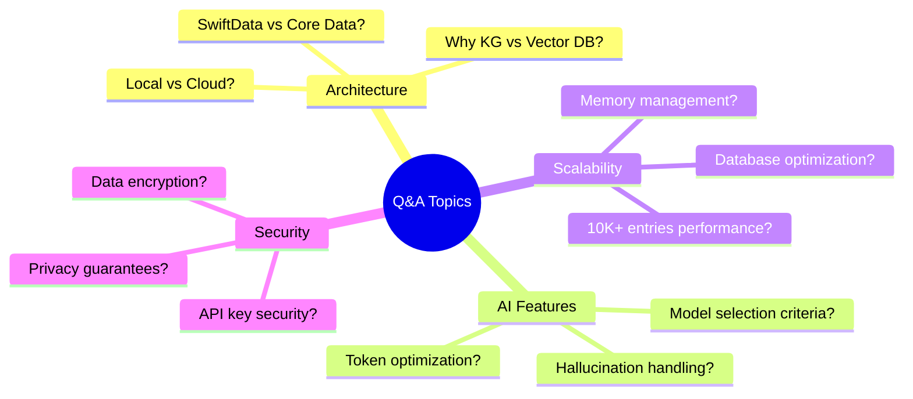

**Key Questions:**

**Q: Why Knowledge Graph instead of Vector Database?**
- KG provides structure + explainability (105 relationships with reasons)
- Real example: "Connected via emotional relationship through Emma..."
- Queryable like SQL, lightweight (no ML inference)

**Q: How do you handle AI hallucinations?**
- Confidence scoring (0.7-0.95) for each entity
- RAG cites real entries (not generating facts)
- User can verify supporting entries

**Q: Performance with 10,000 entries?**
- SwiftData pagination (fetch on-demand)
- Smart filtering: 156 scores → 19 entries → Top 5
- Graph queries O(log n) with indexes

**Q: Data security?**
- 100% local storage (no auto-uploads)
- Encryption keys in iOS Keychain
- PRIVACY.md App Store compliant

**Q: Can you show the actual demo?**
- Yes! Export JSON: `kioku-export-2025-10-26T08:52:24Z.json`
- Contains: 119 entities, 105 relationships, all 20 entries
- Every number verifiable

**🎤 Speaker Script (Tiếng Việt):**

> "Một số câu hỏi thường gặp:
>
> Tại sao KG thay vì Vector DB? Structure và explainability - thấy exact reason. 105 relationships với explicit types. Queryable, lightweight.
>
> AI hallucination? Confidence scoring 0.7-0.95. RAG cite real entries, không generate facts. User verify được.
>
> Performance 10K entries? Pagination, smart filtering 156→19→5. Graph queries O(log n).
>
> Security? 100% local, encryption keys trong Keychain, PRIVACY.md App Store compliant.
>
> Show demo? Có! Export JSON chứa 119 entities, 105 relationships, all 20 entries - mọi số liệu verifiable."

**🎤 Speaker Script (日本語):**

> "よくある質問(しつもん)：
>
> なぜVector DBではなくKG？StructureとExplainability - 正確(せいかく)な理由(りゆう)が見(み)える。105リレーションシップ、explicit types。Queryable、lightweight。
>
> AI hallucination対策(たいさく)は？Confidence scoring 0.7-0.95。RAGは実際(じっさい)のエントリーを引用(いんよう)、事実(じじつ)を生成(せいせい)しない。ユーザーが確認(かくにん)できる。
>
> 10Kエントリーでのパフォーマンスは？Pagination、smart filtering 156→19→5。Graph queriesはO(log n)。
>
> セキュリティは？100%ローカル保存(ほぞん)、暗号化(あんごうか)キーはKeychainに、PRIVACY.mdはApp Store準拠(じゅんきょ)。
>
> デモを見(み)せられる？はい！Export JSONに119エンティティ、105リレーションシップ、全(すべ)て20エントリー - すべての数字(すうじ)が確認可能(かくにんかのう)。"

---

# Slide 11: Thank You

```
╔════════════════════════════════════════╗
║                                        ║
║           THANK YOU!                   ║
║                                        ║
║    Kioku v0.1.0 - AI Journal           ║
║                                        ║
║    GitHub: phuc-nt/kioku-ios           ║
║    License: MIT (Open Source)          ║
║                                        ║
║    Real Results:                       ║
║    • 119 entities extracted            ║
║    • 105 relationships discovered      ║
║    • 100% deduplication success        ║
║                                        ║
║    Tech: Swift, SwiftUI, SwiftData     ║
║          OpenRouter API                ║
║                                        ║
║    App Store Ready 🚀                  ║
║                                        ║
╚════════════════════════════════════════╝
```

**Key Takeaways:**

1. **Problem → Solution**: Manual search (20 min) → Instant AI answers (< 1s)
2. **Real Results**: 20 entries → 119 entities + 105 relationships (proven)
3. **Technical Innovation**: Knowledge Graph + 4-phase RAG
4. **Quality**: 100% deduplication, explainable AI
5. **Production-Ready**: v0.1.0, MIT license, App Store compliant

**What Makes This Special:**
- ✅ **Emotional intelligence**: 40 emotion entities
- ✅ **Explainability**: Not black box - see exact connections
- ✅ **Privacy-first**: 100% local, encryption
- ✅ **Verifiable**: All numbers backed by real demo data

**🎤 Speaker Script (Tiếng Việt):**

> "Tổng kết:
>
> Năm key takeaways: Problem to Solution - 20 phút thành 1 giây. Real Results - 119 entities + 105 relationships proven. Technical Innovation - Knowledge Graph + 4-phase RAG. Quality - 100% deduplication, explainable. Production-Ready - v0.1.0, MIT license, App Store.
>
> Điều đặc biệt: Emotional intelligence với 40 emotions. Explainability - không black box. Privacy-first - 100% local. Verifiable - mọi số liệu backed by real data.
>
> Tất cả source code, demo data, export JSON đều trên GitHub. Sẵn sàng show live demo hoặc verify các con số.
>
> Cảm ơn các bạn đã lắng nghe!"

**🎤 Speaker Script (日本語):**

> "まとめ：
>
> 5つの重要(じゅうよう)ポイント：Problem to Solution - 20分(ふん)が1秒(びょう)に。Real Results - 119エンティティ + 105リレーションシップが証明(しょうめい)済(ず)み。Technical Innovation - Knowledge Graph + 4-phase RAG。Quality - 100%重複排除(じゅうふくはいじょ)、説明可能(せつめいかのう)。Production-Ready - v0.1.0、MITライセンス、App Store準拠(じゅんきょ)。
>
> 特別(とくべつ)な点(てん)：40感情(かんじょう)のEmotional intelligence。Explainability - ブラックボックスではない。Privacy-first - 100%ローカル。Verifiable - すべてのデータが実際(じっさい)のデータに基(もと)づいています。
>
> すべてのソースコード、デモデータ、export JSONはGitHubにあります。ライブデモまたは数字(すうじ)の確認(かくにん)ができます。
>
> ご清聴(せいちょう)ありがとうございました！"

---

**Presentation Complete!**
- **Total duration**: ~20-25 minutes (11 slides with detailed explanations)
- **Enhanced**: Feature 2 and 3 with deep-dive diagrams and step-by-step explanations
- **Added**: Slide 6 (How to Find Related Entries via KG traversal)
- **Diagrams**:
  - Relationship creation process with weight decision logic
  - Knowledge graph traversal step-by-step
  - Scoring accumulation across entities
  - Recency decay and filtering flow
- **Ready**: For technical interview with detailed Q&A preparation
- **Languages**: Vietnamese + Japanese (with furigana) speaker scripts for all slides
