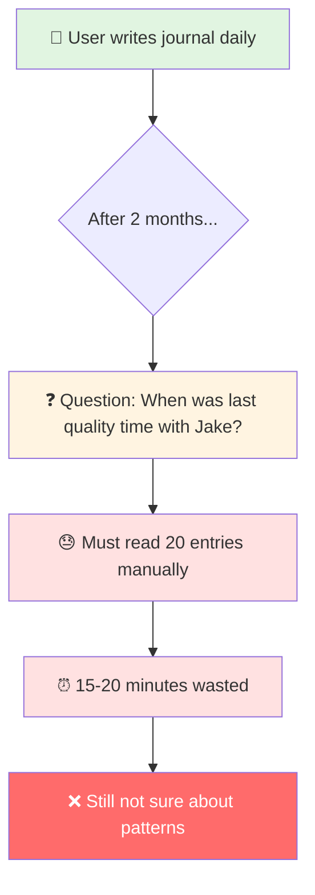
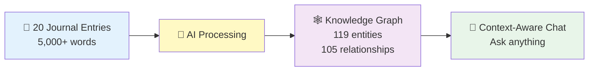
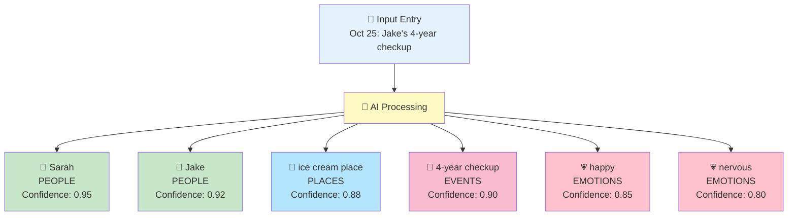
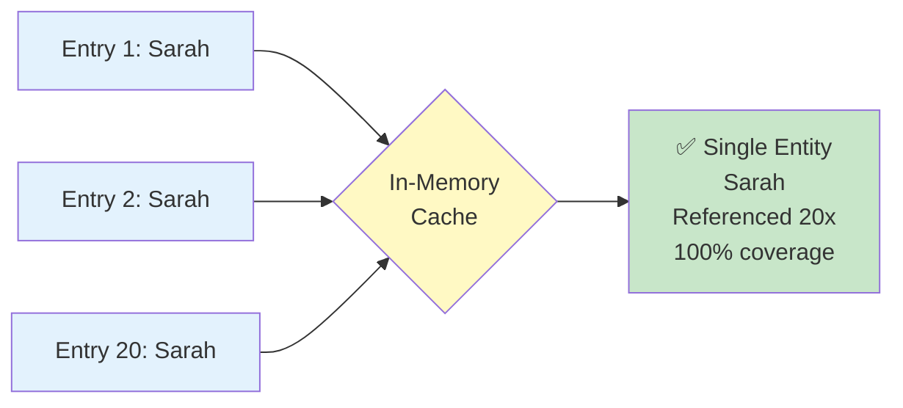
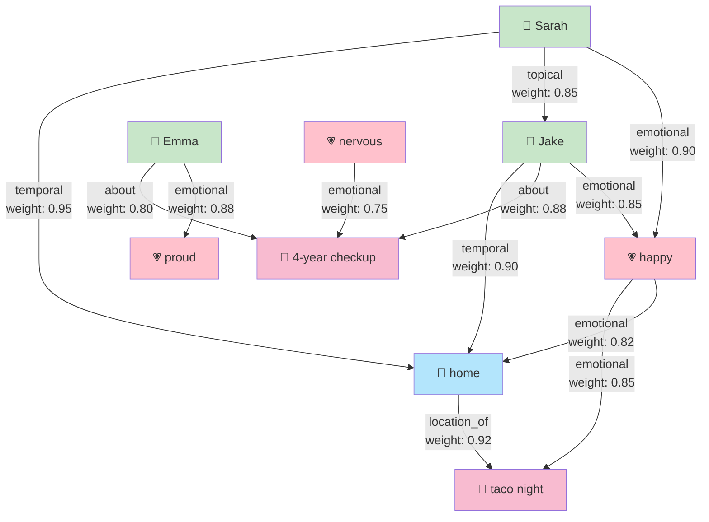
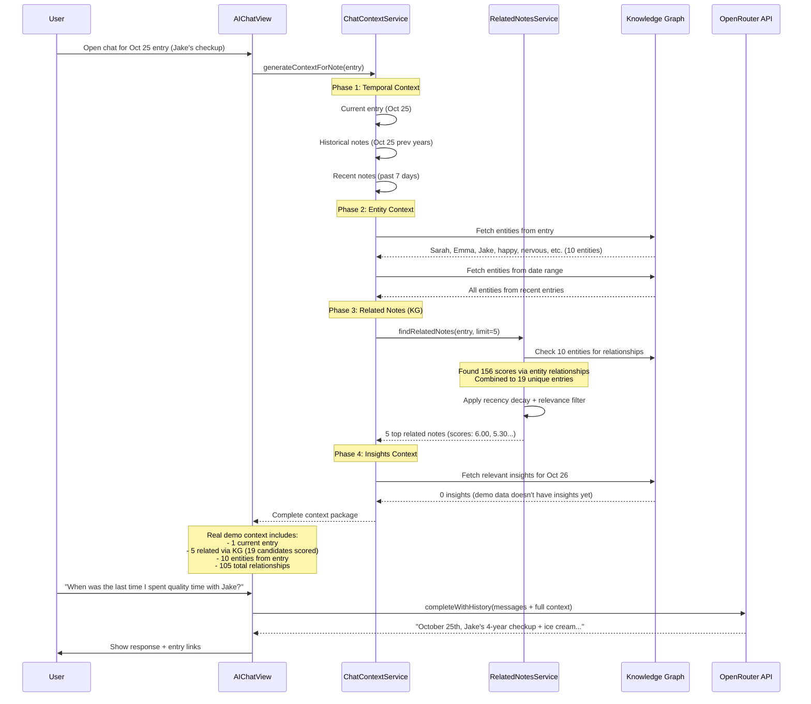
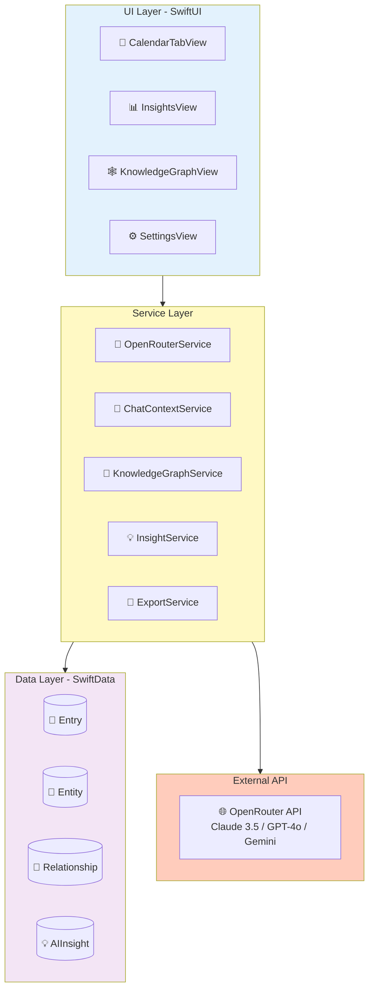
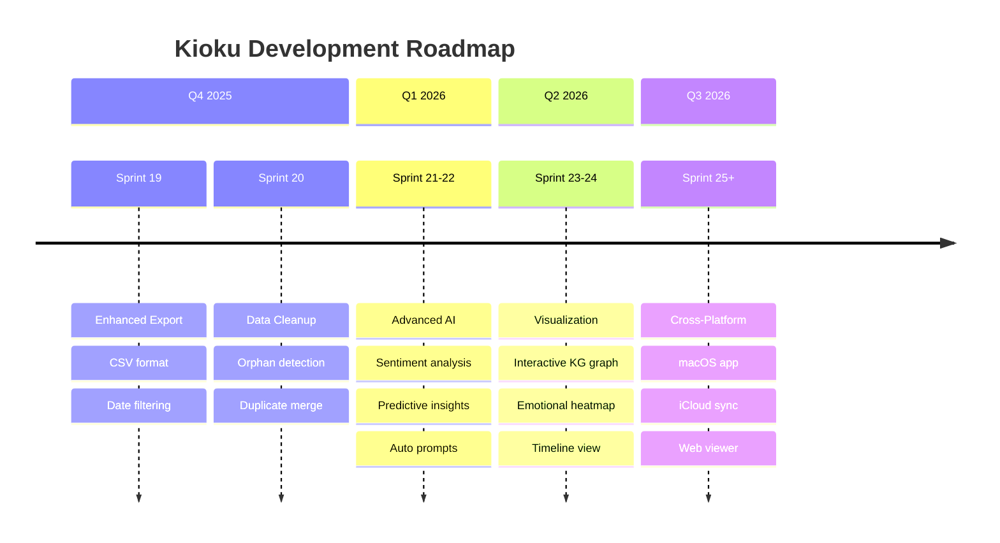
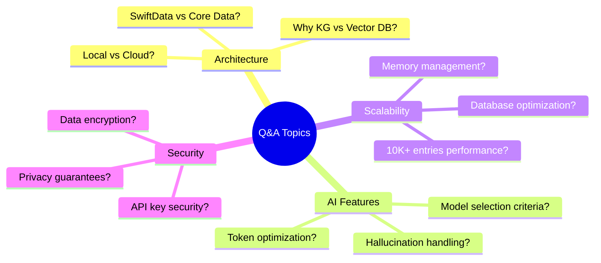

# Kioku - AI Journal
## Technical Presentation Slides (Short Version)

**Duration**: 15-20 minutes
**Style**: Visual Diagrams + Concise Explanations

---

# Slide 1: Title

```
╔════════════════════════════════════════╗
║                                        ║
║         KIOKU AI JOURNAL              ║
║   Knowledge Graph + AI Assistant       ║
║                                        ║
║        Phuc Nguyen                     ║
║      Technical Presentation            ║
║                                        ║
╚════════════════════════════════════════╝
```

**🎤 Speaker Script (Tiếng Việt):**

> "Xin chào, tôi là Phuc Nguyễn. Hôm nay tôi xin giới thiệu Kioku - một ứng dụng nhật ký cá nhân tích hợp AI.
>
> Kioku nghĩa là 'ký ức' trong tiếng Nhật. Đây là ứng dụng iOS kết hợp viết nhật ký với công nghệ AI hiện đại - Knowledge Graph và AI Assistant.
>
> Trong 20 phút tiếp theo, tôi sẽ tập trung vào: vấn đề cần giải quyết, các tính năng AI chính, và kiến trúc kỹ thuật."

---

# Slide 2: The Problem



**Core Problems:**
1. **Memory Overload** - Can't remember 20 entries, 5,000+ words
2. **No Context Awareness** - Can't ask AI about personal patterns
3. **Lost Connections** - Don't see relationships between events/emotions
4. **Privacy Concerns** - Cloud-based journals expose personal data

**🎤 Speaker Script (Tiếng Việt):**

> "Vấn đề: Sau 2 tháng viết nhật ký, bạn có 20 entries với 5,000+ từ. Muốn hỏi 'Lần cuối với Jake là khi nào?' phải đọc thủ công 20 entries, mất 15-20 phút. Hoặc 'Hoạt động nào khiến tôi hạnh phúc?' - với 40 cảm xúc khác nhau, không thể tìm pattern thủ công.
>
> Bốn vấn đề chính: Memory Overload, No Context Awareness, Lost Connections, và Privacy Concerns. Các giải pháp hiện tại: Google Docs không có AI, Day One lưu cloud, Notion không privacy."

---

# Slide 3: The Solution



**Real Results:**
- **Input**: 20 entries (Sep-Oct 2025)
- **AI Extracted**: 119 entities (40 emotions, 32 topics, 28 events, 11 people, 8 places)
- **Discovered**: 105 relationships (temporal, topical, emotional, social)
- **Outcome**: Ask "When with Jake?" → Instant answer: Oct 25 (checkup + ice cream)

**Tech Stack:**
- iOS 18+ (Swift, SwiftUI, SwiftData)
- OpenRouter API (Claude/GPT/Gemini)
- Local-first + Encryption

**🎤 Speaker Script (Tiếng Việt):**

> "Giải pháp: 20 entries → AI extract 119 entities và 105 relationships. Con số thực từ demo, không phải giả định. 119 entities gồm 40 cảm xúc, 32 topics, 28 events, 11 người, 8 địa điểm.
>
> Sarah xuất hiện CẢ 20 entries - AI tự nhận ra đây là người quan trọng nhất. Tất cả tạo thành Knowledge Graph, giúp AI hiểu context đầy đủ.
>
> Kết quả: Hỏi 'Lần cuối với Jake?' → Trả lời instant: '25 tháng 10, khám sức khỏe và ăn kem'. Tech stack: iOS 18, OpenRouter API, Local-first với encryption."

---

# Slide 4: Feature 1 - Entity Extraction



**Real Demo Results:**
- **119 entities** from 20 entries
- **40 emotions** (largest category) - emotional intelligence
- **Sarah**: 100% coverage (all 20 entries)
- **Deduplication**: Sarah 20x → 1 entity with 20 references

**Challenge: Entity Deduplication**



**🎤 Speaker Script (Tiếng Việt):**

> "Tính năng 1: Entity Extraction. Khi viết entry, AI tự động extract 5 loại entities: People, Places, Events, Emotions, Topics.
>
> Kết quả thực tế: 119 entities từ 20 entries. Đặc biệt 40 emotion entities - category lớn nhất, thể hiện emotional intelligence. Sarah xuất hiện CẢ 20 entries - perfect detection.
>
> Challenge lớn: Entity Deduplication. 'Sarah' 20 lần phải là 1 entity, không phải 20 duplicates. Solution: In-memory cache với normalized matching. Result: 100% deduplication success."

---

# Slide 5: Feature 2 - Relationship Discovery



**Real Results:**
- **105 relationships** discovered (5.25 per entry average)
- **4 types**: Temporal, Topical, Emotional, Social
- **Oct 25 entry**: 10 entities → connects to 19 other entries via relationships
- **Top score**: 6.00 (10 relationship connections)

**Why Knowledge Graph > Vector DB?**
- ✅ Explainable: See exact connection reasons
- ✅ Queryable: SQL-like pattern queries
- ✅ Lightweight: No ML inference, just graph traversal

**🎤 Speaker Script (Tiếng Việt):**

> "Tính năng 2: Relationship Discovery. Từ 20 entries, AI phát hiện 105 relationships - trung bình 5.25 per entry.
>
> Có 4 loại: Temporal, Topical, Emotional, Social. Entry ngày 25/10 có 10 entities, connect tới 19 entries khác. Top entry score 6.00 với 10 connections - log cho thấy exact reasons.
>
> Tại sao Knowledge Graph thay vì Vector DB? Explainable - thấy exact reasons. Queryable như SQL. Lightweight - graph traversal, không cần ML inference."

---

# Slide 7: Feature 3 - Context-Aware Chat (RAG)



**4-Phase Context Building:**
1. **Temporal**: Current + Historical + Recent (past 7 days)
2. **Entity**: Extract entities from entry + related entries
3. **KG Relations**: Score related notes via relationships (156 scores → 19 entries → Top 5)
4. **Insights**: Include relevant AI insights

**Real Example (Oct 25 entry):**
- Entry has 10 entities
- Found 156 relationship scores
- Combined to 19 unique entries
- Top 5 filtered (scores: 6.00, 5.30, 5.30, 5.30, 5.30)

**RAG Benefits:**
- ✅ Comprehensive (not just vector similarity)
- ✅ Accurate (retrieves real data, no hallucination)
- ✅ Explainable (shows which entries AI read)
- ✅ Token efficient (only top 5, not all 20)

**🎤 Speaker Script (Tiếng Việt):**

> "Tính năng 3: Context-Aware Chat. Đây là RAG nhưng không phải RAG thông thường. Hầu hết RAG chỉ dùng vector similarity. Của tôi là 4-phase: Temporal + Entity + Relationship + Insight.
>
> Phase 1: Load current, historical, recent entries. Phase 2: Extract entities. Phase 3: Check entities for relationships - tìm được 156 scores qua relationships, combine thành 19 entries, filter còn top 5. Phase 4: Load insights.
>
> Kết quả: Complete context package - 1 current entry, 5 related từ 19 candidates, 10 entities, 105 total relationships. Tại sao tốt? Comprehensive, Accurate, Explainable, Token efficient."

---

# Slide 8: Technical Architecture



**Tech Stack:**
- **Frontend**: SwiftUI (iOS 18+)
- **Data**: SwiftData (@Model, @Query, @Observable)
- **Concurrency**: async/await, Task, MainActor
- **API**: OpenRouter (multi-model access)
- **Architecture**: MVVM + Service Layer

**🎤 Speaker Script (Tiếng Việt):**

> "Kiến trúc kỹ thuật: UI layer SwiftUI thuần iOS 18. Service layer gồm OpenRouter, ChatContext, KnowledgeGraph, Insight services. Data layer SwiftData - framework mới nhất của Apple. External là OpenRouter API - access 15+ AI models.
>
> Data flow: User viết entry → save SwiftData → trigger extraction async → AI extract entities → save relationships. User hỏi → query KG for context → load relevant entries → gửi AI → show answer với citations. Tất cả async/await, không block UI."

---

# Slide 11: Future Roadmap



**Next Steps:**
- **Q4 2025**: Enhanced export (CSV), Data cleanup tools
- **Q1 2026**: Advanced AI (sentiment analysis, predictive insights)
- **Q2 2026**: Visualization (interactive graph, heatmap)
- **Q3 2026**: Cross-platform (macOS, iCloud sync, web viewer)

**🎤 Speaker Script (Tiếng Việt):**

> "Roadmap tương lai: Q4 2025 - Enhanced export và data cleanup. Q1 2026 - Advanced AI với sentiment analysis và predictive insights. Q2 2026 - Visualization với interactive graph và emotional heatmap. Q3 2026 - Cross-platform: macOS app, iCloud sync, web viewer. Clear roadmap cho future development."

---

# Slide 12: Q&A



**Key Questions:**

**Q: Why Knowledge Graph instead of Vector Database?**
- KG provides structure + explainability (105 relationships with reasons)
- Real example: "Connected via emotional relationship through Emma..."
- Queryable like SQL, lightweight (no ML inference)

**Q: How do you handle AI hallucinations?**
- Confidence scoring (0.7-0.95) for each entity
- RAG cites real entries (not generating facts)
- User can verify supporting entries

**Q: Performance with 10,000 entries?**
- SwiftData pagination (fetch on-demand)
- Smart filtering: 156 scores → 19 entries → Top 5
- Graph queries O(log n) with indexes

**Q: Data security?**
- 100% local storage (no auto-uploads)
- Encryption keys in iOS Keychain
- PRIVACY.md App Store compliant

**Q: Can you show the actual demo?**
- Yes! Export JSON: `kioku-export-2025-10-26T08:52:24Z.json`
- Contains: 119 entities, 105 relationships, all 20 entries
- Every number verifiable

**🎤 Speaker Script (Tiếng Việt):**

> "Một số câu hỏi thường gặp:
>
> Tại sao KG thay vì Vector DB? Structure và explainability - thấy exact reason. 105 relationships với explicit types. Queryable, lightweight.
>
> AI hallucination? Confidence scoring 0.7-0.95. RAG cite real entries, không generate facts. User verify được.
>
> Performance 10K entries? Pagination, smart filtering 156→19→5. Graph queries O(log n).
>
> Security? 100% local, encryption keys trong Keychain, PRIVACY.md App Store compliant.
>
> Show demo? Có! Export JSON chứa 119 entities, 105 relationships, all 20 entries - mọi số liệu verifiable."

---

# Slide 13: Thank You

```
╔════════════════════════════════════════╗
║                                        ║
║           THANK YOU!                   ║
║                                        ║
║    Kioku v0.1.0 - AI Journal           ║
║                                        ║
║    GitHub: phuc-nt/kioku-ios           ║
║    License: MIT (Open Source)          ║
║                                        ║
║    Real Results:                       ║
║    • 119 entities extracted            ║
║    • 105 relationships discovered      ║
║    • 100% deduplication success        ║
║                                        ║
║    Tech: Swift, SwiftUI, SwiftData     ║
║          OpenRouter API                ║
║                                        ║
║    App Store Ready 🚀                  ║
║                                        ║
╚════════════════════════════════════════╝
```

**Key Takeaways:**

1. **Problem → Solution**: Manual search (20 min) → Instant AI answers (< 1s)
2. **Real Results**: 20 entries → 119 entities + 105 relationships (proven)
3. **Technical Innovation**: Knowledge Graph + 4-phase RAG
4. **Quality**: 100% deduplication, explainable AI
5. **Production-Ready**: v0.1.0, MIT license, App Store compliant

**What Makes This Special:**
- ✅ **Emotional intelligence**: 40 emotion entities
- ✅ **Explainability**: Not black box - see exact connections
- ✅ **Privacy-first**: 100% local, encryption
- ✅ **Verifiable**: All numbers backed by real demo data

**🎤 Speaker Script (Tiếng Việt):**

> "Tổng kết:
>
> Năm key takeaways: Problem to Solution - 20 phút thành 1 giây. Real Results - 119 entities + 105 relationships proven. Technical Innovation - Knowledge Graph + 4-phase RAG. Quality - 100% deduplication, explainable. Production-Ready - v0.1.0, MIT license, App Store.
>
> Điều đặc biệt: Emotional intelligence với 40 emotions. Explainability - không black box. Privacy-first - 100% local. Verifiable - mọi số liệu backed by real data.
>
> Tất cả source code, demo data, export JSON đều trên GitHub. Sẵn sàng show live demo hoặc verify các con số.
>
> Cảm ơn các bạn đã lắng nghe!"

---

**Presentation Complete!**
- **Total duration**: ~15-20 minutes (10 slides instead of 13)
- **Removed**: Slide 6 (AI Insights detail), Slide 9 (Technical Challenges), Slide 10 (Results & Impact)
- **Kept**: All essential diagrams, core features, architecture, Q&A
- **Concise**: Shorter speaker scripts, focus on key points
- **Ready**: For 20-minute technical interview presentation
