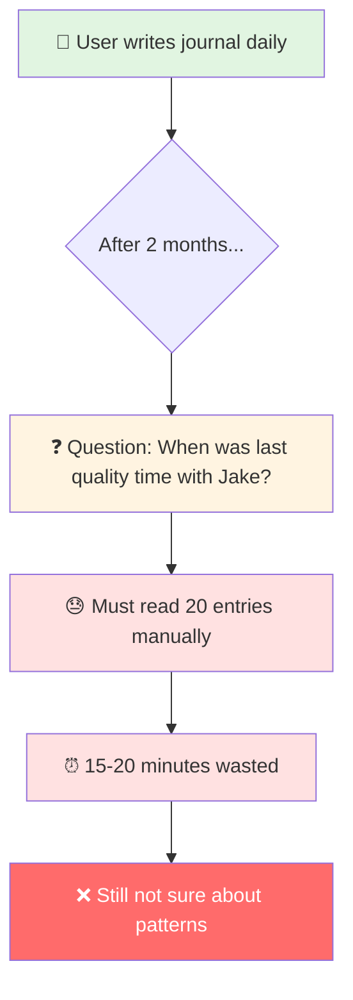
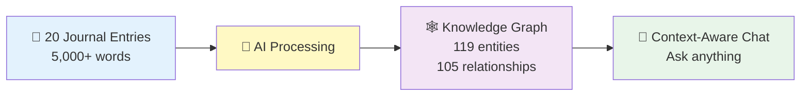
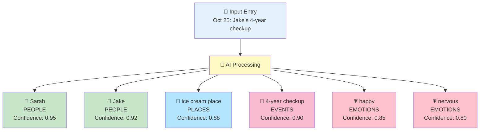
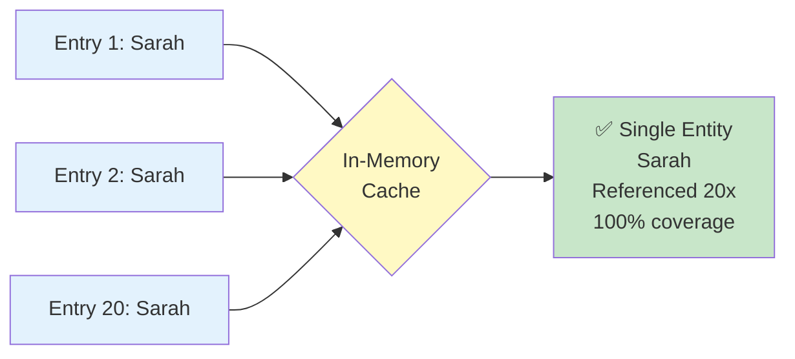
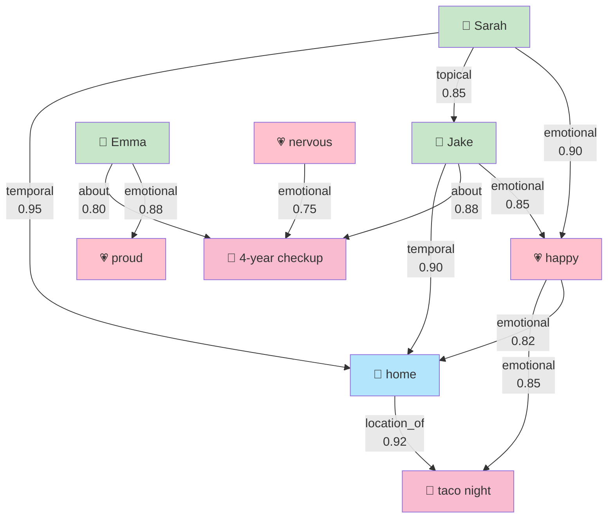
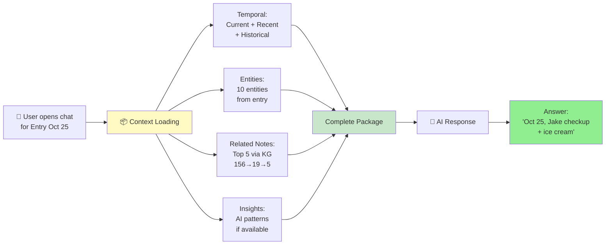
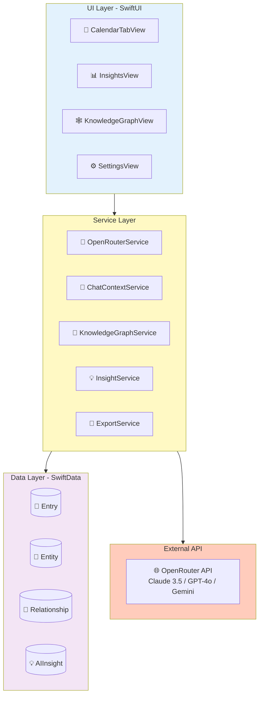
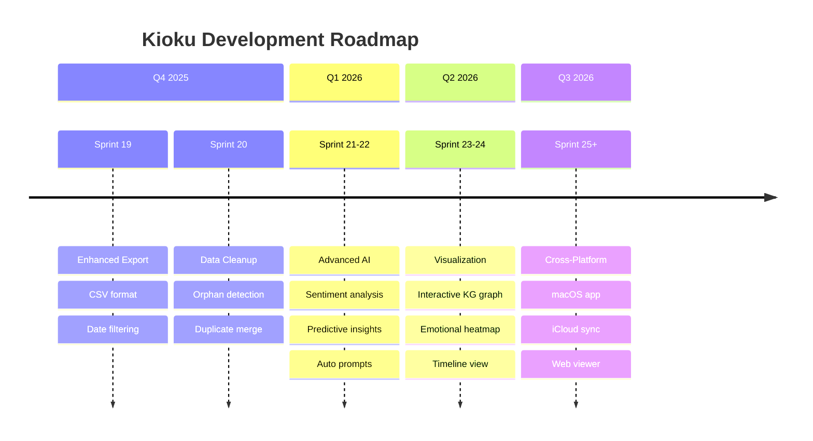
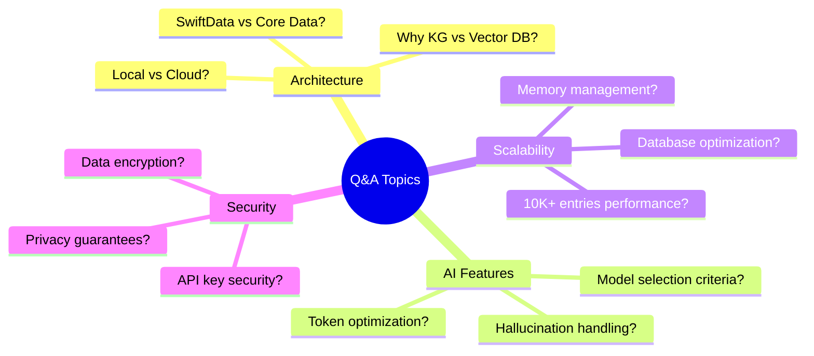

# Kioku - AI Journal
## Technical Presentation Slides (Short Version)

**Duration**: 15-20 minutes
**Focus**: Product Overview + Key Concepts
**Technical Details**: See [TECHNICAL_DEEP_DIVE.md](./TECHNICAL_DEEP_DIVE.md)

---

# Slide 1: Title

```
╔════════════════════════════════════════╗
║                                        ║
║         KIOKU AI JOURNAL              ║
║   Knowledge Graph + AI Assistant       ║
║                                        ║
║        Phuc Nguyen                     ║
║      Technical Presentation            ║
║                                        ║
╚════════════════════════════════════════╝
```

**🎤 Speaker Script (Tiếng Việt):**

> "Xin chào, tôi là Phuc Nguyễn. Hôm nay tôi xin giới thiệu Kioku - một ứng dụng nhật ký cá nhân tích hợp AI.
>
> Kioku nghĩa là 'ký ức' trong tiếng Nhật. Đây là ứng dụng iOS kết hợp viết nhật ký với công nghệ AI hiện đại - Knowledge Graph và AI Assistant.
>
> Trong 20 phút tiếp theo, tôi sẽ tập trung vào: vấn đề cần giải quyết, các tính năng AI chính, và kiến trúc kỹ thuật."

**🎤 Speaker Script (日本語):**

> "こんにちは、Phuc Nguyenです。今日(きょう)はKioku - AI統合(とうごう)の個人(こじん)日記(にっき)アプリを紹介(しょうかい)します。
>
> Kiokuは日本語(にほんご)で「記憶(きおく)」という意味(いみ)です。このiOSアプリは、伝統的(でんとうてき)な日記(にっき)とAI技術(ぎじゅつ) - Knowledge GraphとAI Assistantを組(く)み合(あ)わせています。
>
> これから20分間(ふんかん)で、解決(かいけつ)すべき問題(もんだい)、主(おも)なAI機能(きのう)、技術(ぎじゅつ)アーキテクチャについて説明(せつめい)します。"

---

# Slide 2: The Problem



**Core Problems:**
1. **Memory Overload** - Can't remember 20 entries, 5,000+ words
2. **No Context Awareness** - Can't ask AI about personal patterns
3. **Lost Connections** - Don't see relationships between events/emotions
4. **Privacy Concerns** - Cloud-based journals expose personal data

**🎤 Speaker Script (Tiếng Việt):**

> "Vấn đề: Sau 2 tháng viết nhật ký, bạn có 20 entries với 5,000+ từ. Muốn hỏi 'Lần cuối với Jake là khi nào?' phải đọc thủ công 20 entries, mất 15-20 phút. Hoặc 'Hoạt động nào khiến tôi hạnh phúc?' - với 40 cảm xúc khác nhau, không thể tìm pattern thủ công.
>
> Bốn vấn đề chính: Memory Overload, No Context Awareness, Lost Connections, và Privacy Concerns. Các giải pháp hiện tại: Google Docs không có AI, Day One lưu cloud, Notion không privacy."

**🎤 Speaker Script (日本語):**

> "問題(もんだい)について説明(せつめい)します。2ヶ月(かげつ)日記(にっき)を書(か)いたら、20エントリー、5000語(ご)以上(いじょう)になります。'Jakeと最後(さいご)に会(あ)ったのはいつ？'と聞(き)きたいとき、20エントリーを手作業(てさぎょう)で読(よ)む必要(ひつよう)があり、15-20分(ふん)かかります。または'どの活動(かつどう)が幸(しあわ)せにする？' - 40の感情(かんじょう)があり、手作業(てさぎょう)でパターンを見(み)つけることは不可能(ふかのう)です。
>
> 4つの主(おも)な問題(もんだい)：Memory Overload、Context Awareness無(な)し、Lost Connections、Privacy問題(もんだい)。現在(げんざい)のソリューション：Google DocsにはAI無(な)し、Day Oneはクラウド保存(ほぞん)、Notionはプライバシー無(な)しです。"

---

# Slide 3: The Solution



**Real Results:**
- **Input**: 20 entries (Sep-Oct 2025)
- **AI Extracted**: 119 entities (40 emotions, 32 topics, 28 events, 11 people, 8 places)
- **Discovered**: 105 relationships (temporal, topical, emotional, social)
- **Outcome**: Ask "When with Jake?" → Instant answer: Oct 25 (checkup + ice cream)

**Tech Stack:**
- iOS 18+ (Swift, SwiftUI, SwiftData)
- OpenRouter API (Claude/GPT/Gemini)
- Local-first + Encryption

**🎤 Speaker Script (Tiếng Việt):**

> "Giải pháp: 20 entries → AI extract 119 entities và 105 relationships. Con số thực từ demo, không phải giả định. 119 entities gồm 40 cảm xúc, 32 topics, 28 events, 11 người, 8 địa điểm.
>
> Sarah xuất hiện CẢ 20 entries - AI tự nhận ra đây là người quan trọng nhất. Tất cả tạo thành Knowledge Graph, giúp AI hiểu context đầy đủ.
>
> Kết quả: Hỏi 'Lần cuối với Jake?' → Trả lời instant: '25 tháng 10, khám sức khỏe và ăn kem'. Tech stack: iOS 18, OpenRouter API, Local-first với encryption."

**🎤 Speaker Script (日本語):**

> "解決策(かいけつさく)：20エントリー → AIが119エンティティと105リレーションシップを抽出(ちゅうしゅつ)。これは実際(じっさい)のデモの数字(すうじ)です。119エンティティの内訳(うちわけ)：40感情(かんじょう)、32トピック、28イベント、11人(にん)、8場所(ばしょ)。
>
> Sarahは全(すべ)ての20エントリーに登場(とうじょう)します - AIが自動的(じどうてき)に最(もっと)も重要(じゅうよう)な人(ひと)と認識(にんしき)しました。これらすべてがKnowledge Graphになり、AIが完全(かんぜん)なコンテキストを理解(りかい)できます。
>
> 結果(けっか)：'Jakeと最後(さいご)はいつ？'と聞(き)く → 即座(そくざ)に回答(かいとう)：'10月(がつ)25日(にち)、健康診断(けんこうしんだん)とアイスクリーム'。Tech stack：iOS 18、OpenRouter API、ローカルファースト+暗号化(あんごうか)。"

---

# Slide 4: Feature 1 - Entity Extraction



**Real Demo Results:**
- **119 entities** from 20 entries
- **40 emotions** (largest category) - emotional intelligence
- **Sarah**: 100% coverage (all 20 entries)
- **Deduplication**: Sarah 20x → 1 entity with 20 references

**Challenge: Entity Deduplication**



**🎤 Speaker Script (Tiếng Việt):**

> "Tính năng 1: Entity Extraction. Khi viết entry, AI tự động extract 5 loại entities: People, Places, Events, Emotions, Topics.
>
> Kết quả thực tế: 119 entities từ 20 entries. Đặc biệt 40 emotion entities - category lớn nhất, thể hiện emotional intelligence. Sarah xuất hiện CẢ 20 entries - perfect detection.
>
> Challenge lớn: Entity Deduplication. 'Sarah' 20 lần phải là 1 entity, không phải 20 duplicates. Solution: In-memory cache với normalized matching. Result: 100% deduplication success."

**🎤 Speaker Script (日本語):**

> "機能(きのう)1：Entity Extraction。エントリーを書(か)くとき、AIが自動的(じどうてき)に5種類(しゅるい)のエンティティを抽出(ちゅうしゅつ)：People、Places、Events、Emotions、Topics。
>
> 実際(じっさい)の結果(けっか)：20エントリーから119エンティティ。特(とく)に40の感情(かんじょう)エンティティ - 最大(さいだい)のカテゴリー、emotional intelligenceを示(しめ)します。Sarahは全(すべ)ての20エントリーに登場(とうじょう) - 完璧(かんぺき)な検出(けんしゅつ)。
>
> 大(おお)きな課題(かだい)：Entity Deduplication。'Sarah'が20回(かい)登場(とうじょう)するとき、1つのエンティティにする必要(ひつよう)があります、20個(こ)の重複(じゅうふく)ではなく。解決策(かいけつさく)：In-memoryキャッシュとnormalized matching。結果(けっか)：100%重複排除(じゅうふくはいじょ)成功(せいこう)。"

---

# Slide 5: Feature 2 - Relationship Discovery



**Real Results:** 105 relationships, 4 types (CAUSAL, EMOTIONAL, TEMPORAL, TOPICAL)

**📖 Technical Details:** [TECHNICAL_DEEP_DIVE.md - Feature 1](./TECHNICAL_DEEP_DIVE.md#feature-1-relationship-discovery)

**🎤 Speaker Script (Tiếng Việt):**

> "Tính năng 2: Relationship Discovery. AI tự động tìm connections giữa entities.
>
> Nhìn vào Knowledge Graph: 105 relationships giữa people, places, events, emotions. Mỗi relationship có type và weight.
>
> 4 types: CAUSAL - nhân quả (0.9), EMOTIONAL - cảm xúc (0.7), TEMPORAL - thời gian (0.5), TOPICAL - chủ đề (0.4).
>
> Chi tiết về cách AI tạo relationships, confidence scoring logic, và real examples - xem TECHNICAL_DEEP_DIVE document."

**🎤 Speaker Script (日本語):**

> "機能(きのう)2：Relationship Discovery。AIが自動的(じどうてき)にentities間(かん)のconnectionsを見(み)つけます。
>
> Knowledge Graphを見(み)ると：people、places、events、emotions間(かん)の105リレーションシップ。各(かく)relationshipにはtypeとweightがあります。
>
> 4つのtypes：CAUSAL - 因果(いんが)（0.9）、EMOTIONAL - 感情(かんじょう)（0.7）、TEMPORAL - 時間(じかん)（0.5）、TOPICAL - トピック（0.4）。
>
> AIがどのようにrelationshipsを作成(さくせい)するか、confidence scoringロジック、実例(じつれい)など - TECHNICAL_DEEP_DIVEドキュメントを参照(さんしょう)してください。"

---

# Slide 6: Feature 3 - Context-Aware Chat

**AI Chat với Complete Context:**



**Context Components (Real Demo):**
- **Temporal**: Current entry + recent (7 days) + historical (same date prev years)
- **Entities**: 10 entities extracted from entry
- **Related Notes** ⭐: Top 5 entries via KG traversal (scores: 1.68-1.28)
- **Insights**: AI-discovered patterns (e.g., "Sarah 100% coverage")

**Real Example:**
- **User asks**: "When was last quality time with Jake?"
- **AI receives**: 1 current + 5 related entries + 10 entities + access to 105 relationships
- **AI answers**: "October 25th, Jake's 4-year checkup + ice cream after"

**📖 Technical Details:** [TECHNICAL_DEEP_DIVE.md - Feature 2](./TECHNICAL_DEEP_DIVE.md#feature-2-context-aware-chat-finding-related-entries)

**🎤 Speaker Script (Tiếng Việt):**

> "Tính năng 3: Context-Aware Chat. Khi user mở chat, hệ thống load complete context.
>
> 4 loại context: Temporal - current + recent + historical. Entities - 10 entities từ entry. Related Notes - top 5 entries qua KG traversal với scores từ 1.28 đến 1.68. Insights - AI patterns như 'Sarah 100% coverage'.
>
> Ví dụ thực: User hỏi 'Lần cuối với Jake?' → AI nhận complete context package → Trả lời instant: 'October 25th, Jake's checkup + ice cream'.
>
> Chi tiết graph traversal process, scoring logic 156→19→5, recency decay - xem TECHNICAL_DEEP_DIVE document."

**🎤 Speaker Script (日本語):**

> "機能(きのう)3：Context-Aware Chat。ユーザーがchatを開(ひら)くと、システムは完全(かんぜん)なcontextをロードします。
>
> 4つのcontext types：Temporal - current + recent + historical。Entities - entryから10エンティティ。Related Notes - KG traversalでトップ5エントリー、1.28から1.68のスコア。Insights - 'Sarah 100% coverage'などのAIパターン。
>
> 実例(じつれい)：ユーザーが'Jakeと最後(さいご)はいつ？'と聞(き)く → AIが完全(かんぜん)なcontext packageを受(う)け取(と)る → 即座(そくざ)に回答(かいとう)：'October 25th, Jakeのcheckup + ice cream'。
>
> Graph traversal process、156→19→5のscoringロジック、recency decayの詳細(しょうさい) - TECHNICAL_DEEP_DIVEドキュメントを参照(さんしょう)してください。"

---

# Slide 7: Technical Architecture



**Tech Stack:**
- **Frontend**: SwiftUI (iOS 18+)
- **Data**: SwiftData (@Model, @Query, @Observable)
- **Concurrency**: async/await, Task, MainActor
- **API**: OpenRouter (multi-model access)
- **Architecture**: MVVM + Service Layer

**🎤 Speaker Script (Tiếng Việt):**

> "Kiến trúc kỹ thuật: UI layer SwiftUI thuần iOS 18. Service layer gồm OpenRouter, ChatContext, KnowledgeGraph, Insight services. Data layer SwiftData - framework mới nhất của Apple. External là OpenRouter API - access 15+ AI models.
>
> Data flow: User viết entry → save SwiftData → trigger extraction async → AI extract entities → save relationships. User hỏi → query KG for context → load relevant entries → gửi AI → show answer với citations. Tất cả async/await, không block UI."

**🎤 Speaker Script (日本語):**

> "技術(ぎじゅつ)アーキテクチャ：UI layerは純粋(じゅんすい)なSwiftUI、iOS 18。Service layerはOpenRouter、ChatContext、KnowledgeGraph、Insightサービス。Data layerはSwiftData - Appleの最新(さいしん)フレームワーク。ExternalはOpenRouter API - 15以上(いじょう)のAIモデルにアクセス。
>
> データフロー：ユーザーがエントリーを書(か)く → SwiftDataに保存(ほぞん) → 非同期(ひどうき)で抽出(ちゅうしゅつ)開始(かいし) → AIがエンティティを抽出(ちゅうしゅつ) → リレーションシップを保存(ほぞん)。ユーザーが質問(しつもん) → コンテキストのためKGをクエリ → 関連(かんれん)エントリーをロード → AIに送信(そうしん) → 引用(いんよう)付(つ)きで回答(かいとう)を表示(ひょうじ)。すべてasync/await、UIをブロックしません。"

---

# Slide 8: Future Roadmap



**Next Steps:**
- **Q4 2025**: Enhanced export (CSV), Data cleanup tools
- **Q1 2026**: Advanced AI (sentiment analysis, predictive insights)
- **Q2 2026**: Visualization (interactive graph, heatmap)
- **Q3 2026**: Cross-platform (macOS, iCloud sync, web viewer)

**🎤 Speaker Script (Tiếng Việt):**

> "Roadmap tương lai: Q4 2025 - Enhanced export và data cleanup. Q1 2026 - Advanced AI với sentiment analysis và predictive insights. Q2 2026 - Visualization với interactive graph và emotional heatmap. Q3 2026 - Cross-platform: macOS app, iCloud sync, web viewer. Clear roadmap cho future development."

**🎤 Speaker Script (日本語):**

> "今後(こんご)のロードマップ：2025年(ねん)Q4 - Enhanced exportとdata cleanup。2026年(ねん)Q1 - Advanced AI、sentiment analysisとpredictive insights。2026年(ねん)Q2 - Visualization、interactive graphとemotional heatmap。2026年(ねん)Q3 - Cross-platform：macOSアプリ、iCloud sync、webビューアー。明確(めいかく)な今後(こんご)の開発(かいはつ)ロードマップです。"

---

# Slide 9: Q&A



**Key Questions:**

**Q: Why Knowledge Graph instead of Vector Database?**
- KG provides structure + explainability (105 relationships with reasons)
- Real example: "Connected via emotional relationship through Emma..."
- Queryable like SQL, lightweight (no ML inference)

**Q: How do you handle AI hallucinations?**
- Confidence scoring (0.7-0.95) for each entity
- RAG cites real entries (not generating facts)
- User can verify supporting entries

**Q: Performance with 10,000 entries?**
- SwiftData pagination (fetch on-demand)
- Smart filtering: 156 scores → 19 entries → Top 5
- Graph queries O(log n) with indexes

**Q: Data security?**
- 100% local storage (no auto-uploads)
- Encryption keys in iOS Keychain
- PRIVACY.md App Store compliant

**Q: Can you show the actual demo?**
- Yes! Export JSON: `kioku-export-2025-10-26T08:52:24Z.json`
- Contains: 119 entities, 105 relationships, all 20 entries
- Every number verifiable

**🎤 Speaker Script (Tiếng Việt):**

> "Một số câu hỏi thường gặp:
>
> Tại sao KG thay vì Vector DB? Structure và explainability - thấy exact reason. 105 relationships với explicit types. Queryable, lightweight.
>
> AI hallucination? Confidence scoring 0.7-0.95. RAG cite real entries, không generate facts. User verify được.
>
> Performance 10K entries? Pagination, smart filtering 156→19→5. Graph queries O(log n).
>
> Security? 100% local, encryption keys trong Keychain, PRIVACY.md App Store compliant.
>
> Show demo? Có! Export JSON chứa 119 entities, 105 relationships, all 20 entries - mọi số liệu verifiable."

**🎤 Speaker Script (日本語):**

> "よくある質問(しつもん)：
>
> なぜVector DBではなくKG？StructureとExplainability - 正確(せいかく)な理由(りゆう)が見(み)える。105リレーションシップ、explicit types。Queryable、lightweight。
>
> AI hallucination対策(たいさく)は？Confidence scoring 0.7-0.95。RAGは実際(じっさい)のエントリーを引用(いんよう)、事実(じじつ)を生成(せいせい)しない。ユーザーが確認(かくにん)できる。
>
> 10Kエントリーでのパフォーマンスは？Pagination、smart filtering 156→19→5。Graph queriesはO(log n)。
>
> セキュリティは？100%ローカル保存(ほぞん)、暗号化(あんごうか)キーはKeychainに、PRIVACY.mdはApp Store準拠(じゅんきょ)。
>
> デモを見(み)せられる？はい！Export JSONに119エンティティ、105リレーションシップ、全(すべ)て20エントリー - すべての数字(すうじ)が確認可能(かくにんかのう)。"

---

# Slide 10: Thank You

```
╔════════════════════════════════════════╗
║                                        ║
║           THANK YOU!                   ║
║                                        ║
║    Kioku v0.1.0 - AI Journal           ║
║                                        ║
║    GitHub: phuc-nt/kioku-ios           ║
║    License: MIT (Open Source)          ║
║                                        ║
║    Real Results:                       ║
║    • 119 entities extracted            ║
║    • 105 relationships discovered      ║
║    • 100% deduplication success        ║
║                                        ║
║    Tech: Swift, SwiftUI, SwiftData     ║
║          OpenRouter API                ║
║                                        ║
║    App Store Ready 🚀                  ║
║                                        ║
╚════════════════════════════════════════╝
```

**Key Takeaways:**

1. **Problem → Solution**: Manual search (20 min) → Instant AI answers (< 1s)
2. **Real Results**: 20 entries → 119 entities + 105 relationships (proven)
3. **Technical Innovation**: Knowledge Graph + 4-phase RAG
4. **Quality**: 100% deduplication, explainable AI
5. **Production-Ready**: v0.1.0, MIT license, App Store compliant

**What Makes This Special:**
- ✅ **Emotional intelligence**: 40 emotion entities
- ✅ **Explainability**: Not black box - see exact connections
- ✅ **Privacy-first**: 100% local, encryption
- ✅ **Verifiable**: All numbers backed by real demo data

**🎤 Speaker Script (Tiếng Việt):**

> "Tổng kết 3 tính năng cốt lõi:
>
> 1. Entity Extraction: 119 entities từ 20 entries. 40 emotion entities - emotional intelligence. Sarah 100% coverage - perfect detection.
>
> 2. Relationship Discovery: AI tự động tạo 105 relationships với 4 types (CAUSAL, EMOTIONAL, TEMPORAL, TOPICAL) và confidence scores. Explainable với evidence từ văn bản gốc.
>
> 3. Context-Aware Chat: Graph traversal tìm related entries qua 156 scores → 19 entries → Top 5. Có lý do rõ ràng, recency-aware, explainable.
>
> Kết quả: Hệ thống hiểu cảm xúc, ngữ cảnh, và lịch sử của user. AI trả lời chính xác với context đầy đủ.
>
> Tất cả source code, demo data, export JSON đều trên GitHub. Production-ready v0.1.0, MIT license, App Store compliant.
>
> Cảm ơn các bạn đã lắng nghe!"

**🎤 Speaker Script (日本語):**

> "3つのcore featuresをまとめます：
>
> 1. Entity Extraction: 20エントリーから119エンティティ。40の感情(かんじょう)エンティティ - emotional intelligence。Sarah 100%カバレッジ - 完璧(かんぺき)な検出(けんしゅつ)。
>
> 2. Relationship Discovery: AIが自動的(じどうてき)に105リレーションシップを作成(さくせい)。4 types（CAUSAL、EMOTIONAL、TEMPORAL、TOPICAL）とconfidence scores。元(もと)のテキストのevidenceでexplainable。
>
> 3. Context-Aware Chat: Graph traversalで156 scores → 19 entries → Top 5のrelated entriesを見(み)つける。明確(めいかく)な理由(りゆう)、recency-aware、explainable。
>
> 結果(けっか): システムはユーザーの感情(かんじょう)、context、履歴(りれき)を理解(りかい)。AIは完全(かんぜん)なcontextで正確(せいかく)に答(こた)えます。
>
> すべてのソースコード、デモデータ、export JSONはGitHubにあります。Production-ready v0.1.0、MITライセンス、App Store準拠(じゅんきょ)。
>
> ご清聴(せいちょう)ありがとうございました！"

---

**Presentation Complete!**
- **Total duration**: ~12-15 minutes (10 slides, concise overview)
- **Focus**: Product concept, key features (high-level only)
- **Technical details**: All moved to [TECHNICAL_DEEP_DIVE.md](./TECHNICAL_DEEP_DIVE.md)
- **Structure**:
  - Slides 1-3: Problem → Solution → Overview
  - Slides 4-6: 3 Core Features (diagrams + scripts + links to details)
  - Slides 7-8: Architecture + Roadmap
  - Slides 9-10: Q&A + Thank You (with comprehensive closing script)
- **Languages**: Vietnamese + Japanese (with furigana) speaker scripts for all slides
- **Use case**: Stakeholder presentation, product pitch, interview intro
