# Kioku - AI Journal
## Technical Presentation Slides (Short Version)

**Duration**: 15-20 minutes
**Focus**: Product Overview + Key Concepts
**Technical Details**: See [TECHNICAL_DEEP_DIVE.md](./TECHNICAL_DEEP_DIVE.md)

---

# Slide 1: Title

```
╔════════════════════════════════════════╗
║                                        ║
║         KIOKU AI JOURNAL              ║
║   Knowledge Graph + AI Assistant       ║
║                                        ║
║        Phuc Nguyen                     ║
║      Technical Presentation            ║
║                                        ║
╚════════════════════════════════════════╝
```

**🎤 Speaker Script (Tiếng Việt):**

> "Xin chào, tôi là Phuc Nguyễn. Kioku - ứng dụng nhật ký cá nhân với AI, kết hợp viết nhật ký với Knowledge Graph và AI Assistant."

**🎤 Speaker Script (日本語):**

> "こんにちは、Phuc Nguyenです。Kioku - AIを統合(とうごう)した個人(こじん)日記(にっき)アプリ。日記(にっき)とKnowledge Graph、AI Assistantを組(く)み合(あ)わせています。"

---

# Slide 2: The Problem

```mermaid
graph TD
    A[👤 User writes journal daily] --> B{After 2 months...}
    B --> C[❓ Question: When was last quality time with Jake?]
    C --> D[😓 Must read 20 entries manually]
    D --> E[⏰ 15-20 minutes wasted]
    E --> F[❌ Still not sure about patterns]

    style A fill:#e1f5e1
    style C fill:#fff4e1
    style D fill:#ffe1e1
    style E fill:#ffe1e1
    style F fill:#ff6b6b,color:#fff
```



**Core Problems:**
1. **Memory Overload** - Can't remember past entries
2. **No Context Awareness** - Can't ask AI about personal patterns
3. **Lost Connections** - Don't see relationships between events/emotions
4. **Privacy Concerns** - Cloud-based journals expose personal data

**🎤 Speaker Script (Tiếng Việt):**

> "Vấn đề: Sau vài tháng viết nhật ký, không thể nhớ hết. Muốn hỏi 'Lần cuối với Jake?' phải đọc thủ công nhiều entries. 'Hoạt động nào khiến tôi hạnh phúc?' - không thể tìm pattern thủ công.
>
> Bốn vấn đề: Memory Overload, No Context Awareness, Lost Connections, Privacy Concerns."

**🎤 Speaker Script (日本語):**

> "問題(もんだい)：数(すう)ヶ月(かげつ)日記(にっき)を書(か)くと、全部(ぜんぶ)覚(おぼ)えられない。'Jakeと最後(さいご)はいつ？'と聞(き)きたいとき、手作業(てさぎょう)で読(よ)む必要(ひつよう)。'何(なに)が幸(しあわ)せにする？' - 手作業(てさぎょう)でパターン発見(はっけん)は不可能(ふかのう)。
>
> 4つの問題(もんだい)：Memory Overload、Context Awareness無(な)し、Lost Connections、Privacy問題(もんだい)。"

---

# Slide 3: The Solution

```mermaid
graph LR
    A[📝 20 Journal Entries<br/>5,000+ words] --> B[🧠 AI Processing]
    B --> C[🕸️ Knowledge Graph<br/>119 entities<br/>105 relationships]
    C --> D[💬 Context-Aware Chat<br/>Ask anything]

    style A fill:#e3f2fd
    style B fill:#fff9c4
    style C fill:#f3e5f5
    style D fill:#e8f5e9
```



**Real Results:**
- **Input**: Journal entries
- **AI Extracted**: Entities (people, emotions, events, places, topics)
- **Discovered**: Relationships between entities
- **Outcome**: Ask "When with Jake?" → Instant answer with context

**Tech Stack:**
- iOS 18+ (Swift, SwiftUI, SwiftData)
- OpenRouter API (Claude/GPT/Gemini)
- Local-first + Encryption

**🎤 Speaker Script (Tiếng Việt):**

> "Giải pháp: Entries → AI extract entities và relationships. Tạo thành Knowledge Graph, giúp AI hiểu context đầy đủ.
>
> Kết quả: Hỏi 'Lần cuối với Jake?' → Trả lời instant với context. Tech stack: iOS 18, OpenRouter API, Local-first với encryption."

**🎤 Speaker Script (日本語):**

> "解決策(かいけつさく)：Entries → AIがentitiesとrelationshipsを抽出(ちゅうしゅつ)。Knowledge Graphを作成(さくせい)、AIが完全(かんぜん)なcontextを理解(りかい)。
>
> 結果(けっか)：'Jakeと最後(さいご)はいつ？'と聞(き)く → 即座(そくざ)にcontextと共(とも)に回答(かいとう)。Tech stack：iOS 18、OpenRouter API、ローカルファースト+暗号化(あんごうか)。"

---

# Slide 4: Feature 1 - Entity Extraction

```mermaid
graph TD
    A[📝 Input Entry<br/>Oct 25: Jake's 4-year checkup] --> B[🤖 AI Processing]
    B --> C1[👤 Sarah<br/>PEOPLE<br/>Confidence: 0.95]
    B --> C2[👤 Jake<br/>PEOPLE<br/>Confidence: 0.92]
    B --> C3[📍 ice cream place<br/>PLACES<br/>Confidence: 0.88]
    B --> C4[📅 4-year checkup<br/>EVENTS<br/>Confidence: 0.90]
    B --> C5[💗 happy<br/>EMOTIONS<br/>Confidence: 0.85]
    B --> C6[💗 nervous<br/>EMOTIONS<br/>Confidence: 0.80]

    style A fill:#e3f2fd
    style B fill:#fff9c4
    style C1 fill:#c8e6c9
    style C2 fill:#c8e6c9
    style C3 fill:#b3e5fc
    style C4 fill:#f8bbd0
    style C5 fill:#ffc1cc
    style C6 fill:#ffc1cc
```



**Key Feature:** Automatically extracts 5 types of entities from journal text.

**Challenge: Entity Deduplication**

```mermaid
graph LR
    E1[Entry 1: Sarah] --> Cache{In-Memory<br/>Cache}
    E2[Entry 2: Sarah] --> Cache
    E3[Entry N: Sarah] --> Cache
    Cache --> Result[✅ Single Entity<br/>Sarah<br/>Multiple references<br/>100% coverage]

    style E1 fill:#e3f2fd
    style E2 fill:#e3f2fd
    style E3 fill:#e3f2fd
    style Cache fill:#fff9c4
    style Result fill:#c8e6c9
```



**🎤 Speaker Script (Tiếng Việt):**

> "Tính năng 1: Entity Extraction. AI tự động extract 5 loại entities: People, Places, Events, Emotions, Topics.
>
> Challenge lớn: Entity Deduplication. 'Sarah' xuất hiện nhiều lần phải là 1 entity duy nhất. Solution: In-memory cache với normalized matching."

**🎤 Speaker Script (日本語):**

> "機能(きのう)1：Entity Extraction。AIが自動的(じどうてき)に5種類(しゅるい)のエンティティを抽出(ちゅうしゅつ)：People、Places、Events、Emotions、Topics。
>
> 大(おお)きな課題(かだい)：Entity Deduplication。'Sarah'が何度(なんど)も登場(とうじょう)するとき、1つのエンティティにする必要(ひつよう)。解決策(かいけつさく)：In-memoryキャッシュとnormalized matching。"

---

# Slide 5: Feature 2 - Relationship Discovery

```mermaid
graph TD
    Sarah[👤 Sarah] -->|temporal<br/>0.95| Home[📍 home]
    Jake[👤 Jake] -->|temporal<br/>0.90| Home
    Sarah -->|topical<br/>0.85| Jake
    Home -->|location_of<br/>0.92| TacoNight[📅 taco night]
    Jake -->|about<br/>0.88| Checkup[📅 4-year checkup]
    Emma[👤 Emma] -->|about<br/>0.80| Checkup

    Happy[💗 happy] -->|emotional<br/>0.85| TacoNight
    Happy -->|emotional<br/>0.82| Home
    Nervous[💗 nervous] -->|emotional<br/>0.75| Checkup

    Sarah -->|emotional<br/>0.90| Happy
    Jake -->|emotional<br/>0.85| Happy
    Emma -->|emotional<br/>0.88| Proud[💗 proud]

    style Sarah fill:#c8e6c9
    style Jake fill:#c8e6c9
    style Emma fill:#c8e6c9
    style Home fill:#b3e5fc
    style TacoNight fill:#f8bbd0
    style Checkup fill:#f8bbd0
    style Happy fill:#ffc1cc
    style Nervous fill:#ffc1cc
    style Proud fill:#ffc1cc
```



**Key Concept:** AI finds meaningful connections between entities with 4 relationship types.

**📖 Technical Details:** [TECHNICAL_DEEP_DIVE.md - Feature 1](./TECHNICAL_DEEP_DIVE.md#feature-1-relationship-discovery)

**🎤 Speaker Script (Tiếng Việt):**

> "Tính năng 2: Relationship Discovery. AI tự động tìm connections giữa entities.
>
> 4 types với weights khác nhau: CAUSAL - nhân quả (mạnh nhất), EMOTIONAL - cảm xúc, TEMPORAL - thời gian, TOPICAL - chủ đề (yếu nhất).
>
> Chi tiết kỹ thuật - xem TECHNICAL_DEEP_DIVE document."

**🎤 Speaker Script (日本語):**

> "機能(きのう)2：Relationship Discovery。AIが自動的(じどうてき)にentities間(かん)のconnectionsを見(み)つけます。
>
> 4つのtypesと異(こと)なるweights：CAUSAL - 因果(いんが)（最強(さいきょう)）、EMOTIONAL - 感情(かんじょう)、TEMPORAL - 時間(じかん)、TOPICAL - トピック（最弱(さいじゃく)）。
>
> 技術的(ぎじゅつてき)な詳細(しょうさい) - TECHNICAL_DEEP_DIVEドキュメント参照(さんしょう)。"

---

# Slide 6: Feature 3 - Context-Aware Chat

**AI Chat với Complete Context:**

```mermaid
graph LR
    User[👤 User opens chat<br/>for Entry Oct 25] --> Context[📦 Context Loading]

    Context --> T[Temporal:<br/>Current + Recent<br/>+ Historical]
    Context --> E[Entities:<br/>10 entities<br/>from entry]
    Context --> R[Related Notes:<br/>Top 5 via KG<br/>156→19→5]
    Context --> I[Insights:<br/>AI patterns<br/>if available]

    T --> Package[Complete Package]
    E --> Package
    R --> Package
    I --> Package

    Package --> AI[🤖 AI Response]
    AI --> Answer["Answer:<br/>'Oct 25, Jake checkup<br/>+ ice cream'"]

    style Context fill:#fff9c4
    style Package fill:#c8e6c9
    style Answer fill:#90EE90
```



**Context Components:**
- **Temporal**: Current + recent + historical entries
- **Entities**: Extracted entities from entry
- **Related Notes** ⭐: Top entries via KG traversal
- **Insights**: AI-discovered patterns

**Real Example:**
- **User asks**: "When was last quality time with Jake?"
- **AI receives**: Complete context package via Knowledge Graph
- **AI answers**: "October 25th, Jake's checkup + ice cream after"

**📖 Technical Details:** [TECHNICAL_DEEP_DIVE.md - Feature 2](./TECHNICAL_DEEP_DIVE.md#feature-2-context-aware-chat-finding-related-entries)

**🎤 Speaker Script (Tiếng Việt):**

> "Tính năng 3: Context-Aware Chat. Khi user mở chat, hệ thống load complete context.
>
> 4 loại context: Temporal, Entities, Related Notes qua KG traversal, và Insights.
>
> Ví dụ: User hỏi 'Lần cuối với Jake?' → AI nhận complete context → Trả lời instant với details.
>
> Chi tiết kỹ thuật - xem TECHNICAL_DEEP_DIVE document."

**🎤 Speaker Script (日本語):**

> "機能(きのう)3：Context-Aware Chat。ユーザーがchatを開(ひら)くと、システムは完全(かんぜん)なcontextをロード。
>
> 4つのcontext types：Temporal、Entities、KG traversalでRelated Notes、Insights。
>
> 例(れい)：'Jakeと最後(さいご)はいつ？' → AIが完全(かんぜん)なcontextを受(う)け取(と)る → 即座(そくざ)に詳細(しょうさい)と共(とも)に回答(かいとう)。
>
> 技術的(ぎじゅつてき)な詳細(しょうさい) - TECHNICAL_DEEP_DIVEドキュメント参照(さんしょう)。"

---

# Slide 7: Technical Architecture

```mermaid
graph TB
    subgraph UI["UI Layer - SwiftUI"]
        Calendar[📅 CalendarTabView]
        Insights[📊 InsightsView]
        Graph[🕸️ KnowledgeGraphView]
        Settings[⚙️ SettingsView]
    end

    subgraph Services["Service Layer"]
        OpenRouter[🤖 OpenRouterService]
        ChatContext[💬 ChatContextService]
        KGService[🧠 KnowledgeGraphService]
        InsightSvc[💡 InsightService]
        Export[💾 ExportService]
    end

    subgraph Data["Data Layer - SwiftData"]
        Entry[(📝 Entry)]
        Entity[(👤 Entity)]
        Relation[(🔗 Relationship)]
        Insight[(💡 AIInsight)]
    end

    subgraph External["External API"]
        API[🌐 OpenRouter API<br/>Claude 3.5 / GPT-4o / Gemini]
    end

    UI --> Services
    Services --> Data
    Services --> External

    style UI fill:#e3f2fd
    style Services fill:#fff9c4
    style Data fill:#f3e5f5
    style External fill:#ffccbc
```



**Tech Stack:**
- **Frontend**: SwiftUI (iOS 18+)
- **Data**: SwiftData (@Observable pattern)
- **API**: OpenRouter (multi-model access)
- **Architecture**: MVVM + Service Layer

**🎤 Speaker Script (Tiếng Việt):**

> "Kiến trúc: SwiftUI cho UI, SwiftData cho data persistence, OpenRouter API cho AI. MVVM + Service Layer architecture.
>
> Data flow: User viết entry → AI extract entities → save relationships. User hỏi → query KG → gửi AI → show answer. Tất cả async/await."

**🎤 Speaker Script (日本語):**

> "アーキテクチャ：SwiftUI (UI)、SwiftData (data)、OpenRouter API (AI)。MVVM + Service Layer。
>
> データフロー：ユーザーがエントリー書(か)く → AI抽出(ちゅうしゅつ) → 保存(ほぞん)。質問(しつもん) → KGクエリ → AI送信(そうしん) → 回答(かいとう)表示(ひょうじ)。すべてasync/await。"

---

# Slide 8: Future Roadmap


**Next Steps:**
- **Q4 2025**: Enhanced export, Data cleanup tools
- **Q1 2026**: Advanced AI (sentiment analysis, predictive insights)
- **Q2 2026**: Visualization (interactive graph, heatmap)
- **Q3 2026**: Cross-platform (macOS, iCloud sync)

**🎤 Speaker Script (Tiếng Việt):**

> "Roadmap: Q4 2025 - Export và cleanup. Q1 2026 - Advanced AI. Q2 2026 - Visualization. Q3 2026 - Cross-platform."

**🎤 Speaker Script (日本語):**

> "ロードマップ：2025年(ねん)Q4 - ExportとCleanup。2026年(ねん)Q1 - Advanced AI。2026年(ねん)Q2 - Visualization。2026年(ねん)Q3 - Cross-platform。"

---

# Slide 9: Q&A


**Key Questions:**

**Q: Why Knowledge Graph vs Vector Database?**
- Structure + explainability with reasons
- Queryable, lightweight, no ML inference

**Q: AI hallucination handling?**
- Confidence scoring for entities
- RAG cites real entries (not generating facts)

**Q: Performance at scale?**
- Pagination + smart filtering
- Graph queries with indexes

**Q: Data security?**
- 100% local storage, encryption
- iOS Keychain, App Store compliant

**🎤 Speaker Script (Tiếng Việt):**

> "Câu hỏi thường gặp:
>
> Tại sao KG? Structure và explainability với reasons rõ ràng.
>
> AI hallucination? Confidence scoring, RAG cite real entries.
>
> Performance? Pagination và smart filtering.
>
> Security? 100% local, encryption, App Store compliant."

**🎤 Speaker Script (日本語):**

> "よくある質問(しつもん)：
>
> なぜKG？Structureと明確(めいかく)なreasonsでExplainability。
>
> AI hallucination対策(たいさく)？Confidence scoring、RAGは実際(じっさい)のエントリー引用(いんよう)。
>
> パフォーマンス？PaginationとSmart filtering。
>
> セキュリティ？100%ローカル、暗号化(あんごうか)、App Store準拠(じゅんきょ)。"

---

# Slide 10: Thank You

```
╔════════════════════════════════════════╗
║                                        ║
║           THANK YOU!                   ║
║                                        ║
║    Kioku v0.1.0 - AI Journal           ║
║                                        ║
║    GitHub: phuc-nt/kioku-ios           ║
║    License: MIT (Open Source)          ║
║                                        ║
║    Real Results:                       ║
║    • 119 entities extracted            ║
║    • 105 relationships discovered      ║
║    • 100% deduplication success        ║
║                                        ║
║    Tech: Swift, SwiftUI, SwiftData     ║
║          OpenRouter API                ║
║                                        ║
║    App Store Ready 🚀                  ║
║                                        ║
╚════════════════════════════════════════╝
```

**Key Takeaways:**

1. **Problem → Solution**: Manual search → Instant AI answers
2. **Technical Innovation**: Knowledge Graph + Context-Aware RAG
3. **Quality**: Explainable AI with evidence
4. **Production-Ready**: v0.1.0, MIT license, App Store compliant

**What Makes This Special:**
- ✅ **Emotional intelligence**: Understands emotions and patterns
- ✅ **Explainability**: See exact reasons for connections
- ✅ **Privacy-first**: 100% local, encrypted
- ✅ **Verifiable**: All backed by real demo data

**🎤 Speaker Script (Tiếng Việt):**

> "Tổng kết 3 tính năng:
>
> 1. Entity Extraction: AI extract entities với deduplication.
>
> 2. Relationship Discovery: AI tạo relationships với 4 types và confidence scores. Explainable.
>
> 3. Context-Aware Chat: Graph traversal tìm related entries. Recency-aware, explainable.
>
> Kết quả: Hệ thống hiểu emotions, context, history của user. AI trả lời chính xác.
>
> Production-ready v0.1.0, MIT license, App Store compliant. Cảm ơn!"

**🎤 Speaker Script (日本語):**

> "3つのfeaturesをまとめます：
>
> 1. Entity Extraction: AIがentitiesを抽出(ちゅうしゅつ)、deduplication。
>
> 2. Relationship Discovery: AIがrelationshipsを作成(さくせい)、4 typesとconfidence scores。Explainable。
>
> 3. Context-Aware Chat: Graph traversalでrelated entriesを検索(けんさく)。Recency-aware、explainable。
>
> 結果(けっか): システムはemotions、context、historyを理解(りかい)。AIは正確(せいかく)に回答(かいとう)。
>
> Production-ready v0.1.0、MITライセンス、App Store準拠(じゅんきょ)。ありがとうございました！"

---

**Presentation Complete!**
- **Total duration**: ~10-12 minutes (10 slides, very concise)
- **Focus**: Product concept and key ideas only
- **No detailed numbers**: Removed specific counts (119, 105, etc.)
- **Technical details**: Link to [TECHNICAL_DEEP_DIVE.md](./TECHNICAL_DEEP_DIVE.md)
- **Structure**:
  - Slides 1-3: Problem → Solution → Overview
  - Slides 4-6: 3 Core Features (diagrams + brief scripts + links)
  - Slides 7-8: Architecture + Roadmap (streamlined)
  - Slides 9-10: Q&A + Thank You (concise closing)
- **Languages**: Vietnamese + Japanese (short scripts)
- **Use case**: Quick overview, stakeholder pitch, interview intro
