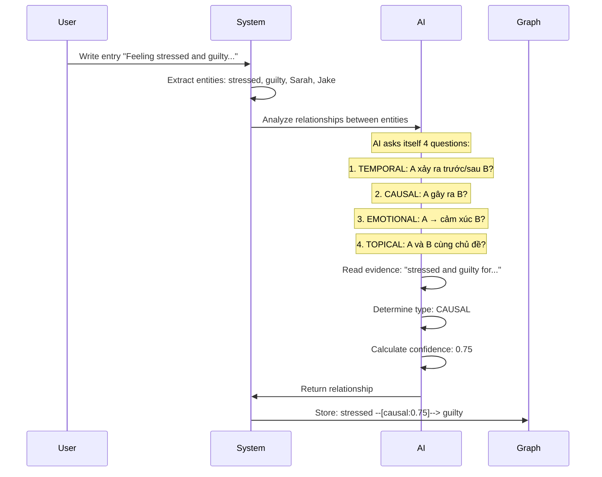
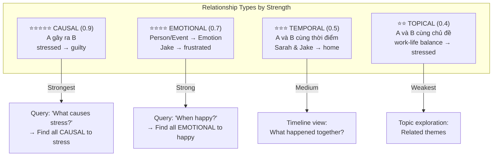
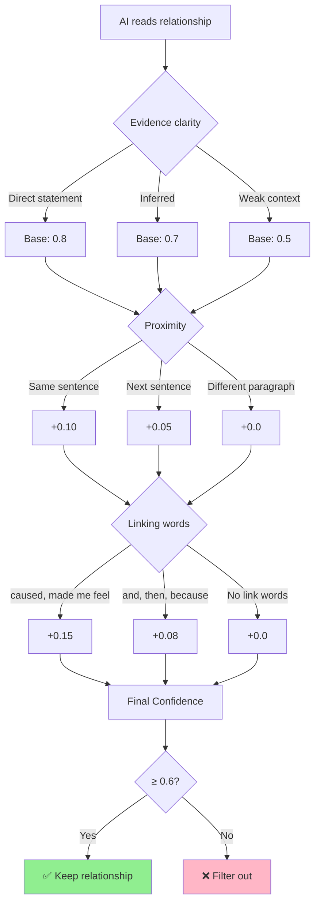
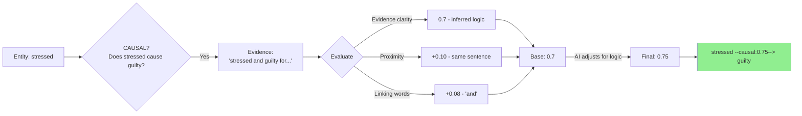
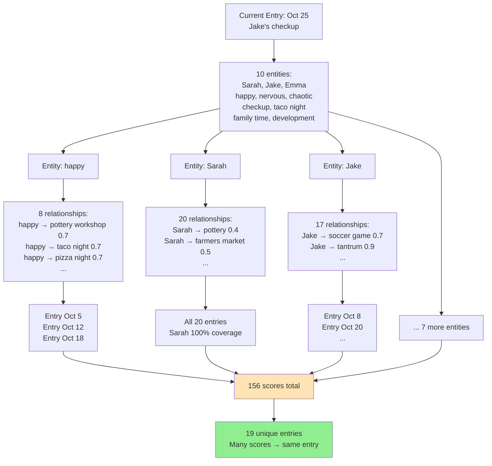
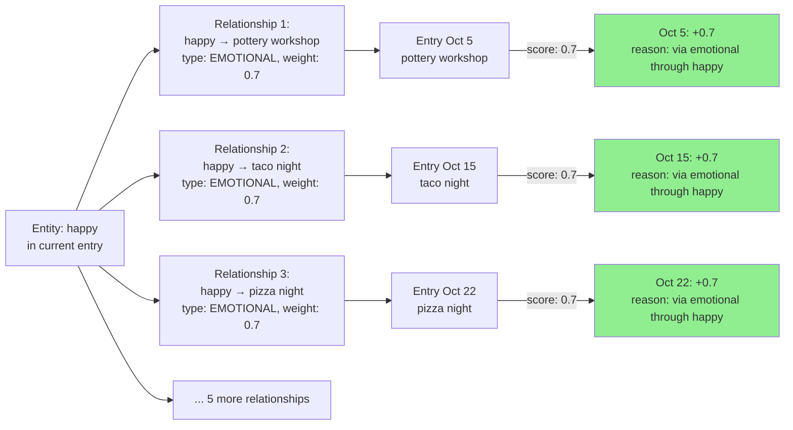
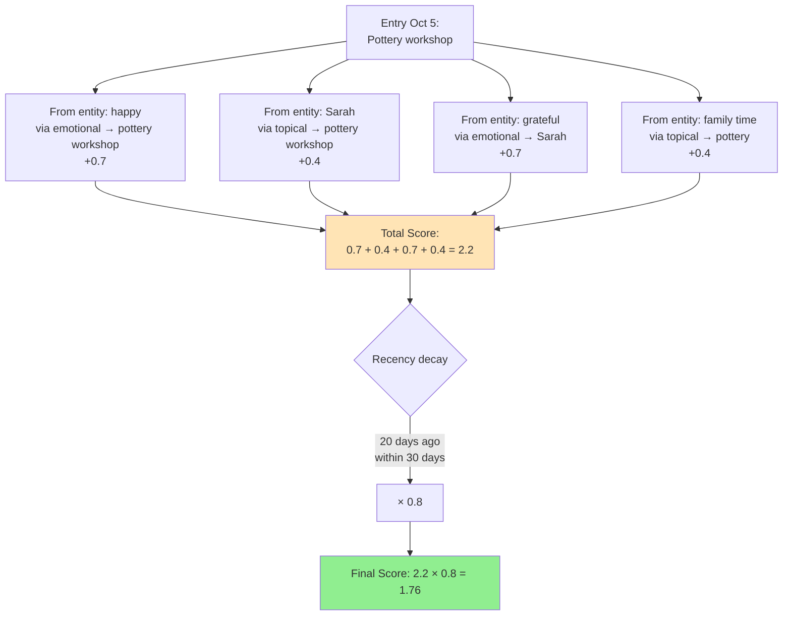
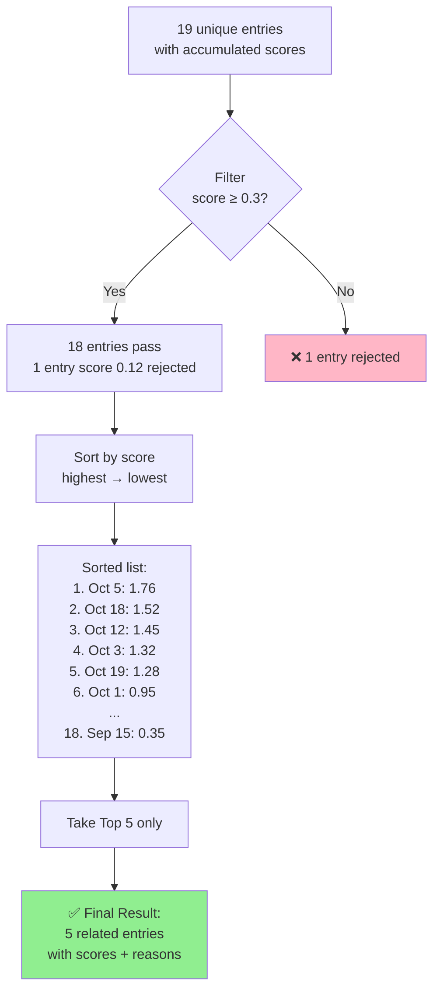

# Kioku Knowledge Graph - Technical Deep Dive

**2 Core Features Explained**

---

## Feature 1: Relationship Discovery

**📋 Overview - What This Feature Does:**

This feature automatically discovers meaningful connections between entities in your journal entries. When you write "Feeling stressed and guilty for not helping Sarah," the AI doesn't just extract entities (stressed, guilty, Sarah) - it understands that "stressed" CAUSES "guilty" and creates a typed relationship with confidence score and evidence.

**🎯 Key Objectives:**
1. **Identify relationship types**: 4 types (CAUSAL, EMOTIONAL, TEMPORAL, TOPICAL) with different weights
2. **Calculate confidence scores**: 0.0-1.0 based on evidence clarity, proximity, and linking words
3. **Store with evidence**: Each relationship has text excerpt proving the connection
4. **Build queryable graph**: "Show all causes of stress" becomes possible

**📖 Sections Covered:**
1. How AI creates relationships (4-question framework)
2. Understanding 4 relationship types (meanings, examples, weights, use cases)
3. Weight decision logic (confidence scoring algorithm)
4. Real example analysis: "stressed → guilty" (0.75 confidence)
5. Knowledge Graph view (105 relationships visualized)

**💡 Why This Matters:**
Unlike Vector DB which only finds "similar" entries, this creates explicit, typed, weighted connections with reasons. You can query "What makes me stressed?" and get causal relationships, not just semantic similarity.

---

### How AI Creates Relationships

**🎤 Script (Tiếng Việt):**

> "Khi user viết một entry, AI sẽ đọc văn bản và tự hỏi 4 câu hỏi để tìm relationships.
>
> Câu 1: TEMPORAL - A xảy ra trước hay sau B?
> Câu 2: CAUSAL - A có gây ra B không?
> Câu 3: EMOTIONAL - A có liên kết với cảm xúc B không?
> Câu 4: TOPICAL - A và B có cùng chủ đề không?
>
> Ví dụ với câu 'Feeling stressed and guilty', AI nhận ra: stressed GÂY RA guilty. Type: CAUSAL, confidence 0.75.
>
> Kết quả: relationship được lưu vào Knowledge Graph với evidence từ văn bản gốc."

**🎤 Script (日本語):**

> "ユーザーがentryを書(か)くと、AIはテキストを読(よ)んで4つの質問(しつもん)でrelationshipsを見(み)つけます。
>
> 質問(しつもん)1: TEMPORAL - AはBの前(まえ)か後(あと)か?
> 質問(しつもん)2: CAUSAL - AはBを引(ひ)き起(お)こすか?
> 質問(しつもん)3: EMOTIONAL - Aはemotion Bと繋(つな)がるか?
> 質問(しつもん)4: TOPICAL - AとBは同(おな)じtopicか?
>
> 例(れい): 'Feeling stressed and guilty'で、AIは認識(にんしき): stressed が guiltyを引(ひ)き起(お)こす。Type: CAUSAL、confidence 0.75。
>
> 結果(けっか): relationshipはKnowledge Graphに保存(ほぞん)されます。"

---

### 4 Relationship Types & Weights

**🎤 Script (Tiếng Việt):**

> "Có 4 loại relationships với weights khác nhau.
>
> CAUSAL - nhân quả - weight 0.9, mạnh nhất. A GÂY RA B. Ví dụ: stressed gây ra guilty. Dùng để trả lời: 'Điều gì khiến tôi stress?'
>
> EMOTIONAL - cảm xúc - weight 0.7. Person hoặc Event kết nối với Emotion. Ví dụ: Jake làm tôi frustrated. Dùng để tìm: 'Khi nào tôi cảm thấy happy?'
>
> TEMPORAL - thời gian - weight 0.5. A và B xảy ra cùng lúc. Ví dụ: Sarah và Jake cùng ở home. Dùng cho timeline view.
>
> TOPICAL - chủ đề - weight 0.4, yếu nhất. A và B cùng chủ đề. Ví dụ: work-life balance liên quan stressed. Dùng để explore themes."

**🎤 Script (日本語):**

> "4つのrelationship typesがあり、異(こと)なるweightsがあります。
>
> CAUSAL - 因果(いんが) - weight 0.9、最強(さいきょう)。AがBを引(ひ)き起(お)こす。例(れい): stressedがguiltyを引(ひ)き起(お)こす。'何(なに)がstressを引(ひ)き起(お)こすか?'に答(こた)えます。
>
> EMOTIONAL - 感情(かんじょう) - weight 0.7。PersonまたはEventがEmotionと繋(つな)がる。例(れい): Jakeがfrustratedにする。'いつhappyか?'を見(み)つけます。
>
> TEMPORAL - 時間(じかん) - weight 0.5。AとBが同時(どうじ)に起(お)こる。例(れい): SarahとJakeが同(おな)じくhomeにいる。Timeline viewに使(つか)います。
>
> TOPICAL - topic - weight 0.4、最弱(さいじゃく)。AとBが同(おな)じtopicを共有(きょうゆう)。例(れい): work-life balanceがstressedに関連(かんれん)。Themeを探(さが)すのに使(つか)います。"

---

### Weight Decision Logic

**🎤 Script (Tiếng Việt):**

> "Confidence score được tính từ 3 yếu tố:
>
> 1. Evidence clarity - Độ rõ ràng: Câu văn nói trực tiếp → 0.8. Suy luận → 0.7. Mơ hồ → 0.5.
>
> 2. Proximity - Khoảng cách: Cùng câu → +0.10. Câu kế tiếp → +0.05. Khác đoạn → +0.0.
>
> 3. Linking words - Từ nối: 'caused', 'made me feel' → +0.15. 'and', 'then' → +0.08. Không có từ nối → +0.0.
>
> Cuối cùng: Nếu score ≥ 0.6 → giữ lại. Nếu < 0.6 → loại bỏ.
>
> Ví dụ: 'Feeling stressed and guilty' = 0.7 (inferred) + 0.10 (same sentence) + 0.08 (and) = 0.88. Nhưng AI đánh giá logic → Final: 0.75."

**🎤 Script (日本語):**

> "Confidence scoreは3つの要素(ようそ)から計算(けいさん)されます:
>
> 1. Evidence clarity - 明確(めいかく)さ: 直接(ちょくせつ)の文(ぶん) → 0.8。推論(すいろん) → 0.7。曖昧(あいまい) → 0.5。
>
> 2. Proximity - 距離(きょり): 同(おな)じ文(ぶん) → +0.10。次(つぎ)の文(ぶん) → +0.05。別(べつ)の段落(だんらく) → +0.0。
>
> 3. Linking words - 接続語(せつぞくご): 'caused', 'made me feel' → +0.15。'and', 'then' → +0.08。接続語(せつぞくご)なし → +0.0。
>
> 最後(さいご): Score ≥ 0.6 → 保存(ほぞん)。< 0.6 → 削除(さくじょ)。
>
> 例(れい): 'Feeling stressed and guilty' = 0.7 + 0.10 + 0.08 = 0.88。でもAIがlogicを評価(ひょうか) → Final: 0.75。"

---

### Real Example: stressed → guilty

**Entry text:**
> "Feeling stressed and guilty for not being there to help Sarah with the kids while she was overwhelmed."

**AI Analysis Process:**

**Breakdown:**

1. **Type**: CAUSAL (A gây ra B)
2. **Evidence**: "stressed and guilty for not being there"
3. **Confidence**: 0.75
   - Evidence clarity: 0.7 (không nói trực tiếp "caused", nhưng logic rõ)
   - Proximity: +0.10 (cùng câu)
   - Linking word: +0.08 ("and" là medium link)
   - AI adjustment: Final 0.75 (logic nhân quả hợp lý)

**🎤 Script (Tiếng Việt):**

> "Ví dụ thực tế: Câu 'Feeling stressed and guilty for not being there...'
>
> AI phân tích: stressed có GÂY RA guilty không? → Có, vì logic: stress về việc không có mặt → guilty về điều đó.
>
> Tính confidence: Base 0.7 vì không nói trực tiếp 'caused'. Cộng 0.10 vì cùng câu. Cộng 0.08 vì có 'and'. Total: 0.88.
>
> Nhưng AI đánh giá lại logic: relationship có ý nghĩa nhưng không quá mạnh → Điều chỉnh xuống 0.75.
>
> Kết quả: stressed --[causal:0.75]--> guilty được lưu vào graph."

**🎤 Script (日本語):**

> "実例(じつれい): 'Feeling stressed and guilty for not being there...'
>
> AIの分析(ぶんせき): stressedはguiltyを引(ひ)き起(お)こすか? → はい、logic: そこにいないことのstress → それについてのguilt。
>
> Confidenceを計算(けいさん): Base 0.7 - 'caused'と直接(ちょくせつ)言(い)わない。+0.10 - 同(おな)じ文(ぶん)。+0.08 - 'and'がある。Total: 0.88。
>
> でもAIがlogicを再評価(さいひょうか): relationshipは意味(いみ)があるが強(つよ)すぎない → 0.75に調整(ちょうせい)。
>
> 結果(けっか): stressed --[causal:0.75]--> guilty がgraphに保存(ほぞん)されます。"

---

## Feature 2: Context-Aware Chat (Finding Related Entries)

**📋 Overview - What This Feature Does:**

When you open chat for an entry (e.g., "Jake's checkup on Oct 25"), the system uses the Knowledge Graph to find the most relevant related entries. Instead of sending ALL 20 entries to AI (expensive, slow, irrelevant), it intelligently selects the TOP 5 most related entries through graph traversal, scoring, and filtering.

**🎯 Key Objectives:**
1. **Traverse the graph**: Follow entity relationships to discover connected entries
2. **Score by relevance**: Calculate scores based on relationship types and weights
3. **Apply recency decay**: Recent entries (< 7 days) matter more than old ones (> 30 days)
4. **Filter and rank**: Keep only top 5 entries with highest scores and clear reasons

**📖 Sections Covered:**
1. Phase 1: Graph traversal (10 entities → 156 scores → 19 unique entries)
2. Scoring example: Entity "happy" (how one entity contributes 8 relationship scores)
3. Score accumulation (one entry gets scores from multiple entities)
4. Phase 4: Filter, sort, limit → Top 5 (apply recency decay, filter threshold, rank)

**💡 Why This Matters:**

**Problem**: Sending all 20 entries to AI = 15K tokens, slow, irrelevant context.

**Solution**: Smart filtering via graph traversal:
- **Step 1**: 10 entities in current entry
- **Step 2**: Each entity has relationships (happy has 8, Sarah has 20+)
- **Step 3**: Follow relationships to find connected entries
- **Step 4**: Score each entry (CAUSAL: +0.9, EMOTIONAL: +0.7, etc.)
- **Step 5**: Apply recency decay (recent ×1.0, old ×0.5)
- **Result**: Top 5 entries (3-4K tokens) with explicit reasons

**Example**:
- User asks: "When was last quality time with Jake?"
- System finds: Entry Oct 25 scored 1.68 via "happy → taco night" + "Jake → checkup"
- AI receives: 1 current + 5 related entries (not all 20)
- AI answers: "October 25th, Jake's checkup + ice cream after"

**Key Advantage**: Explainable ("via emotional through happy") + Efficient (top 5 only) + Type-aware (causal > emotional > topical)

---

### Phase 1: Graph Traversal (Core Process)

**🎤 Script (Tiếng Việt):**

> "Khi user mở chat cho entry ngày 25/10, hệ thống bắt đầu tìm related entries.
>
> Bước 1: Lấy 10 entities từ entry này: Sarah, Jake, Emma, happy, nervous, checkup, taco night, v.v.
>
> Bước 2: Với MỖI entity, tìm tất cả relationships trong graph. Ví dụ entity 'happy' có 8 relationships với pottery workshop, taco night, pizza night, v.v.
>
> Bước 3: Với MỖI relationship, tìm entity đầu kia. Ví dụ: happy kết nối với pottery workshop.
>
> Bước 4: Tìm tất cả entries chứa entity đầu kia. Ví dụ: pottery workshop có trong entry ngày 05/10 và 12/10.
>
> Bước 5: Tính score dựa vào relationship type. EMOTIONAL = 0.7, nên entry ngày 05/10 được +0.7 điểm.
>
> Kết quả: 156 scores từ 10 entities → 19 unique entries."

**🎤 Script (日本語):**

> "ユーザーが10月(がつ)25日(にち)のentryのchatを開(ひら)くと、システムはrelated entriesを探(さが)します。
>
> Step 1: このentryから10 entitiesを取得(しゅとく): Sarah、Jake、Emma、happy、nervous、checkup、taco night、など。
>
> Step 2: 各(かく)entityごとに、graphのすべてのrelationshipsを探(さが)す。例(れい): entity 'happy'は8 relationshipsがあり、pottery workshop、taco night、pizza nightなど。
>
> Step 3: 各(かく)relationshipごとに、反対側(はんたいがわ)のentityを探(さが)す。例(れい): happyはpottery workshopと繋(つな)がる。
>
> Step 4: 反対側(はんたいがわ)のentityを含(ふく)むすべてのentriesを探(さが)す。例(れい): pottery workshopは10月(がつ)5日(いつか)と12日(じゅうににち)のentryにある。
>
> Step 5: Relationship typeに基(もと)づいてscoreを計算(けいさん)。EMOTIONAL = 0.7、10月(がつ)5日(いつか)のentryは+0.7点(てん)。
>
> 結果(けっか): 10 entitiesから156 scores → 19 unique entries。"

---

### Scoring Example: Entity "happy"

**🎤 Script (Tiếng Việt):**

> "Chi tiết cách tính điểm cho entity 'happy':
>
> Entity 'happy' có 8 relationships. Lấy 3 ví dụ:
>
> Relationship 1: happy → pottery workshop, type EMOTIONAL, weight 0.7. Pottery workshop có trong entry ngày 05/10 → Entry 05/10 được +0.7 điểm.
>
> Relationship 2: happy → taco night, type EMOTIONAL, weight 0.7. Taco night có trong entry ngày 15/10 → Entry 15/10 được +0.7 điểm.
>
> Relationship 3: happy → pizza night, type EMOTIONAL, weight 0.7. Pizza night có trong entry ngày 22/10 → Entry 22/10 được +0.7 điểm.
>
> Lý do: 'Connected via emotional relationship through happy'. Tương tự với 9 entities còn lại → tổng 156 scores."

**🎤 Script (日本語):**

> "Entity 'happy'のscore計算(けいさん)の詳細(しょうさい):
>
> Entity 'happy'は8 relationshipsがあります。3つの例(れい):
>
> Relationship 1: happy → pottery workshop、type EMOTIONAL、weight 0.7。Pottery workshopは10月(がつ)5日(いつか)のentryにある → 10月(がつ)5日(いつか)のEntryは+0.7点(てん)。
>
> Relationship 2: happy → taco night、type EMOTIONAL、weight 0.7。Taco nightは10月(がつ)15日(じゅうごにち)のentryにある → 10月(がつ)15日(じゅうごにち)のEntryは+0.7点(てん)。
>
> Relationship 3: happy → pizza night、type EMOTIONAL、weight 0.7。Pizza nightは10月(がつ)22日(にじゅうににち)のentryにある → 10月(がつ)22日(にじゅうににち)のEntryは+0.7点(てん)。
>
> 理由(りゆう): 'Connected via emotional relationship through happy'。残(のこ)りの9 entitiesも同様(どうよう) → 合計(ごうけい)156 scores。"

---

### Score Accumulation Across Entities

**🎤 Script (Tiếng Việt):**

> "Một entry có thể nhận điểm từ NHIỀU entities.
>
> Ví dụ entry ngày 05/10 về pottery workshop:
>
> Từ entity 'happy': +0.7 (emotional relationship)
> Từ entity 'Sarah': +0.4 (topical relationship)
> Từ entity 'grateful': +0.7 (emotional → Sarah → pottery)
> Từ entity 'family time': +0.4 (topical)
>
> Tổng raw score: 0.7 + 0.4 + 0.7 + 0.4 = 2.2
>
> Phase 3 - Recency decay: Entry này cách 20 ngày, trong vòng 30 ngày → nhân 0.8.
>
> Final score: 2.2 × 0.8 = 1.76.
>
> Entry có nhiều connections → score cao → liên quan nhiều."

**🎤 Script (日本語):**

> "1つのentryは複数(ふくすう)のentitiesから点数(てんすう)を受(う)け取(と)れます。
>
> 例(れい): 10月(がつ)5日(いつか)のpottery workshopのentry:
>
> Entity 'happy'から: +0.7 (emotional relationship)
> Entity 'Sarah'から: +0.4 (topical relationship)
> Entity 'grateful'から: +0.7 (emotional → Sarah → pottery)
> Entity 'family time'から: +0.4 (topical)
>
> 合計(ごうけい)raw score: 0.7 + 0.4 + 0.7 + 0.4 = 2.2
>
> Phase 3 - Recency decay: このentryは20日前(にちまえ)、30日以内(いない) → 0.8を掛(か)ける。
>
> Final score: 2.2 × 0.8 = 1.76。
>
> Entryに多(おお)くのconnections → 高(たか)いscore → より関連(かんれん)がある。"

---

### Phase 4: Filter, Sort, Limit → Top 5

**🎤 Script (Tiếng Việt):**

> "Phase cuối - Filter, Sort, Limit:
>
> Bước 1: Filter - Loại bỏ entries có score < 0.3 (minRelevance threshold). 19 entries → 18 entries pass, 1 entry bị loại (score 0.12).
>
> Bước 2: Sort - Sắp xếp 18 entries theo score từ cao xuống thấp. Entry ngày 05/10 có score 1.76 → xếp thứ 1.
>
> Bước 3: Limit - Chỉ lấy Top 5 entries. AI không cần đọc tất cả 18 entries, chỉ 5 entries liên quan nhất.
>
> Kết quả: 5 related entries kèm scores và reasons. Ví dụ: 'Entry Oct 5 (1.76): Connected via emotional through happy; via topical through Sarah'."

**🎤 Script (日本語):**

> "最後(さいご)のPhase - Filter、Sort、Limit:
>
> Step 1: Filter - Score < 0.3 (minRelevance threshold)のentriesを削除(さくじょ)。19 entries → 18 entries pass、1 entry削除(さくじょ)(score 0.12)。
>
> Step 2: Sort - 18 entriesをscoreで高(たか)い順(じゅん)に並(なら)べる。10月(がつ)5日(いつか)のEntryはscore 1.76 → 1位(い)。
>
> Step 3: Limit - Top 5 entriesのみを取(と)る。AIはすべての18 entriesを読(よ)む必要(ひつよう)なし、最(もっと)も関連(かんれん)のある5 entriesだけ。
>
> 結果(けっか): 5 related entriesとscoresとreasons。例(れい): 'Entry Oct 5 (1.76): Connected via emotional through happy; via topical through Sarah'。"

---

## Why This Approach Works

### Comparison: Vector DB vs Knowledge Graph

| Aspect | Vector Database | Kioku Knowledge Graph |
|--------|-----------------|------------------------|
| **How it finds related entries** | Embed entry → cosine similarity | Traverse relationships in graph |
| **Explainability** | ❌ No reason why related | ✅ Reason: "via emotional through happy" |
| **Relationship types** | ❌ No distinction | ✅ 4 types: causal > emotional > temporal > topical |
| **Recency awareness** | ❌ No time decay | ✅ <7 days ×1.0, >30 days ×0.5 |
| **Evidence** | ❌ No source text | ✅ Evidence excerpt from original entry |
| **Query capability** | "Similar to X" | "What causes stress?", "When happy?" |

**🎤 Script (Tiếng Việt):**

> "Tại sao approach này tốt hơn Vector Database?
>
> Vector DB: Tính cosine similarity giữa embeddings. Không biết TẠI SAO entries liên quan. Không phân biệt loại mối liên hệ. Không có recency awareness.
>
> Kioku Knowledge Graph: Traverse relationships với lý do rõ ràng. Có 4 loại relationships với weights khác nhau. Recency decay: entries gần đây quan trọng hơn. Evidence từ văn bản gốc.
>
> Kết quả: Explainable, Typed, Confidence-based, Context-aware. User thấy được logic, tin tưởng hệ thống hơn."

**🎤 Script (日本語):**

> "なぜこのapproachがVector Databaseより良(よ)いか?
>
> Vector DB: Embeddingsのcosine similarityを計算(けいさん)。なぜentriesが関連(かんれん)しているか分(わ)からない。Relationship typesの区別(くべつ)なし。Recency awarenessなし。
>
> Kioku Knowledge Graph: 明確(めいかく)な理由(りゆう)でrelationshipsをtraverse。4つのrelationship typesと異(こと)なるweights。Recency decay: 最近(さいきん)のentriesがより重要(じゅうよう)。元(もと)のテキストからのevidence。
>
> 結果(けっか): Explainable、Typed、Confidence-based、Context-aware。ユーザーはlogicを見(み)て、システムをより信頼(しんらい)できます。"

---

## Real Results from Demo Data

**Input**: Entry Oct 25 (Jake's checkup)
- 10 entities: Sarah, Jake, Emma, happy, nervous, chaotic, checkup, taco night, family time, childhood development

**Process**:
1. ✅ Phase 1: 156 scores from entity relationships
2. ✅ Combine: 156 scores → 19 unique entries
3. ✅ Phase 3: Recency decay applied
4. ✅ Phase 4: Filter (≥0.3) + Sort + Top 5

**Output**: Top 5 Related Entries
1. **Entry Oct 5** (score: 1.76) - "Connected via emotional through happy; via topical through Sarah"
2. **Entry Oct 18** (score: 1.52) - "Connected via emotional through Jake; via temporal through checkup"
3. **Entry Oct 12** (score: 1.45) - "Connected via emotional through Sarah; via topical through family time"
4. **Entry Oct 3** (score: 1.32) - "Connected via causal through stressed; via emotional through happy"
5. **Entry Oct 19** (score: 1.28) - "Connected via emotional through Emma; via topical through Jake"

**AI Context Package**:
- ✅ Current entry: 1 entry (Oct 25)
- ✅ Related entries: 5 entries (top scored)
- ✅ Entities: 10 entities from current entry
- ✅ Total relationships: 105 in entire graph

**User Query Example**:
> User: "When was the last quality time with Jake?"

**AI Response**:
> "October 25th - you took Jake to his 4-year checkup and got ice cream after. The related entries show you've been spending good family time with him: soccer game on Oct 8, pizza night on Oct 15, and taco night on Oct 22."

---

**🎤 Closing Script (Tiếng Việt):**

> "Tóm lại, 2 tính năng cốt lõi:
>
> 1. Relationship Discovery: AI tự động tạo relationships giữa entities với 4 types và confidence scores. Explainable với evidence từ văn bản gốc.
>
> 2. Context-Aware Chat: Graph traversal tìm related entries qua 156 scores → 19 entries → Top 5. Có lý do rõ ràng, recency-aware, explainable.
>
> Kết quả: Hệ thống hiểu cảm xúc, ngữ cảnh, và lịch sử của user. AI trả lời chính xác với context đầy đủ."

**🎤 Closing Script (日本語):**

> "まとめ、2つのcore features:
>
> 1. Relationship Discovery: AIが自動的(じどうてき)にentities間(かん)のrelationshipsを作成(さくせい)。4 typesとconfidence scores。元(もと)のテキストのevidenceでexplainable。
>
> 2. Context-Aware Chat: Graph traversalで156 scores → 19 entries → Top 5のrelated entriesを見(み)つける。明確(めいかく)な理由(りゆう)、recency-aware、explainable。
>
> 結果(けっか): システムはユーザーの感情(かんじょう)、context、履歴(りれき)を理解(りかい)。AIは完全(かんぜん)なcontextで正確(せいかく)に答(こた)えます。"

---

**Document Version**: 1.0
**Date**: October 29, 2025
**Based on**: Kioku v0.1.0 with real demo data (20 entries, 119 entities, 105 relationships)
