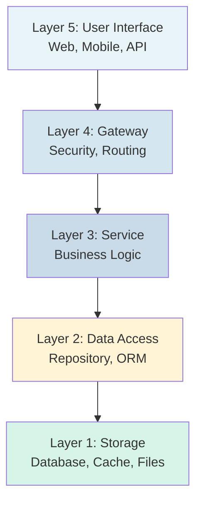
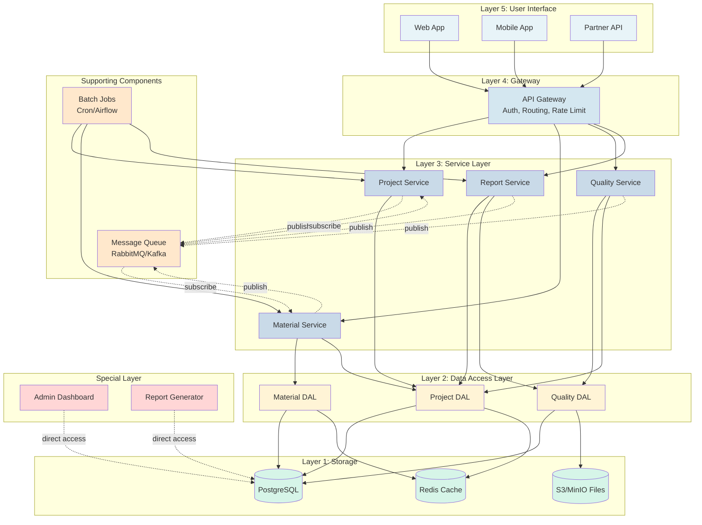
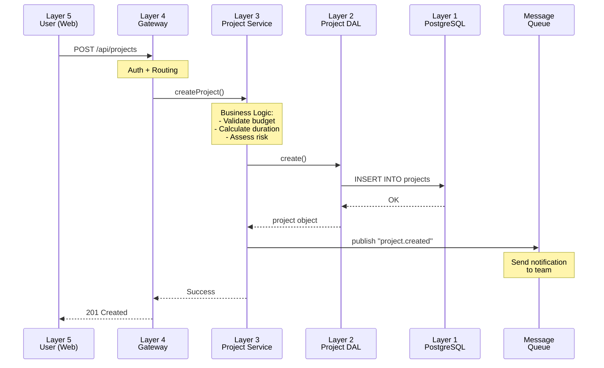
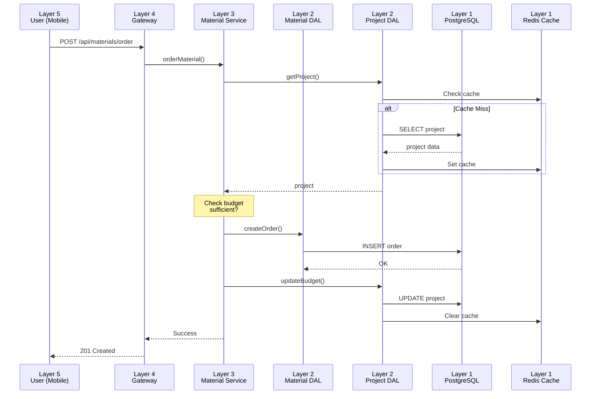
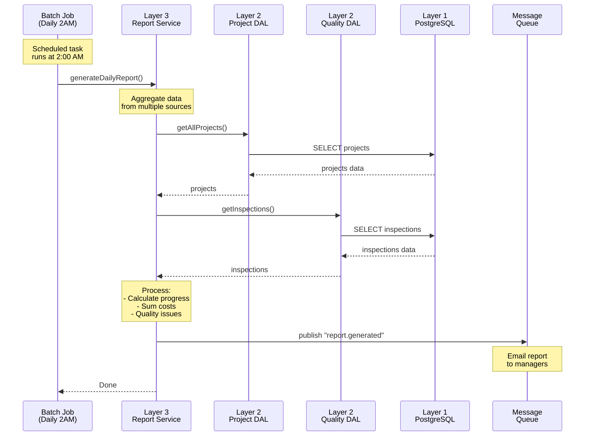
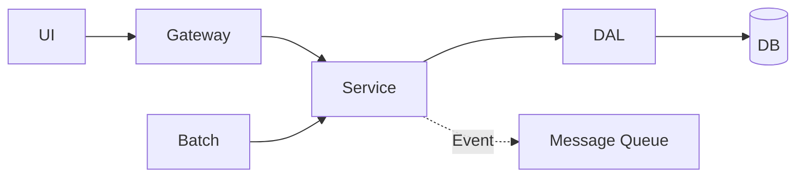
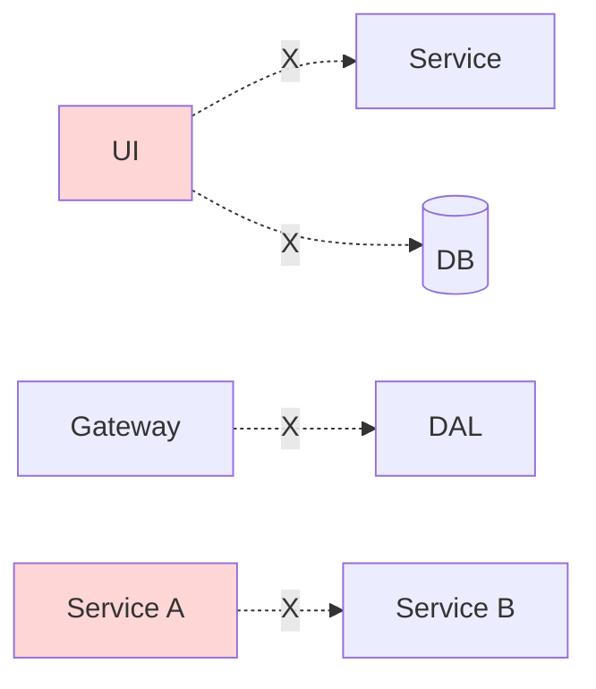

# 5-Layer Architecture - Construction Project Management System

## Introduction

This document illustrates 5-Layer Architecture through a practical example: Construction Project Management System.

**System Features**:
- Project management (progress, budget, workforce)
- Material management
- Quality inspection
- Reporting

**🎤 Script (Tiếng Việt):**
> "Tài liệu này giới thiệu 5-Layer Architecture qua ví dụ thực tế: Hệ thống quản lý dự án xây dựng.
>
> Hệ thống bao gồm 4 chức năng chính: Quản lý dự án (tiến độ, ngân sách, nhân lực), Quản lý vật tư, Kiểm tra chất lượng, và Báo cáo. Chúng ta sẽ thấy cách các layer tương tác với nhau qua các use case cụ thể."

**🎤 Script (日本語):**
> "この資料(しりょう)は実際(じっさい)の例(れい)を通(つう)じて5-Layer Architectureを紹介(しょうかい)します：建設(けんせつ)プロジェクト管理(かんり)システム。
>
> システムには4つの主要(しゅよう)機能(きのう)：プロジェクト管理(かんり)（進捗(しんちょく)、予算(よさん)、人員(じんいん)）、資材(しざい)管理(かんり)、品質(ひんしつ)検査(けんさ)、レポート。具体的(ぐたいてき)なユースケースを通(つう)じて各(かく)レイヤーの相互(そうご)作用(さよう)を見(み)ていきます。"

---

## 5-Layer Overview

**Principle**: Each layer only communicates with the layer directly below it (Closed Layer Architecture).

**🎤 Script (Tiếng Việt):**

> "5-Layer Architecture bao gồm: Layer 5 - User Interface, Layer 4 - Gateway, Layer 3 - Service (business logic), Layer 2 - Data Access, Layer 1 - Storage.
>
> Nguyên tắc quan trọng: Mỗi layer chỉ giao tiếp với layer liền kề bên dưới. Không được skip layer."

**🎤 Script (日本語):**

> "5-Layer Architectureは5つのレイヤー：Layer 5 - User Interface、Layer 4 - Gateway、Layer 3 - Service（ビジネスロジック）、Layer 2 - Data Access、Layer 1 - Storage。
>
> 重要(じゅうよう)な原則(げんそく)：各(かく)レイヤーは隣接(りんせつ)する下(した)のレイヤーとのみ通信(つうしん)。レイヤーをスキップ不可(ふか)。"

---

## Complete System Diagram

**Component Explanation**:
- **Layer 5**: 3 types of clients (Web, Mobile, Partner API)
- **Layer 4**: API Gateway handles security and routing
- **Layer 3**: 4 Services handle business logic
- **Layer 2**: 3 DAL repositories access data
- **Layer 1**: 3 storage types (Database, Cache, Files)
- **Message Queue**: Asynchronous communication between Services
- **Batch Jobs**: Scheduled automated tasks
- **Special Layer**: Admin tools (bypass 5 layers)

**🎤 Script (Tiếng Việt):**

> "Hệ thống hoàn chỉnh gồm: 3 clients ở Layer 5, API Gateway ở Layer 4, 4 Services ở Layer 3, 3 DAL repositories ở Layer 2, và 3 storage types ở Layer 1.
>
> Thêm Message Queue cho async communication, Batch Jobs cho scheduled tasks, và Special Layer cho admin tools (bypass architecture khi cần thiết)."

**🎤 Script (日本語):**

> "完全(かんぜん)なシステムは：Layer 5に3つのクライアント、Layer 4にAPI Gateway、Layer 3に4つのサービス、Layer 2に3つのDALリポジトリ、Layer 1に3つのストレージタイプ。
>
> さらにMessage Queue（非同期(ひどうき)通信(つうしん)用(よう)）、Batch Jobs（スケジュールタスク用(よう)）、Special Layer（管理(かんり)ツール、必要(ひつよう)時(じ)にアーキテクチャをバイパス）。"

---

### Cloud Deployment Options

| Layer | AWS Traditional | AWS Modern | GCP Traditional | GCP Modern |
|-------|----------------|------------|-----------------|------------|
| **Layer 5** | EC2 + Nginx | S3 + CloudFront | Compute Engine + Nginx | Cloud Storage + CDN |
| **Layer 4** | EC2 + HAProxy | API Gateway + WAF | Compute Engine + LB | Cloud Load Balancing |
| **Layer 3** | EC2 + Docker | Lambda / ECS Fargate | Compute Engine + Docker | Cloud Run / Functions |
| **Layer 2** | EC2 + Redis | ElastiCache (Redis) | Compute Engine + Redis | Memorystore (Redis) |
| **Layer 1** | EC2 + PostgreSQL | RDS / Aurora | Compute Engine + PostgreSQL | Cloud SQL / Spanner |
| **Queue** | EC2 + RabbitMQ/Kafka | SQS / SNS / EventBridge | Compute Engine + RabbitMQ | Pub/Sub |
| **Batch** | EC2 + Cron | Lambda / Fargate + EventBridge | Compute Engine + Cron | Cloud Run + Scheduler |
| **Special** | EC2 Bastion Host | Session Manager | Compute Engine Bastion | Cloud Shell + IAP |

**Recommended Hybrid**:
- Layer 5, 4: Modern (serverless, auto-scale)
- Layer 3: Hybrid (stable workload on VMs + burst traffic on serverless)
- Layer 2, 1: Modern (managed services, zero ops)
- Queue, Batch: Modern (serverless)

---

## Layer Details

**🎤 Script (Tiếng Việt):**
> "Bây giờ chúng ta đi vào chi tiết từng layer. Từ trên xuống dưới:
>
> Layer 5 - User Interface: Web, Mobile, API - chỉ gọi qua Gateway, không truy cập trực tiếp Service hay Database.
>
> Layer 4 - Gateway: Entry point duy nhất, xử lý authentication, authorization, rate limiting, routing. Không chứa business logic.
>
> Layer 3 - Service: Business logic, orchestrate nhiều DALs. Services không gọi nhau trực tiếp mà dùng Message Queue.
>
> Layer 2 - Data Access: Repository pattern, ORM mapping, caching. Chỉ layer này được truy cập Database.
>
> Layer 1 - Storage: PostgreSQL, Redis cache, S3 file storage. Không ai truy cập trực tiếp ngoài DAL."

**🎤 Script (日本語):**
> "それでは各(かく)レイヤーの詳細(しょうさい)を見(み)ていきます。上(うえ)から下(した)へ：
>
> Layer 5 - User Interface：Web、Mobile、API - Gatewayを通(とお)してのみ呼(よ)び出(だ)し、ServiceやDatabaseに直接(ちょくせつ)アクセス不可(ふか)。
>
> Layer 4 - Gateway：唯一(ゆいいつ)のエントリーポイント、authentication、authorization、rate limiting、routing処理(しょり)。ビジネスロジックは含(ふく)まない。
>
> Layer 3 - Service：ビジネスロジック、複数(ふくすう)のDALsをオーケストレート。Service同士(どうし)は直接(ちょくせつ)呼(よ)ばずMessage Queueを使用(しよう)。
>
> Layer 2 - Data Access：Repositoryパターン、ORMマッピング、キャッシング。このレイヤーのみがDatabaseアクセス可能(かのう)。
>
> Layer 1 - Storage：PostgreSQL、Redisキャッシュ、S3ファイルストレージ。DAL以外(いがい)の直接(ちょくせつ)アクセス不可(ふか)。"

### Layer 5: User Interface

**Purpose**: User interface, handle input, display output.

**Examples**:
- **Web App**: Project dashboard, material management, reports
- **Mobile App**: Site check-in, photo capture, progress updates
- **Partner API**: Supplier order view, contractor progress updates

**Rules**:
- ✅ Only call APIs through Gateway
- ❌ No direct access to Service or Database

---

### Layer 4: Gateway

**Purpose**: Single entry point, handle security, routing.

**Responsibilities**:
1. **Authentication**: Verify JWT token
2. **Authorization**: Check access permissions
3. **Rate Limiting**: Limit requests/minute
4. **Routing**: Forward request to correct Service
5. **Logging**: Log all requests

**Rules**:
- ✅ Forward requests to Service Layer
- ❌ No business logic
- ❌ No Database access

---

### Layer 3: Service

**Purpose**: Handle business logic, orchestrate Data Access Layer.

**Example Services**:
- **Project Service**: Create projects, calculate budget, assign workforce
- **Material Service**: Order materials, check inventory
- **Quality Service**: Quality inspection, calculate scores

**Rules**:
- ✅ Contains all business logic
- ✅ Call multiple DALs to complete tasks
- ❌ No direct Database access
- ❌ Services don't call other Services (use Message Queue)

---

### Layer 2: Data Access

**Purpose**: Abstract database, provide API for Services.

**Responsibilities**:
- **Repository Pattern**: CRUD operations
- **ORM Mapping**: Object ↔ Table
- **Caching**: Redis cache for performance
- **Validation**: Check data types, lengths

**Rules**:
- ✅ Only Service Layer can call
- ✅ Handle all database operations
- ❌ No business logic

---

### Layer 1: Storage

**Purpose**: Physical data storage.

**Components**:
- **PostgreSQL**: Main data storage (projects, materials, users)
- **Redis**: Cache for faster queries
- **S3/MinIO**: File storage (contract PDFs, site photos)

**Rules**:
- ❌ No direct access from Service
- ✅ Only Data Access Layer can access

---

## Supporting Components

### Message Queue (RabbitMQ/Kafka)

**Purpose**: Asynchronous communication between Services.

**How it works**:
- Service publishes event to Queue
- Other Services subscribe and handle event
- Example: `material.ordered` → Notification Service sends notification

**Benefits**:
- Reduce coupling between Services
- Non-blocking, asynchronous processing
- Auto-retry on failure

---

### Batch Jobs (Scheduled Tasks)

**Purpose**: Handle periodic tasks.

**Examples**:
- **Daily (2:00 AM)**: Calculate project progress, check inventory
- **Weekly (Sunday)**: Weekly quality report
- **Monthly (1st)**: Monthly report, archive old projects

**Rules**:
- ✅ Call Service Layer (follow architecture)
- ❌ No direct Database access

---

### Special Layer

**Purpose**: Internal tools, direct Database access.

**Examples**:
- **Admin Dashboard**: User management, emergency data fixes
- **Report Generator**: Complex reports (JOIN multiple tables)
- **Data Migration**: Bulk import/export

**Rules**:
- ⚠️ Admin/superuser only
- ⚠️ Audit log required
- ⚠️ Internal tools only

---

## Use Case 1: Create New Project

**Explanation**:
1. User creates project via Web
2. Gateway authenticates and routes
3. Project Service handles business logic
4. Project DAL saves to Database
5. Publish event to send notification
6. Return result to User

**Layers involved**: Layer 5 → 4 → 3 → 2 → 1 + Message Queue

**🎤 Script (Tiếng Việt):**

> "Use Case 1: Tạo dự án mới.
>
> Flow: User tạo project qua Web → Gateway auth và routing → Project Service xử lý business logic (validate budget, tính duration, đánh giá risk) → Project DAL lưu vào Database → Publish event để gửi notification → Trả kết quả cho User.
>
> Đi qua tất cả 5 layers plus Message Queue."

**🎤 Script (日本語):**

> "Use Case 1：新(あたら)しいプロジェクト作成(さくせい)。
>
> フロー：ユーザーがWebでプロジェクト作成(さくせい) → Gateway認証(にんしょう)とルーティング → Project Serviceがビジネスロジック処理(しょり)（予算(よさん)検証(けんしょう)、期間(きかん)計算(けいさん)、リスク評価(ひょうか)） → Project DALがデータベースに保存(ほぞん) → 通知(つうち)用(よう)にイベント公開(こうかい) → ユーザーに結果(けっか)を返(かえ)す。
>
> 全(すべ)ての5レイヤーとMessage Queueを経由(けいゆ)。"

---

## Use Case 2: Order Materials

**Explanation**:
1. User orders materials via Mobile
2. Material Service checks project budget
3. Use Cache for performance
4. Create order and update budget
5. Clear cache to ensure fresh data

**Layers involved**: Layer 5 → 4 → 3 → 2 → 1 (Database + Cache)

**Special note**: Service calls 2 DALs (Material DAL + Project DAL)

**🎤 Script (Tiếng Việt):**

> "Use Case 2: Đặt vật liệu.
>
> Flow: User đặt materials qua Mobile → Material Service check project budget (dùng Cache để tăng performance) → Tạo order và update budget → Clear cache để đảm bảo data mới nhất.
>
> Đặc biệt: Material Service gọi 2 DALs - Material DAL và Project DAL."

**🎤 Script (日本語):**

> "Use Case 2：資材(しざい)注文(ちゅうもん)。
>
> フロー：ユーザーがモバイルで資材(しざい)注文(ちゅうもん) → Material Serviceがプロジェクト予算(よさん)確認(かくにん)（パフォーマンス向上(こうじょう)のためCache使用(しよう)） → 注文(ちゅうもん)作成(さくせい)と予算(よさん)更新(こうしん) → 最新(さいしん)データ確保(かくほ)のためCache削除(さくじょ)。
>
> 特別(とくべつ)：Material Serviceが2つのDALを呼(よ)び出(だ)す - Material DALとProject DAL。"

---

## Use Case 3: Daily Automated Report

**Explanation**:
1. Batch Job runs automatically at 2:00 AM
2. Report Service collects data from multiple DALs
3. Process and aggregate report
4. Publish event to send email report
5. Complete without user interaction

**Layers involved**: Batch Job → Layer 3 → 2 → 1 + Message Queue

**Special note**: No Layer 5 (UI), batch runs automatically

**🎤 Script (Tiếng Việt):**

> "Use Case 3: Báo cáo tự động hàng ngày.
>
> Flow: Batch Job chạy tự động lúc 2:00 AM → Report Service thu thập data từ nhiều DALs (Project DAL và Quality DAL) → Xử lý và aggregate report → Publish event để email report cho managers.
>
> Đặc biệt: Không có Layer 5 (UI), batch chạy tự động không cần user interaction."

**🎤 Script (日本語):**

> "Use Case 3：毎日(まいにち)の自動(じどう)レポート。
>
> フロー：Batch Jobが午前(ごぜん)2時(じ)に自動(じどう)実行(じっこう) → Report Serviceが複数(ふくすう)のDALからデータ収集(しゅうしゅう)（Project DALとQuality DAL） → レポート処理(しょり)と集計(しゅうけい) → マネージャーへのメールレポート用(よう)にイベント公開(こうかい)。
>
> 特別(とくべつ)：Layer 5（UI）なし、バッチが自動(じどう)実行(じっこう)、ユーザー操作(そうさ)不要(ふよう)。"

---

## Comparison: With vs Without 5 Layers

| Criteria | Without 5 Layers | With 5 Layers |
|----------|------------------|---------------|
| **Database Change** | Modify many files (2-3 months) | Only modify DAL (1-2 weeks) |
| **Testing** | Hard to test, need real DB | Easy to test with mocks |
| **Scaling** | Scale entire system (expensive) | Scale each layer independently |
| **Team Work** | Many conflicts when merging | Few conflicts, clear responsibilities |
| **Code Reuse** | Duplicate logic everywhere | Reuse Service for multiple clients |
| **Bug Fixing** | Hard to locate bugs | Easy to identify faulty layer |

---

## Key Benefits

### 1. Separation of Concerns
Each layer has distinct responsibilities, no overlap.

### 2. Maintainability
Easy to maintain: changing one layer doesn't affect others.

### 3. Scalability
Independent scaling: scale the layer that needs more resources.

### 4. Testability
Easy to test: mock lower layer, test current layer logic.

### 5. Reusability
One Service used by multiple clients (Web, Mobile, API).

---

## Important Rules

### ✅ ALLOWED

### ❌ NOT ALLOWED

**Golden Rules**:
- Only communicate with adjacent layer
- No skipping layers
- Services don't call Services (use Message Queue)

---

## When to Use?

### ✅ SHOULD use when:
- Large projects with many features
- Team > 5 people
- Long-term maintenance (> 2 years)
- Multiple clients (Web, Mobile, Partner API)
- Complex business logic

### ❌ SHOULD NOT use when:
- Prototype, POC
- Small, simple projects
- Team < 3 people
- Tight deadline
- Simple business logic (basic CRUD)

---

## Conclusion

**5-Layer Architecture** helps:
- Clear, understandable code
- Easy to maintain and extend
- Efficient team collaboration
- Fewer bugs, higher quality

**Trade-off**: More complex, requires team understanding of architecture.

**Recommendation**: Start simple (3 layers), expand gradually when needed.

**🎤 Script (Tiếng Việt):**

> "Kết luận: 5-Layer Architecture giúp code rõ ràng, dễ maintain, team collaboration hiệu quả, ít bugs hơn.
>
> Trade-off: Phức tạp hơn, cần team hiểu architecture.
>
> Khuyến nghị: Bắt đầu đơn giản với 3 layers, mở rộng dần khi cần."

**🎤 Script (日本語):**

> "結論(けつろん)：5-Layer Architectureはコードを明確(めいかく)に、メンテナンス容易(ようい)に、チームコラボレーション効率的(こうりつてき)に、バグ削減(さくげん)に役立(やくだ)ちます。
>
> トレードオフ：より複雑(ふくざつ)、チームがアーキテクチャを理解(りかい)する必要(ひつよう)。
>
> 推奨(すいしょう)：3レイヤーでシンプルに開始(かいし)、必要(ひつよう)に応(おう)じて段階的(だんかいてき)に拡張(かくちょう)。"
